<!-- theme: gaia -->
<!-- _class: lead -->

# 第六讲 虚拟存储管理
## 第二节 局部页面置换算法

<br>
<br>

向勇 陈渝 李国良 

2022年秋季

---

**提纲**

### 1. 页面置换算法的基本概念
2. 最优页面置换算法 (OPT, optimal)
3. 先进先出页面置换算法 (FIFO)
4. 最近最久未使用页面置换算法 (LRU, Least Recently Used)
5. 时钟页面置换算法 (Clock)
6. 改进的时钟页面置换算法
7. 最不常用页面置换算法 (LFU, Least Frequently Used)
8. Belady现象

--- 

#### 页面置换算法的功能与设计目标

- 功能
  - 出现缺页异常需调入新页面而内存已满时，置换算法**选择被置换的物理页面**

- 设计目标
  - 尽可能减少页面**缺页次数**、**换入/换出次数**
  - 把未来不再访问或**短期内不访问**的页面调出


--- 
#### 页面置换的时机

- **空闲内存**数量上限和下限
- 到达下限，开始回收内存
- 到达上限，暂停回收内存


--- 

#### 页面锁定(frame locking)/常驻内存

**必须常驻内存**的逻辑页面
  - 操作系统的关键部分
  - 要求响应速度的代码和数据
  - 页表中的锁定标志位(lock bit)


--- 

#### 页面置换算法的评价方法

- 评价方法
  - 记录进程**访问内存页面的轨迹**，模拟置换行为，记录**缺页次数**；
  - 更**少**的缺页, 更**好**的性能
- 示例: 虚拟地址访问用(页号, 位移)表示
```
(3,0),  (1,9),  (4,1),  (2,1),  (5,3),  (2,0),  (1,9),  (2,4),  (3,1),  (4,8)
```
- 对应的页面轨迹
```
3, 1, 4, 2, 5, 2, 1, 2, 3, 4 用数字表示 
c, a, d, b, e, b, a, b, c, d 用字符表示
```

--- 

#### 页面置换算法的分类

- **局部**页面置换算法
  - 置换页面的选择范围仅限于**当前进程**占用的物理页面内
  - 最优算法、先进先出算法、最近最久未使用算法
  - 时钟算法、最不常用算法

- **全局**页面置换算法
  - 置换页面的选择范围是**所有**可换出的物理页面
  - 工作集算法、缺页率算法

---

**提纲**

1. 页面置换算法的基本概念
### 2. 最优页面置换算法 (OPT, optimal)
3. 先进先出页面置换算法 (FIFO)
4. 最近最久未使用页面置换算法 (LRU, Least Recently Used)
5. 时钟页面置换算法 (Clock)
6. 改进的时钟页面置换算法
7. 最不常用页面置换算法 (LFU, Least Frequently Used)
8. Belady现象

--- 

#### 最优页面置换算法的工作原理
- 基本思路
  - 置换在**未来最长时间**不访问的页面
- 算法实现
  - 缺页时，计算内存中每个逻辑页面的**下一次访问时间**
  - 选择未来最长时间不访问的页面
  
---
#### 最优页面置换算法特征
  - 缺页最少，是**理想情况**
  - 实际系统中**无法实现**
  - **无法预知**每个页面在下次访问前的等待时间
    - 在模拟器上运行某个程序，并记录每一次的页面访问情况
    - 第二遍运行时使用最优算法
 
  
---

#### 最优页面置换算法示例


  
  
---

#### 最优页面置换算法示例


---

#### 最优页面置换算法示例

 

---

#### 最优页面置换算法示例


---

**提纲**

1. 页面置换算法的基本概念
2. 最优页面置换算法 (OPT, optimal)
### 3. 先进先出页面置换算法 (FIFO)
4. 最近最久未使用页面置换算法 (LRU, Least Recently Used)
5. 时钟页面置换算法 (Clock)
6. 改进的时钟页面置换算法
7. 最不常用页面置换算法 (LFU, Least Frequently Used)
8. Belady现象

--- 

#### 先进先出算法的工作原理
- 基本思路
  - 选择在内存**驻留时间最长**的页面进行置换
- 算法实现
  - 维护一个记录所有**位于内存中的逻辑页面链表**
  - 链表元素**按驻留内存的时间排序**，链首最长，链尾最短
  - 出现缺页时，**选择**链首页面进行置换，新页面加到链尾

---
#### 先进先出算法特征

  - 实现简单
  - 性能较差，调出的页面可能是经常访问的
  - 分配物理页面数增加时，缺页并不一定减少(Belady现象)
  - 很少单独使用

---

#### 先进先出算法示例

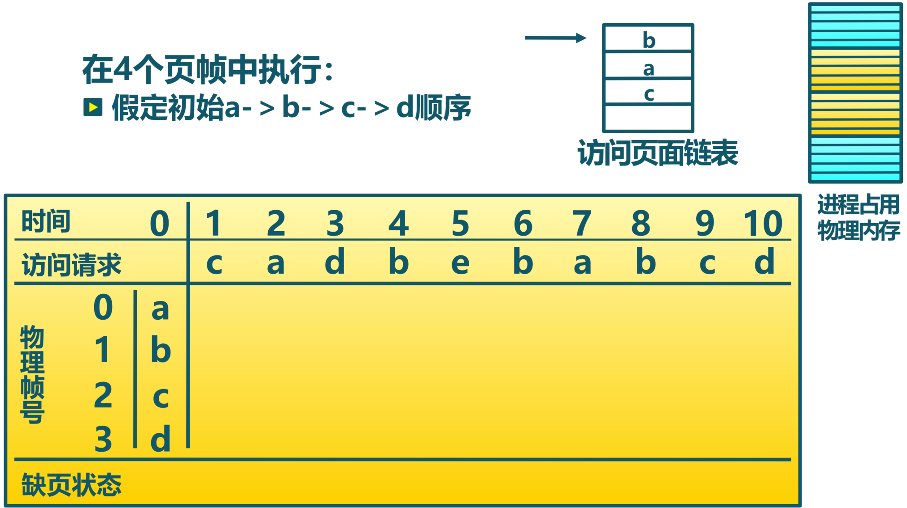

  
---

#### 先进先出算法示例


  
---

#### 先进先出算法示例


---

#### 先进先出算法示例

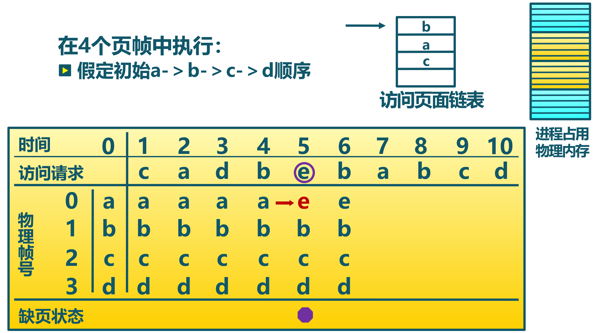

---

#### 先进先出算法示例

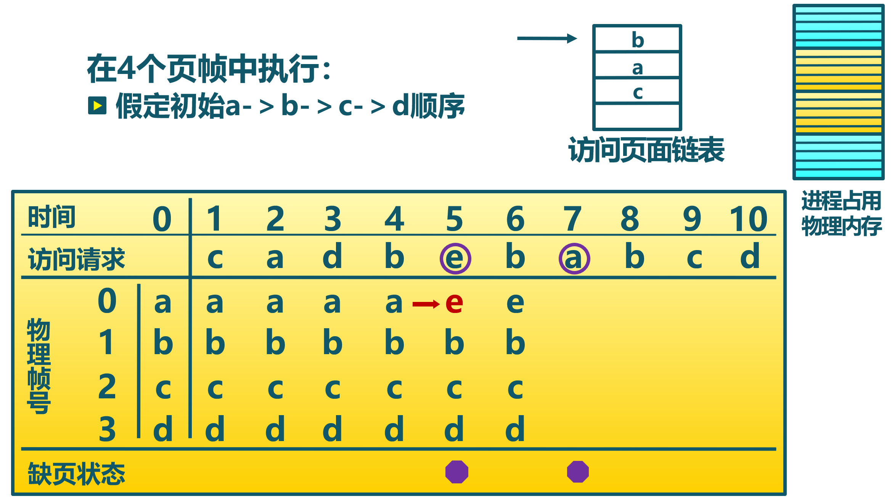

---

#### 先进先出算法示例

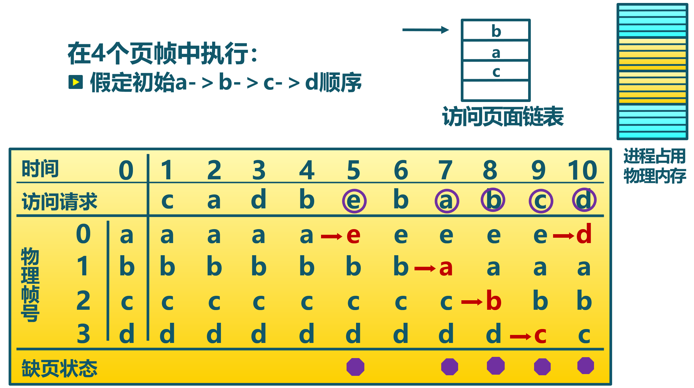

  
---

**提纲**

1. 页面置换算法的基本概念
2. 最优页面置换算法 (OPT, optimal)
3. 先进先出页面置换算法 (FIFO)
### 4. 最近最久未使用算法 (LRU, Least Recently Used)
5. 时钟页面置换算法 (Clock)
6. 改进的时钟页面置换算法
7. 最不常用页面置换算法 (LFU, Least Frequently Used)
8. Belady现象

--- 

#### 最近最久未使用算法的工作原理

- 基本思路
  - 选择**最长时间没有被引用**的页面进行置换
  - 如某页面长时间未被访问，则它**在将来还可能**会长时间不会访问

- 算法实现
  - 缺页时，计算内存中每个逻辑页面的**上一次访问**时间
  - 选择上一次使用到当前时间最长的页面进行置换
- 算法特征
  - **最优置换算法的一种近似**

---

#### 最近最久未使用算法示例

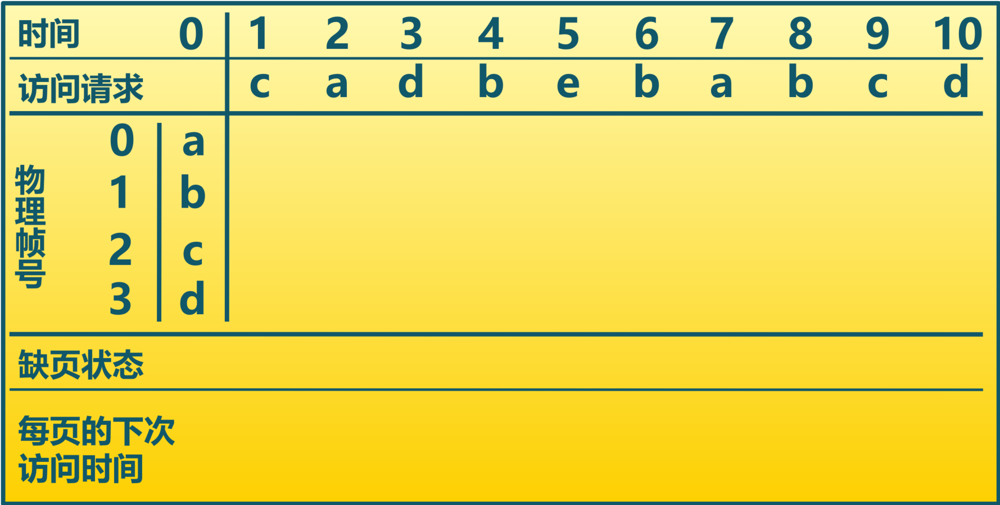

  
---

#### 最近最久未使用算法示例

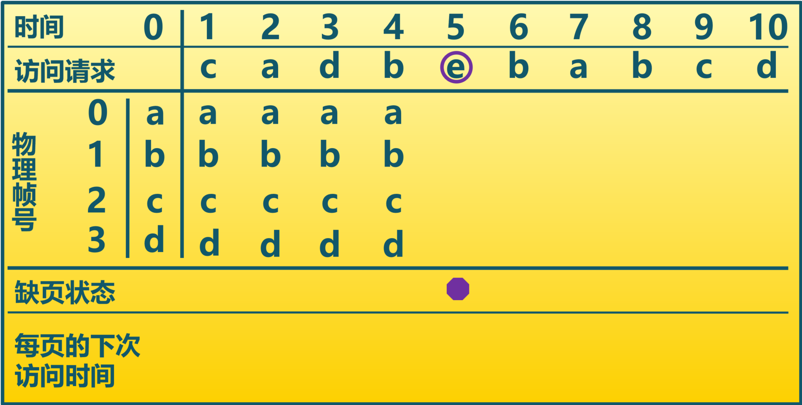


  
---

#### 最近最久未使用算法示例

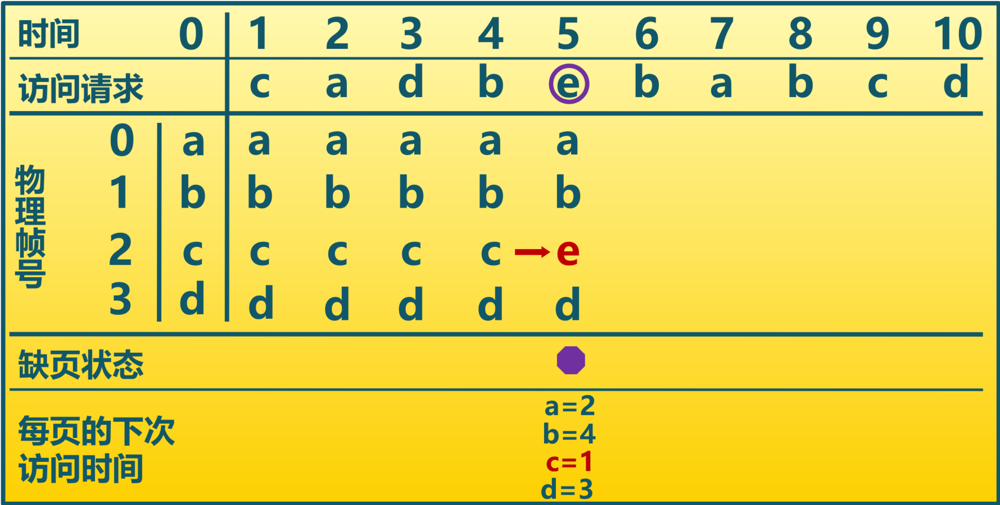

  
---

#### 最近最久未使用算法示例


  
---

#### 最近最久未使用算法示例

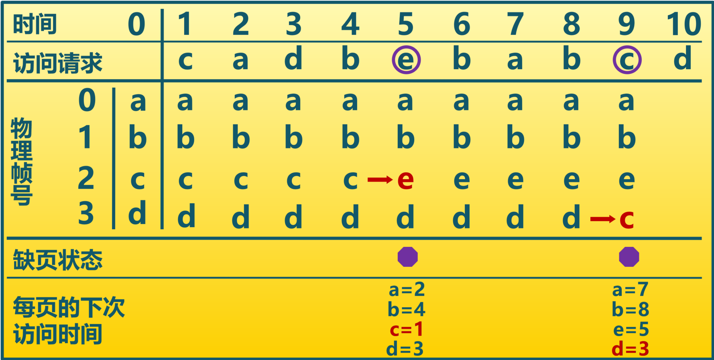

  
---

#### 最近最久未使用算法示例

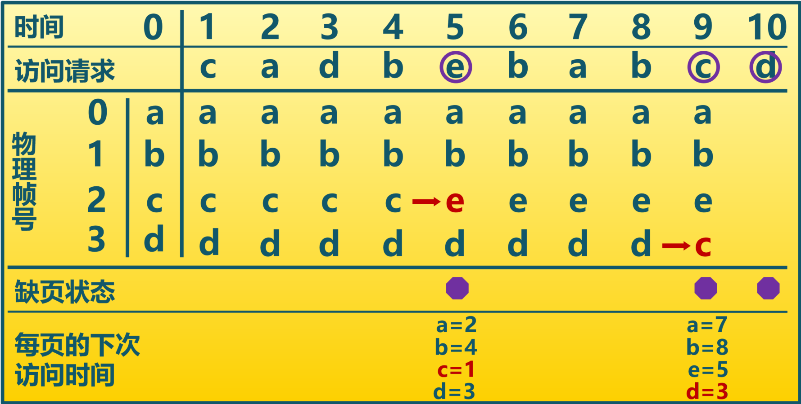


  
---

#### 最近最久未使用算法示例

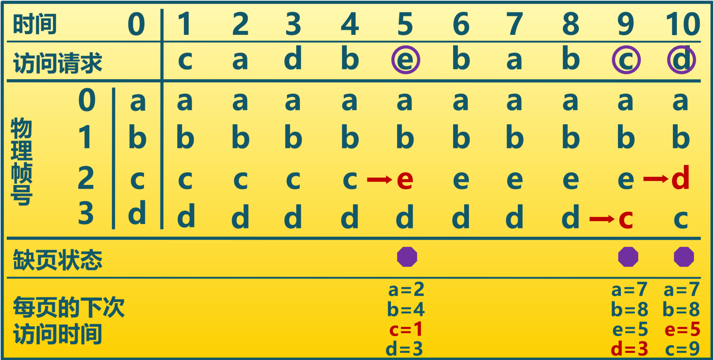

  
  
---

#### LRU的页面链表实现

- 页面链表
  - 系统维护一个按最近一次访问时间排序的页面**链表**
    - **链表首节点**是最近刚刚使用过的页面
    - **链表尾节点**是最久未使用的页面
  - 访问内存时，找到相应页面，并把它**移到链表之首**
  - 缺页时，置换链表尾节点的页面
- 特征
  - 开销大

  
  
---

#### LRU的活动页面栈实现

- 活动页面**栈**
  - 访问页面时，将此页号**压入栈顶**，并栈内相同的页号抽出
  - 缺页时，**置换栈底**的页面
- 特征
  - 开销大

  
---

#### LRU的活动页面栈实现示例


---

#### LRU的活动页面栈实现示例

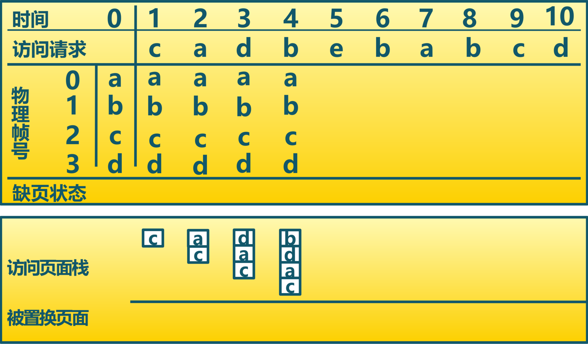


  
---

#### LRU的活动页面栈实现示例


  
---

#### LRU的活动页面栈实现示例

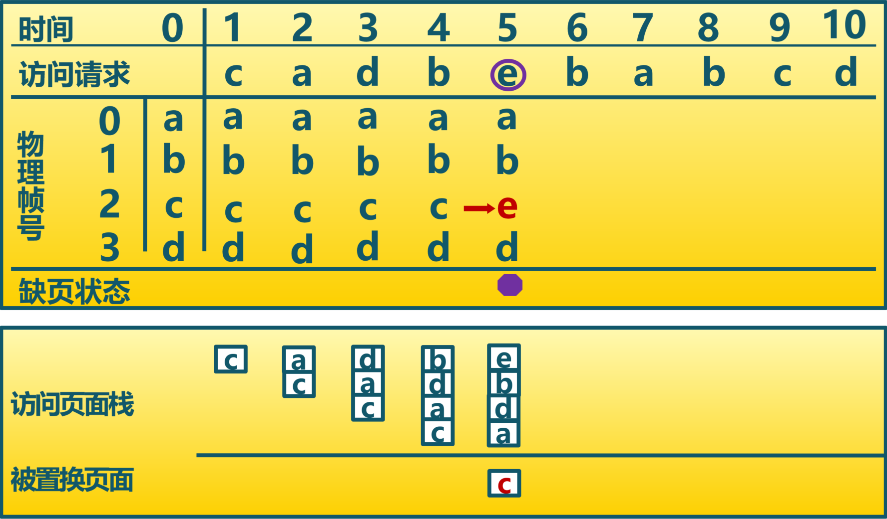

---

#### LRU的活动页面栈实现示例


  
---

#### LRU的活动页面栈实现示例


---

#### LRU的活动页面栈实现示例

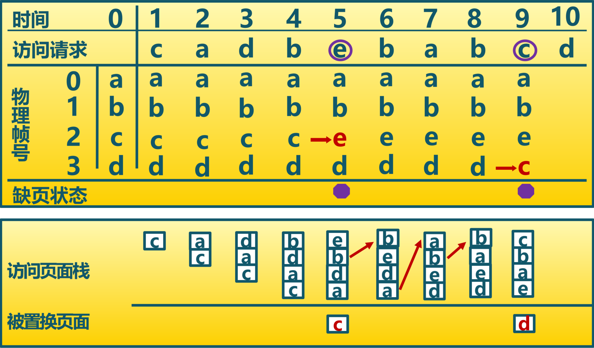


  
---

#### LRU的活动页面栈实现示例


  
---

#### LRU的活动页面栈实现示例


  
---

**提纲**

1. 页面置换算法的基本概念
2. 最优页面置换算法 (OPT, optimal)
3. 先进先出页面置换算法 (FIFO)
4. 最近最久未使用页面置换算法 (LRU, Least Recently Used)
### 5. 时钟页面置换算法 (Clock)
6. 改进的时钟页面置换算法
7. 最不常用页面置换算法 (LFU, Least Frequently Used)
8. Belady现象

--- 

#### 时钟置换算法的工作原理

- 基本思路
  - 仅对页面的访问情况进行**大致统计**
- 数据结构 
  - 在页表项中增加**访问位**，描述页面在过去一段时间的内访问情况
  - 各页面组织成**环形链表**
  - 指针指向**最先调入的页面**

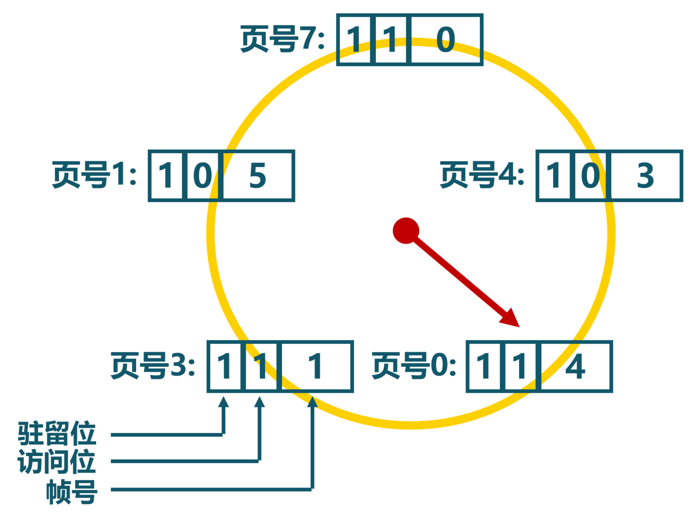

---

#### 时钟置换算法的工作原理

- 算法实现
  - **访问页面时**，在页表项记录页面访问情况
  - **缺页时**，从指针处开始顺序查找未被访问的页面进行置换


  
---

#### 时钟置换算法的具体实现过程

- 页面**装入内存时**，访问位初始化为0
- **访问页面（读/写)时**，访问位置1
- **缺页时**，从指针当前位置顺序检查
  - 访问位为0，则置换该页
  - 访问位为1，则访问位置0，并指针移动到下一个页面，直到找到可置换的页面
- 算法特征
  - 时钟算法是LRU和FIFO的折中


---

#### 时钟置换算法示例

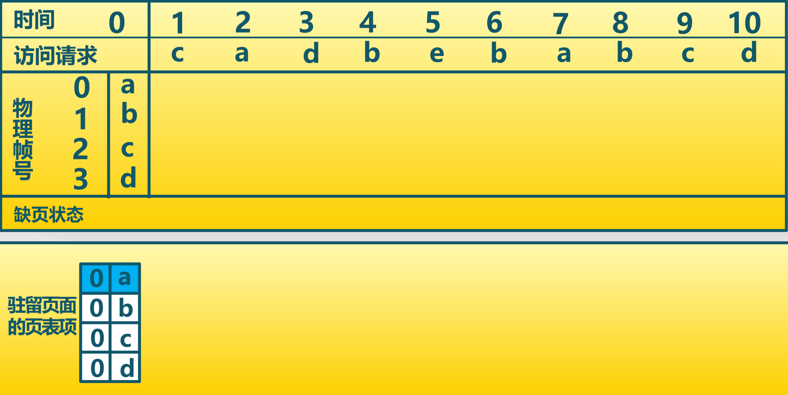


---

#### 时钟置换算法示例

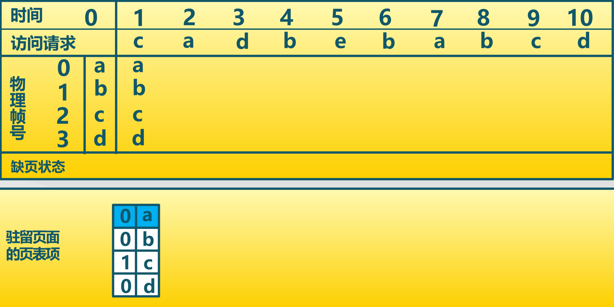


---

#### 时钟置换算法示例


---

#### 时钟置换算法示例

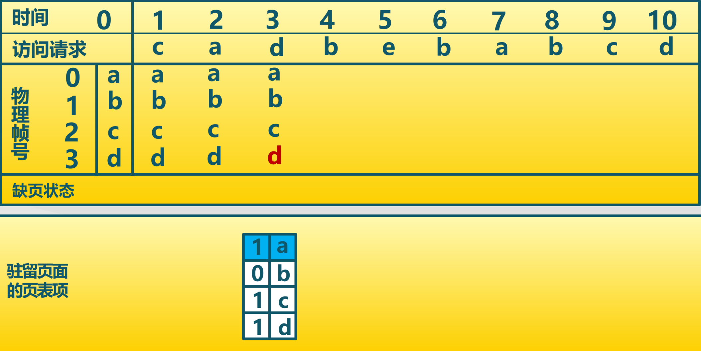


---

#### 时钟置换算法示例

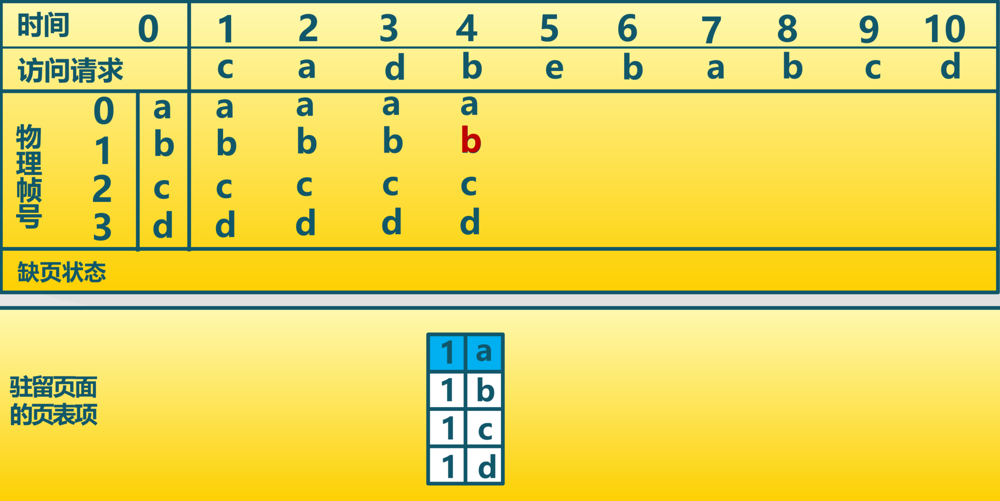


---

#### 时钟置换算法示例

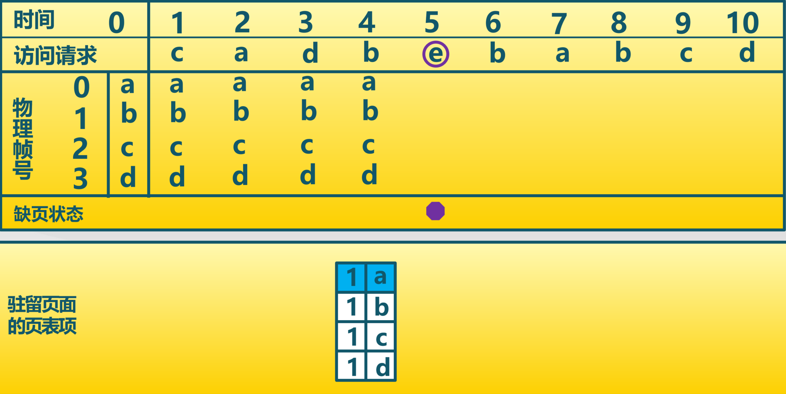


---

#### 时钟置换算法示例

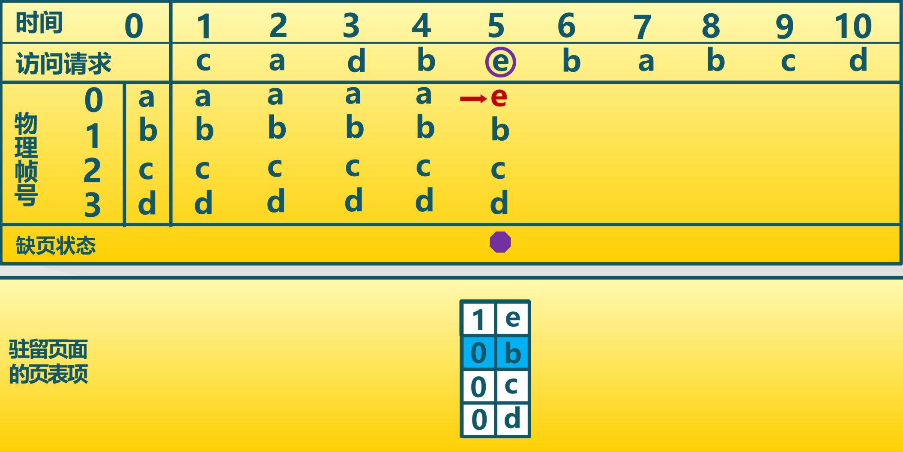


---

#### 时钟置换算法示例


---

#### 时钟置换算法示例


---

#### 时钟置换算法示例


---

#### 时钟置换算法示例


---

#### 时钟置换算法示例


---

#### 时钟置换算法示例


---

#### 时钟置换算法示例


---

#### 时钟置换算法示例

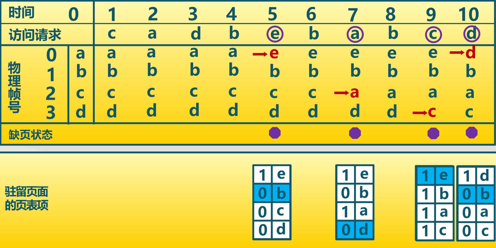


  
---

**提纲**

1. 页面置换算法的基本概念
2. 最优页面置换算法 (OPT, optimal)
3. 先进先出页面置换算法 (FIFO)
4. 最近最久未使用页面置换算法 (LRU, Least Recently Used)
5. 时钟页面置换算法 (Clock)
### 6. 改进的时钟页面置换算法
7. 最不常用页面置换算法 (LFU, Least Frequently Used)
8. Belady现象

--- 

#### 改进的时钟置换算法的工作原理

- 基本思路
  - 减少**修改页**的缺页处理开销
- 数据结构 
  - 在页面中增加**修改位**，描述页面在过去一段时间的内写访问情况
- 算法实现
  - 访问页面时，在页表项记录页面访问情况
  - **修改页面时**，在页表项记录页面修改情况
  - 缺页时，修改页面标志位，以**跳过**有修改的页面
  
---

#### 改进的时钟置换算法的工作原理

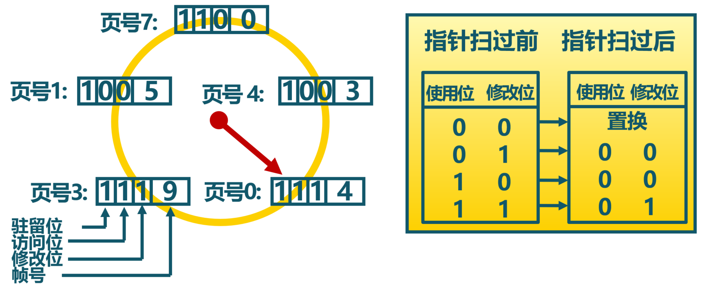

  
---

#### 改进的时钟置换算法示例


  
---

#### 改进的时钟置换算法示例


  
---

#### 改进的时钟置换算法示例

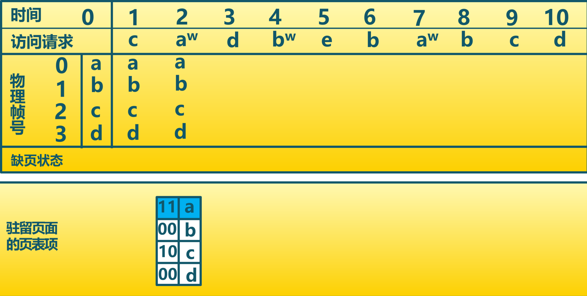

  
---

#### 改进的时钟置换算法示例

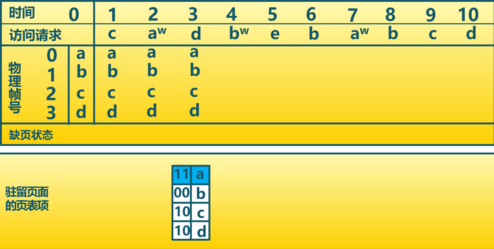

---

#### 改进的时钟置换算法示例

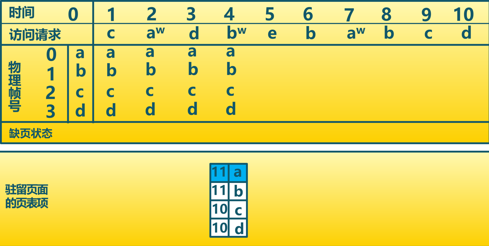

  
---

#### 改进的时钟置换算法示例


  
---

#### 改进的时钟置换算法示例

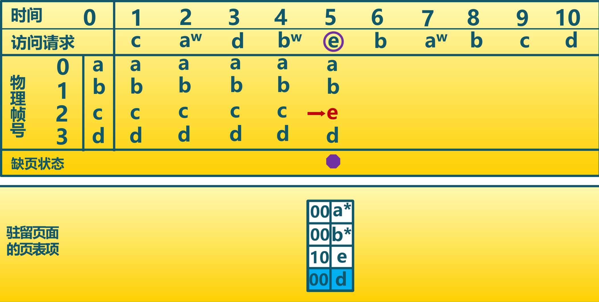

  
---

#### 改进的时钟置换算法示例

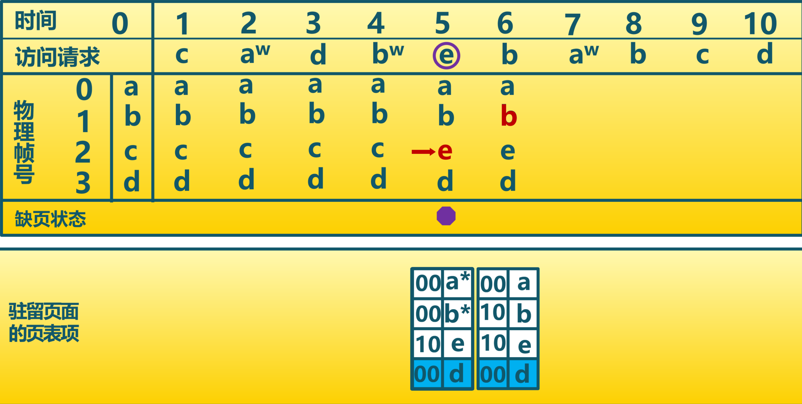

---

#### 改进的时钟置换算法示例


  
---

#### 改进的时钟置换算法示例


  
---

#### 改进的时钟置换算法示例


  
---

#### 改进的时钟置换算法示例

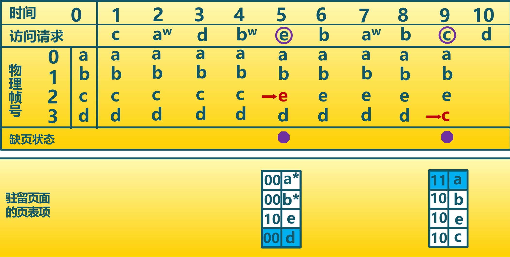

---

#### 改进的时钟置换算法示例


  
---

#### 改进的时钟置换算法示例

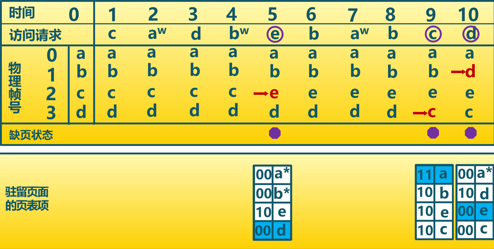

  
---

**提纲**

1. 页面置换算法的基本概念
2. 最优页面置换算法 (OPT, optimal)
3. 先进先出页面置换算法 (FIFO)
4. 最近最久未使用页面置换算法 (LRU, Least Recently Used)
5. 时钟页面置换算法 (Clock)
6. 改进的时钟页面置换算法
### 7. 最不常用置换算法 (LFU, Least Frequently Used)
8. Belady现象

--- 

#### 最不常用算法的工作原理

- 基本思路
  - 缺页时，置换**访问次数最少**的页面

- 算法实现
  - 每个页面设置一个**访问计数**
  - 访问页面时，**访问计数加1** 
  - 缺页时，置换**计数最小的页面**

  
---

#### 最不常用算法特征

- 特征
  - 算法开销大
  - 开始时频繁使用，但以后不使用的页面**很难置换**
    - 解决方法：计数定期右移

- LRU关注多久未访问,时间越短越好
- LFU关注访问次数，次数越多越好

  
---

#### LFU示例

4个物理页帧，最初的访问次数a-＞8 b-＞5 c-＞6 d-＞2


  
---

#### LFU示例

4个物理页帧，最初的访问次数a-＞8 b-＞5 c-＞6 d-＞2
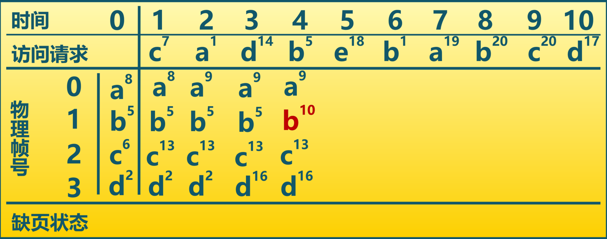

  
---

#### LFU示例

4个物理页帧，最初的访问次数a-＞8 b-＞5 c-＞6 d-＞2


  
---

#### LFU示例

4个物理页帧，最初的访问次数a-＞8 b-＞5 c-＞6 d-＞2


---

#### LFU示例

4个物理页帧，最初的访问次数a-＞8 b-＞5 c-＞6 d-＞2
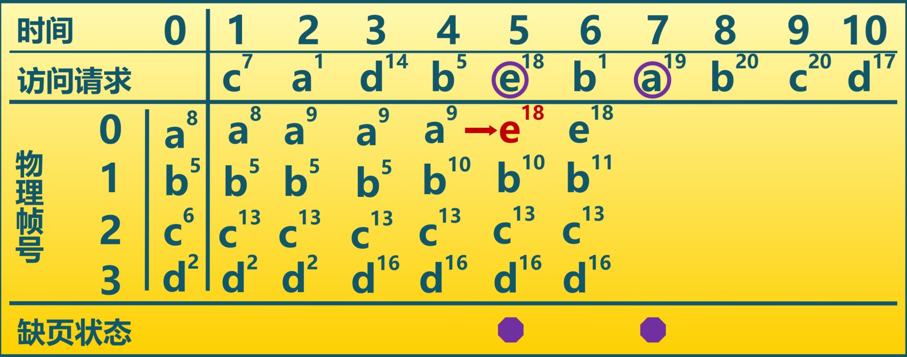

  
---

#### LFU示例

4个物理页帧，最初的访问次数a-＞8 b-＞5 c-＞6 d-＞2


  
---

#### LFU示例

4个物理页帧，最初的访问次数a-＞8 b-＞5 c-＞6 d-＞2
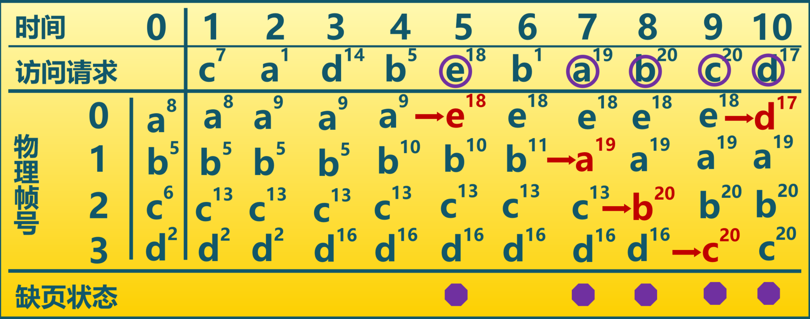

---

**提纲**

1. 页面置换算法的基本概念
2. 最优页面置换算法 (OPT, optimal)
3. 先进先出页面置换算法 (FIFO)
4. 最近最久未使用页面置换算法 (LRU, Least Recently Used)
5. 时钟页面置换算法 (Clock)
6. 改进的时钟页面置换算法
7. 最不常用页面置换算法 (LFU, Least Frequently Used)
### 8. Belady现象

--- 

#### Belady现象
- 现象
  - 采用FIFO等算法时，可能出现**分配的物理页面数增加**，**缺页次数反而升高**的异常现象
- 原因
  - FIFO算法的置换特征与进程访问内存的动态特征**矛盾**
  - 被它置换出去的页面**并不一定**是进程近期不会访问的
- 思考
  - 哪些置换算法没有Belady现象？

---

#### FIFO算法的Belady现象

访问顺序 : 1, 2, 3, 4, 1, 2, 5, 1, 2, 3, 4, 5
物理页面数: 3  ； 缺页次数: 9
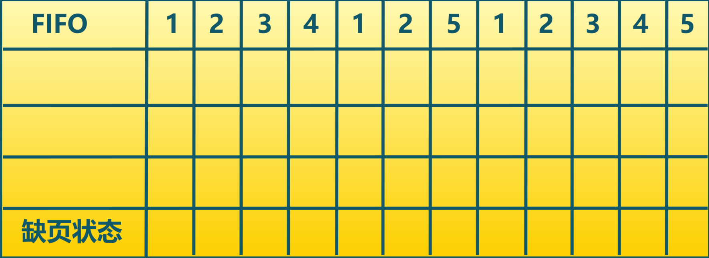


---

#### FIFO算法的Belady现象

访问顺序 : 1, 2, 3, 4, 1, 2, 5, 1, 2, 3, 4, 5
物理页面数: 3  ； 缺页次数: 9


---

#### FIFO算法的Belady现象

访问顺序 : 1, 2, 3, 4, 1, 2, 5, 1, 2, 3, 4, 5
物理页面数: 3  ； 缺页次数: 9


---

#### FIFO算法的Belady现象

访问顺序 : 1, 2, 3, 4, 1, 2, 5, 1, 2, 3, 4, 5
物理页面数: 3  ； 缺页次数: 9


---

#### FIFO算法的Belady现象

访问顺序 : 1, 2, 3, 4, 1, 2, 5, 1, 2, 3, 4, 5
物理页面数: 3  ； 缺页次数: 9
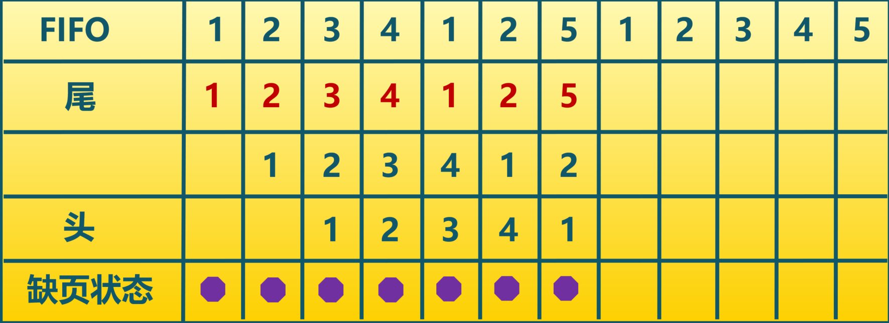


---

#### FIFO算法的Belady现象

访问顺序 : 1, 2, 3, 4, 1, 2, 5, 1, 2, 3, 4, 5
物理页面数: 3  ； 缺页次数: 9
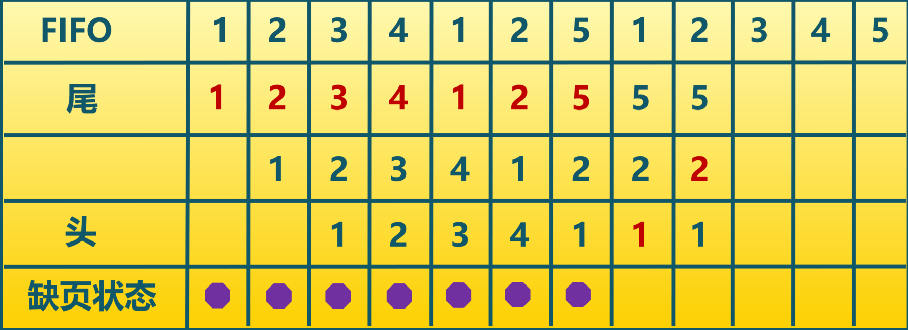


---

#### FIFO算法的Belady现象

访问顺序 : 1, 2, 3, 4, 1, 2, 5, 1, 2, 3, 4, 5
物理页面数: 3  ； 缺页次数: 9
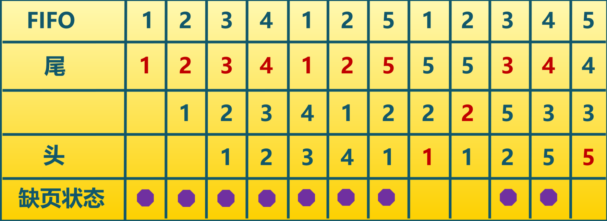


---

#### FIFO算法的Belady现象

访问顺序 : 1, 2, 3, 4, 1, 2, 5, 1, 2, 3, 4, 5
物理页面数: 4  ； 缺页次数: 10
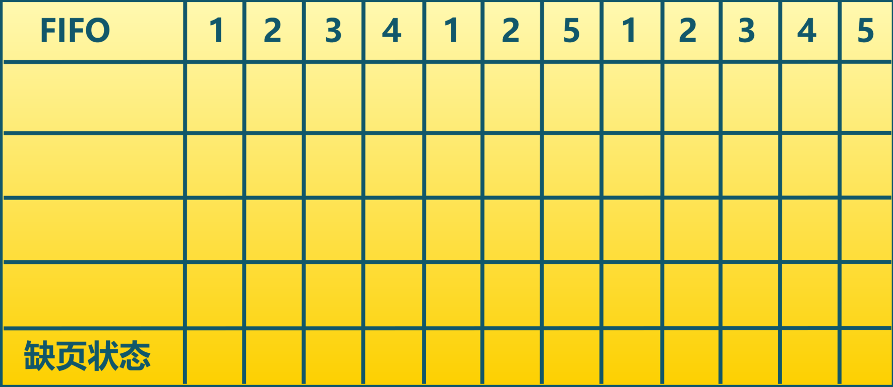


---

#### FIFO算法的Belady现象

访问顺序 : 1, 2, 3, 4, 1, 2, 5, 1, 2, 3, 4, 5
物理页面数: 4  ； 缺页次数: 10


---

#### FIFO算法的Belady现象

访问顺序 : 1, 2, 3, 4, 1, 2, 5, 1, 2, 3, 4, 5
物理页面数: 4  ； 缺页次数: 10


---

#### FIFO算法的Belady现象

访问顺序 : 1, 2, 3, 4, 1, 2, 5, 1, 2, 3, 4, 5
物理页面数: 4  ； 缺页次数: 10
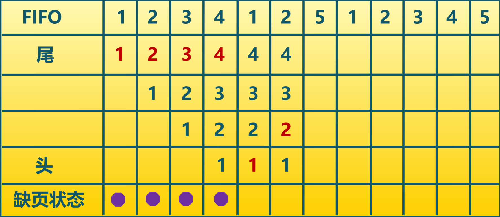


---

#### FIFO算法的Belady现象

访问顺序 : 1, 2, 3, 4, 1, 2, 5, 1, 2, 3, 4, 5
物理页面数: 4  ； 缺页次数: 10
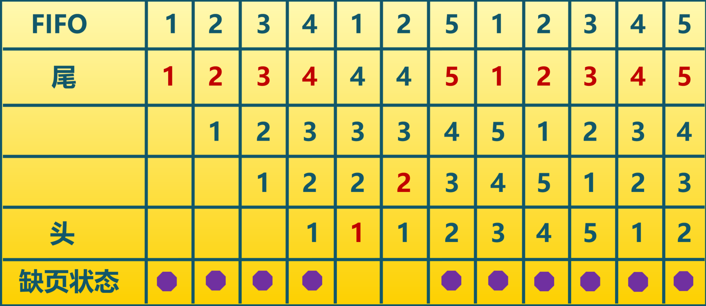


---

#### FIFO算法存在Belady现象


<!-- 
-->
<!-- -->

---

#### LRU算法不存在Belady现象


时钟/改进的时钟页面置换是否有Belady现象？
为什么LRU页面置换算法没有Belady现象？

---

#### LRU、FIFO和Clock的比较

  - LRU算法和FIFO本质上都是先进先出的思路
  - LRU依据页面的最近访问时间排序
  - LRU需要动态地调整顺序
  - FIFO依据页面进入内存的时间排序
  - FIFO的页面进入时间是固定不变的

---

#### LRU、FIFO和Clock的比较

  - LRU可退化成FIFO
    - 如页面进入内存后**没有被访问**，最近访问时间与进入内存的时间相同
    - 例如：给进程分配3个物理页面，逻辑页面的访问顺序为1、2、3、4、5、6、1、2、3…


---

#### LRU、FIFO和Clock的比较

  - LRU算法性能较好，但系统开销较大
  - FIFO算法系统开销较小，会发生Belady现象
  - Clock算法是它们的**折衷**
    - 页面访问时，不动态调整页面在链表中的顺序，仅做标记
    - 缺页时，再把它移动到链表末尾
    - 对于**未被访问的**页面，Clock和LRU算法的表现一样好
    - 对于**被访问过的**页面，Clock算法不能记录准确访问顺序，而LRU算法可以

--- 

### 小结

1. 页面置换算法的基本概念
2. 最优页面置换算法 (OPT, optimal)
3. 先进先出页面置换算法 (FIFO)
4. 最近最久未使用页面置换算法 (LRU, Least Recently Used)
5. 时钟页面置换算法 (Clock)
6. 改进的时钟页面置换算法
7. 最不常用页面置换算法 (LFU, Least Frequently Used)
8. Belady现象


