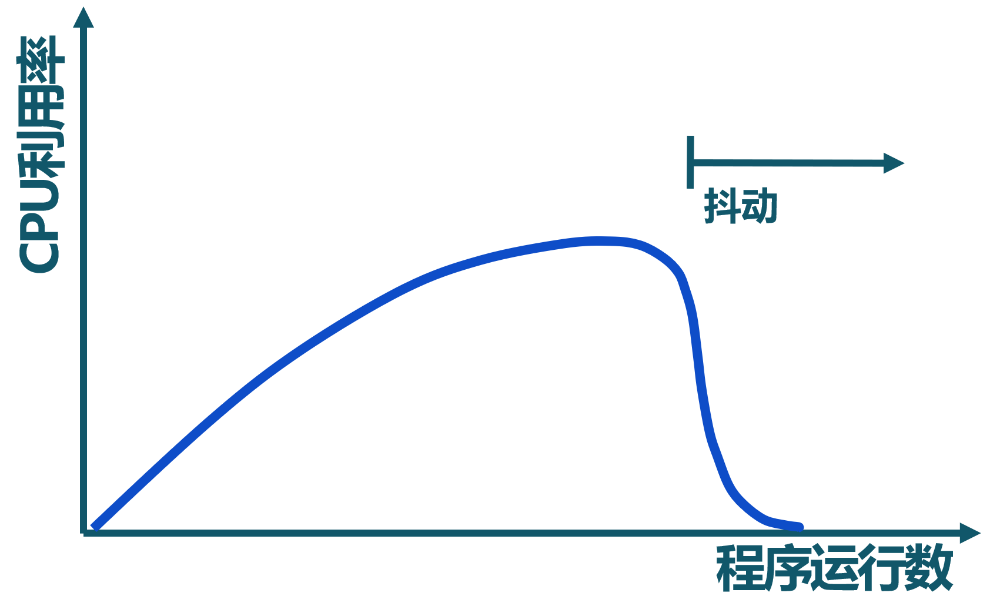
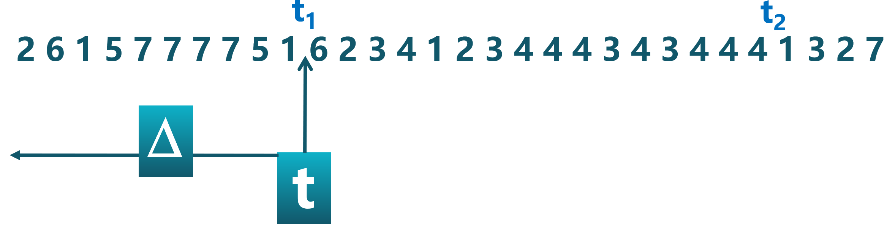
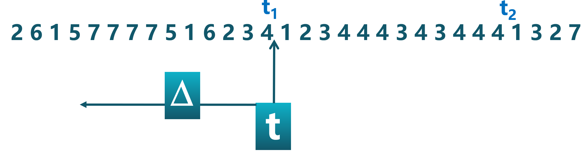
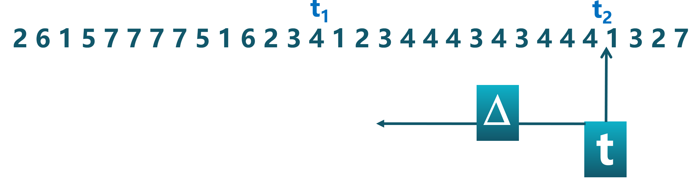
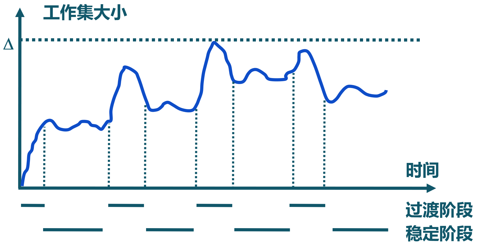
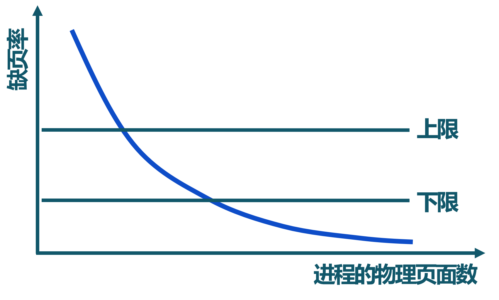

<!-- theme: gaia -->
<!-- _class: lead -->

## 第六讲 地址空间-虚拟存储管理

### 第二节 页面置换算法 -- 全局页面置换算法
- 基本概念
- 局部页面置换算法
- **全局页面置换算法**
  - 工作集置换算法
  - 缺页率置换算法
  - 抖动和负载控制
--- 
### 局部置换算法没有考虑进程访存差异
FIFO 页面置换算法: 假设初始顺序 a->b->c 
物理页面数: 3   缺页次数: 9

--- 
### 局部置换算法没有考虑进程访存差异
FIFO 页面置换算法: 假设初始顺序 a->b->c 
物理页面数: 4   缺页次数: 1

--- 
### 全局置换算法
- 思路
  - 全局置换算法为进程分配可变数目的物理页面
- 全局置换算法要解决的问题
  - 进程在不同阶段的内存需求是变化的
  - 分配给进程的**内存**也需要在**不同阶段有所变化**
  - 全局置换算法需要**确定分配给进程的物理页面数**

---
### CPU利用率与程序运行数量

<!--  -->
 - CPU利用率与程序运行数量存在相互促进和制约的关系
   - 运行程序少时，提高程序运行数，可提高CPU利用率
   - 程序运行数量大导致内存访问增加，并会降低访存的局部性
   - 局部性下降会导致缺页率上升和CPU利用率下降

---
### 工作集
一个进程当前正在使用的逻辑页面集合，可表示为二元函数W(t, $\Delta$)
- t是当前的执行时刻
-  $\Delta$称为工作集窗口（working-set window ），即一个定长的页面访问时间窗口
- $\tau$ 是 $\Delta$工作集窗口的大小（即时间段长度），一般可用当前时刻t 前的内存访问次数来表示
-  W(t, $\Delta$)是指在当前时刻 t 前的$\Delta$时间窗口中的所有访问页面所组成的集合
-  | W(t, $\Delta$) | 指工作集的大小，即页面数目

---
### 进程的工作集示例
页面访问顺序：
W(t, $\Delta$) ={1,2,5,6,7} , 工作集窗口大小 $\tau=10, 当前时刻 t=t_1$ 

---
### 进程的工作集示例
页面访问顺序：
W(t, $\Delta$) ={1,2,3,4,5,6,7} , 工作集窗口大小 $\tau=10, 当前时刻 t=t_1$ 

---
### 进程的工作集示例
页面访问顺序：
W(t, $\Delta$) ={3,4}， 工作集窗口大小 $\tau=10, 当前时刻 t=t_2$ 

---
### 工作集的变化

- 任务开始执行后，随着访问新页面逐步建立较稳定的工作集
- 当内存访问的局部性区域的位置大致稳定时，工作集大小也大致稳定
- 局部性区域的位置改变时，工作集快速扩张和收缩过渡到下一个稳定值

---
### 常驻集
  在当前时刻，进程实际驻留在内存当中的页面集合
- 工作集与常驻集的关系
  - 工作集是进程在运行过程中固有的性质
  - 常驻集取决于系统分配给进程的物理页面数目和页面置换算法
- 缺页率与常驻集的关系 
  - 常驻集  $\supseteq$ 工作集时，缺页较少
  - 工作集发生剧烈变动（过渡）时，缺页较多
  - 进程常驻集大小达到一定数目后，缺页率也不会明显下降

---
### 工作集置换算法
- 思路
   - 换出不在工作集中的页面
- 工作集窗口大小$\tau$
   - 当前时刻前$\tau$次内存访问的页引用是工作集，$\tau$被称为工作集窗口大小

- 实现方法
  - 访存链表：维护窗口内的访存页面链表
  -  访存时，换出不在工作集的页面；更新访存链表
  - 缺页时，换入页面；更新访存链表

---
### 工作集置换算法举例
$\tau=4$

---
### 工作集置换算法举例
$\tau=4$

---
### 工作集置换算法举例
$\tau=4$

---
### 工作集置换算法举例
$\tau=4$

---
### 工作集置换算法举例
$\tau=4$

---
### 工作集置换算法举例
$\tau=4$

---
### 工作集置换算法举例
$\tau=4$

---
### 工作集置换算法举例
$\tau=4$

---
### 工作集置换算法举例
$\tau=4$

---
### 缺页率(Page-Fault-Frequency, Page Fault Rate )
缺页次数 / 内存访问次数 或 缺页平均时间间隔的倒数

- 影响缺页率的因素
  - 页面置换算法
  - 分配给进程的物理页面数目
  - 页面大小
  - 程序的编写方法

---
### 缺页率置换算法

通过调节常驻集大小，使每个进程的缺页率保持在一个合理的范围内
- 若进程缺页率过高，则增加常驻集以分配更多的物理页面
- 若进程缺页率过低，则减少常驻集以减少它的物理页面数

---
### 缺页率置换算法
- 访存时，设置引用位标志
- 缺页时，计算从上次缺页时间$t_{last}$ 到现在$t_{current}$ 的时间间隔
- 如果$t_{current} – t_{last}>T$（容忍的缺页窗口）, 则置换所有在$[t_{last} ,  t_{current} ]$时间内没有被引用的页
- 如果$t_{current} – t_{last} \le T$, 则增加缺失页到常驻集中

---
### 缺页率置换算法举例
假定窗口大小为 2

---
### 缺页率置换算法举例
假定窗口大小为 2

---
### 缺页率置换算法举例
假定窗口大小为 2

---
### 缺页率置换算法举例
假定窗口大小为 2

---
### 缺页率置换算法举例
假定窗口大小为 2

---
### 缺页率置换算法举例
假定窗口大小为 2

---
### 缺页率置换算法举例
假定窗口大小为 2

---
### 缺页率置换算法举例
假定窗口大小为 2

---
### 缺页率置换算法举例
假定窗口大小为 2

---
### 缺页率置换算法举例
假定窗口大小为 2

---
###  抖动问题(thrashing)
- 抖动
  - 进程物理页面太少，不能包含工作集
  - 造成大量缺页，频繁置换
  - 进程运行速度变慢

- 产生抖动的原因
   - 随着驻留内存的进程数目增加，分配给每个进程的物理页面数不断减小，缺页率不断上升
-  操作系统需在并发水平和缺页率之间达到一个平衡
   - 选择一个适当的进程数目和进程需要的物理页面数

---
### 小结
提供容量更大、速度更快的存储空间
- 局部性原理
- 虚拟存储定义
- 虚拟页式存储
- 缺页异常
- 局部页面置换算法
- 全局页面置换算法