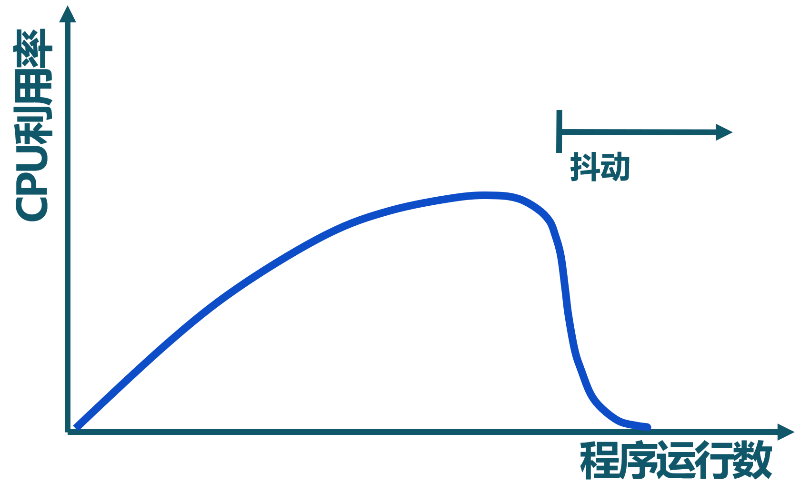
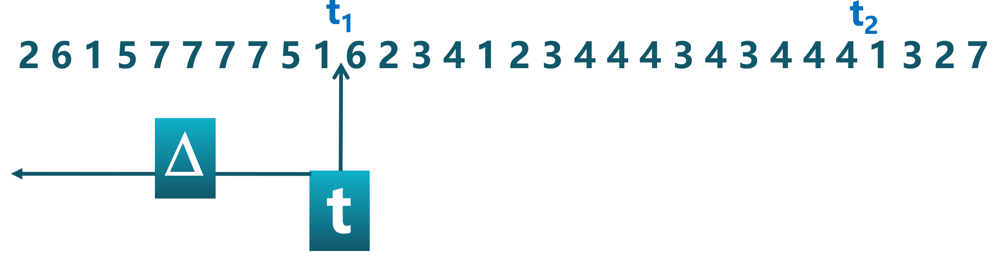
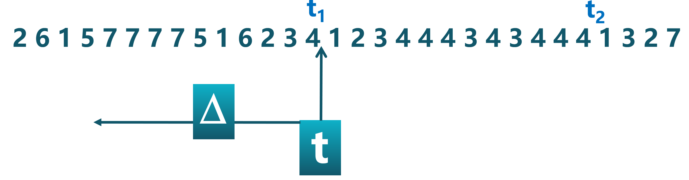
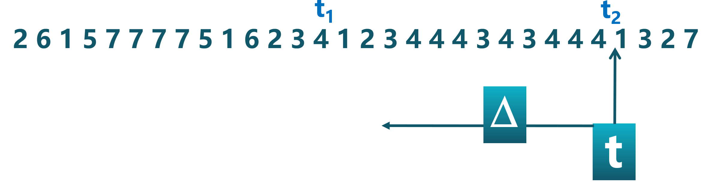
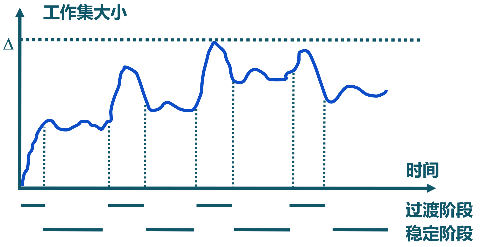
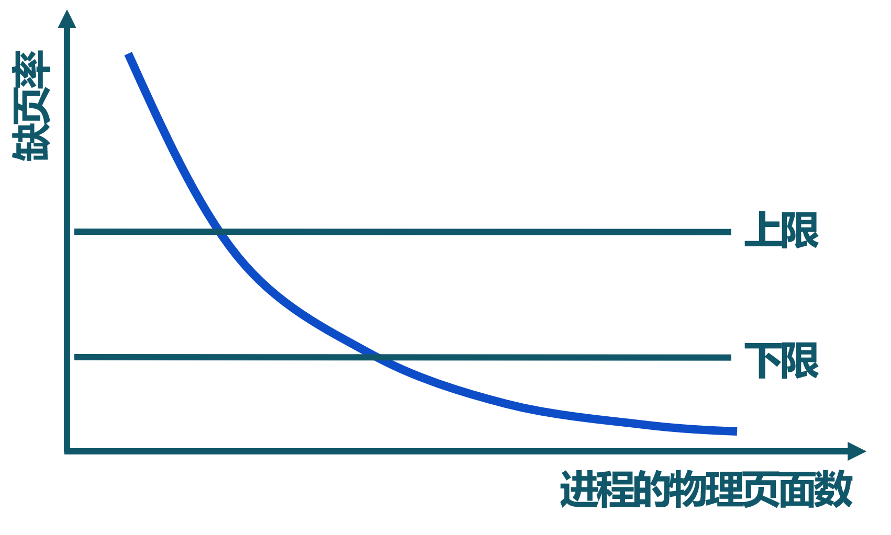

<!-- theme: gaia -->
<!-- _class: lead -->

# 第六讲 虚拟存储管理
## 第三节 全局页面置换算法

 
 

向勇 陈渝 李国良 

2022年秋季

---

**提纲**

### 1. 全局页面置换算法的定义
2. 工作集页面置换算法
3. 缺页率页面置换算法

--- 
#### 局部置换算法没有考虑进程访存差异
FIFO 页面置换算法: 假设初始顺序 a->b->c 
物理页面数: 3   缺页次数: 9

--- 
#### 局部置换算法没有考虑进程访存差异
FIFO 页面置换算法: 假设初始顺序 a->b->c 
物理页面数: 4   缺页次数: 1

--- 
#### 全局置换算法的工作原理
- 思路
  - **为进程分配可变数目的物理页面**
- 全局置换算法要解决的问题
  - 进程在**不同阶段**的内存需求是变化的
  - 分配给进程的**内存**也需要在**不同阶段有所变化**
  - 全局置换算法需要**确定分配给进程的物理页面数**

---
#### CPU利用率与程序运行数量

<!--  -->
 - CPU利用率与程序运行数量存在相互**促进和制约**的关系
   - 运行程序少时，提高程序运行数，可提高CPU利用率
   - 程序运行数量大导致内存访问增加，并会降低访存的局部性
   - 局部性下降会导致缺页率上升和CPU利用率下降

---

**提纲**

1. 全局页面置换算法的定义
### 2. 工作集页面置换算法
3. 缺页率页面置换算法

--- 

#### 工作集
一个进程当前正在使用的逻辑页面集合，可表示为二元函数W(t, $\Delta$)
- 当前执行时刻$t$
- 工作集窗口(working-set window)$\Delta$：一个定长的页面访问时间窗口
- 工作集窗口$\Delta$大小$\tau$
  - 时间段长度，用当前时刻 $t$ 前的**内存访问次数**来表示
- 工作集W(t, $\Delta$)
  - 在当前时刻 $t$ 前的$\Delta$时间窗口中的所有访问页面所组成的集合
- 工作集大小 | W(t, $\Delta$) |：页面数目

---
#### 进程的工作集示例
页面访问顺序：
W(t, $\Delta$) ={1,2,5,6,7} , 工作集窗口大小 $\tau=10, 当前时刻 t=t_1$ 

---
#### 进程的工作集示例

页面访问顺序：
W(t, $\Delta$) ={1,2,3,4,5,6,7} , 工作集窗口大小 $\tau=10, 当前时刻 t=t_1$ 

---
#### 进程的工作集示例
页面访问顺序：
W(t, $\Delta$) ={3,4}， 工作集窗口大小 $\tau=10$，当前时刻 $t=t_2$

---
#### 工作集的变化

- **进程开始执行**后，随着访问新页面逐步建立较稳定的工作集
- 当内存访问的**局部性区域位置大致稳定**时，工作集大小也大致稳定
- **局部性区域位置改变**时，工作集快速扩张和收缩过渡到下一个稳定值

---
#### 常驻集
  在当前时刻，进程**实际驻留内存**中的页面集合
- 工作集与常驻集的关系
  - 工作集是进程在运行过程中的**固有性质**
  - 常驻集**取决于系统**分配给进程的物理页面数目和页面置换算法
- 缺页率与常驻集的关系 
  - 常驻集  $\supseteq$ 工作集时，缺页较少
  - 工作集发生剧烈变动（过渡）时，缺页较多
  - 进程常驻集大小达到一定数目后，缺页率也不会明显下降

---
#### 工作集页面置换算法
- 思路
   - 换出**不在工作集中的**页面
- 工作集窗口大小$\tau$
   - 当前时刻前$\tau$次内存访问的页面集合构成**工作集**

- 实现方法
  - 访存链表：维护窗口内的访存页面链表
  - 访存时，**换出**不在工作集的页面，更新访存链表
  - 缺页时，换入页面，更新访存链表

---

#### 工作集置换算法示例

$\tau=4$

---

#### 工作集置换算法示例

$\tau=4$

---

#### 工作集置换算法示例

$\tau=4$

---

#### 工作集置换算法示例

$\tau=4$

---

#### 工作集置换算法示例

$\tau=4$

---

#### 工作集置换算法示例

$\tau=4$

---

#### 工作集置换算法示例

$\tau=4$

---

#### 工作集置换算法示例

$\tau=4$

---

#### 工作集置换算法示例

$\tau=4$

---

**提纲**

1. 全局页面置换算法的定义
2. 工作集页面置换算法
### 3. 缺页率页面置换算法

--- 

#### 缺页率(Page-Fault-Frequency, Page Fault Rate)

缺页次数 / 内存访问**次数** 或 缺页平均时间**间隔的倒数**

- 影响缺页率的因素
  - 页面置换算法
  - 分配给进程的物理页面数目
  - 页面大小
  - 程序的编写方法

---
#### 缺页率置换算法

通过调节**常驻集大小**，使每个进程的**缺页率**保持在一个合理的范围内
- 若进程缺页率过高，则增加常驻集以分配更多的物理页面
- 若进程缺页率过低，则减少常驻集以减少它的物理页面数

---
#### 缺页率页面置换算法
- 访存时，**设置**引用位标志
- 缺页时，**计算**从上次缺页时间$t_{last}$ 到现在$t_{current}$ 的**时间间隔**
  - 如果 $t_{current} – t_{last}>T$（容忍的缺页窗口），则**置换**所有在$[t_{last} ,  t_{current} ]$时间内没有被引用的页
  - 如果$t_{current} – t_{last} \le T$，则**增加**缺失页到常驻集中

---

#### 缺页率置换算法示例

假定窗口大小为 2

---

#### 缺页率置换算法示例

假定窗口大小为 2

---

#### 缺页率置换算法示例

假定窗口大小为 2

---

#### 缺页率置换算法示例

假定窗口大小为 2

---

#### 缺页率置换算法示例

假定窗口大小为 2

---

#### 缺页率置换算法示例

假定窗口大小为 2

---

#### 缺页率置换算法示例

假定窗口大小为 2

---

#### 缺页率置换算法示例

假定窗口大小为 2

---

#### 缺页率置换算法示例

假定窗口大小为 2

---

#### 缺页率置换算法示例

假定窗口大小为 2

---
####  抖动问题(thrashing)
- 抖动
  - 进程**物理页面太少**，不能包含工作集
  - 造成**大量缺页**，频繁置换
  - 进程**运行速度变慢**

- 产生抖动的原因
   - 随着驻留内存的**进程数目**增加，分配给每个进程的物理页面数不断减小，缺页率不断上升
-  操作系统需**在并发水平和缺页率之间达到一个平衡**
   - 选择一个适当的进程数目和进程需要的物理页面数

---

### 课程实验二

* 第四章：地址空间 -> chapter4练习 -> 
    * [rCore](https://learningos.github.io/rCore-Tutorial-Guide-2022A/chapter4/7exercise.html)
    * [uCore](https://learningos.github.io/uCore-Tutorial-Guide-2022A/chapter4/7exercise.html)
* 实验任务
    * 重写获取系统时间和进程控制块信息的内核函数
    * 实现申请和取消虚存映射的系统调用
* 实验提交要求
    * 任务布置后的第11天（2022年10月30日）；

---

### 第五讲虚拟存储管理小结

* 第一节 虚拟存储概念
    * 需求、覆盖、交换、虚拟存储的概念、缺页异常
* 第二节 局部页面置换算法
    * 页面置换算法的概念、OPT、FIFO、LRU、Clock、改进的时钟页面置换算法、LFU、Belady现象
* 第三节 全局页面置换算法
    * 全局页面置换算法、工作集置换算法、缺页率置换算法
