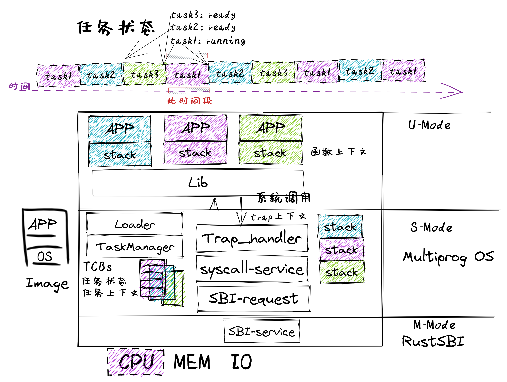
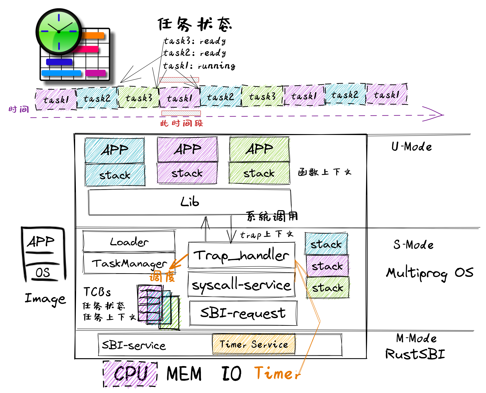
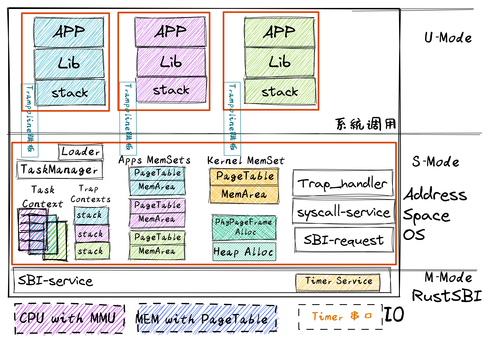

<!-- theme: gaia -->
<!-- _class: lead -->

## 第六讲 地址空间-虚拟存储管理

### 第0节 回顾
- 给应用提供"好"的服务
   - 提高性能、简化开发、加强安全
   - 应用的执行环境持续进化
   - 操作系统功能持续增强
---
### 回顾
- lec1: UNIX/Linux APP 

  - "系统调用"
  - 例子，用C语言，来自UNIX（例如Linux、macOS、FreeBSD）。

            fd = open("out", 1);
            write(fd, "hello\n", 6);
            pid = fork()

---
### 回顾
- lec2: 裸机程序：LibOS             
  - 软硬件启动，函数调用，SBI调用

---
### 回顾
- lec3: 写 Batch OS  
  - 特权级: U-Mode, S-Mode
  - **特权级切换**
  - **陷入上下文**
  - 编译多应用+OS的镜像
  - 加载并执行应用

---
### 回顾
- lec4-1: MultiProg OS  
   - 任务的概念
   - 任务的设计实现
   - **协作**/抢占式调度
   -  **任务上下文** 
   -  **陷入上下文**
   - **切换任务**
   - **切换特权级**
 

---
### 回顾
- lec4-2: TimeSharing OS  
   - **中断**
   - **中断响应**
   - 协作/**抢占式**调度
   -  **陷入上下文**
   -  **任务上下文** 
   - **切换任务**
   - **切换特权级**
 

---
### 回顾 App/OS内存布局
- .text: 数据段
- 已初始化数据段.rodata：只读的全局数据（常数或者是常量字符串）、.data：可修改的全局数据。
- 未初始化数据段 .bss
- 堆 （heap）向高地址增长
- 栈 （stack）向低地址增长

---
### 回顾
- lec5: AddrSpace OS  
- 地址空间
- 物理地址
- 页表
-  **陷入上下文**
-  **任务上下文** 
-  **中断响应**

 

---
### 回顾 App/OS内存布局
- 应用地址空间
- 内核地址空间
- **切换任务**
- **切换特权级**
- **切换页表**
  

---
### 回顾
- lec7: Process OS  
  - Process
    - Trap
    - Task
    - Address Space
    - state
    - relations
    - exit code
 

---
### 回顾
- lec7: Process OS  
  - fork
  - exec
  - exit
  - wait

 

---
### 回顾
- lec7: Process OS  
   - PCB 

