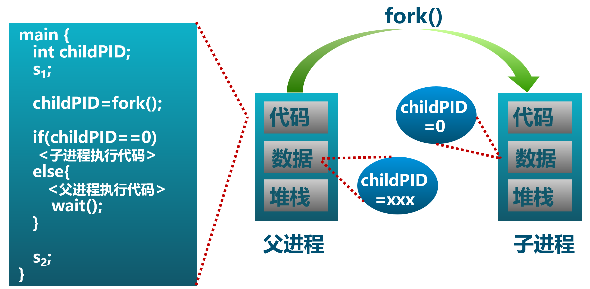
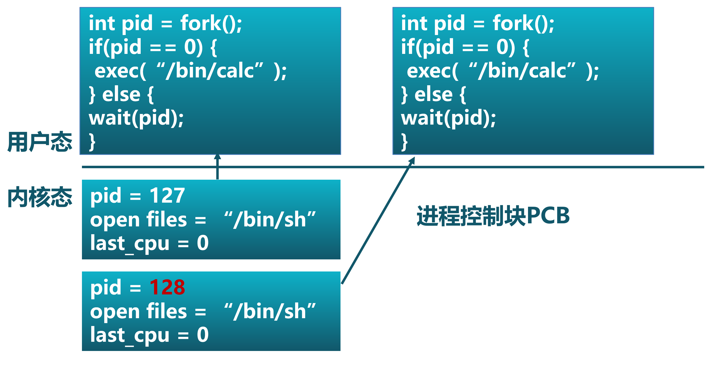
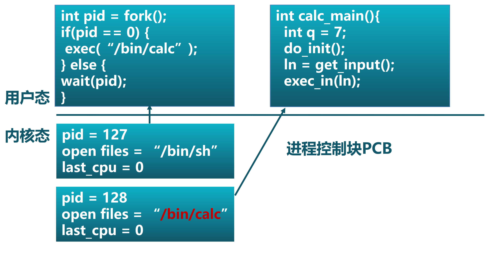
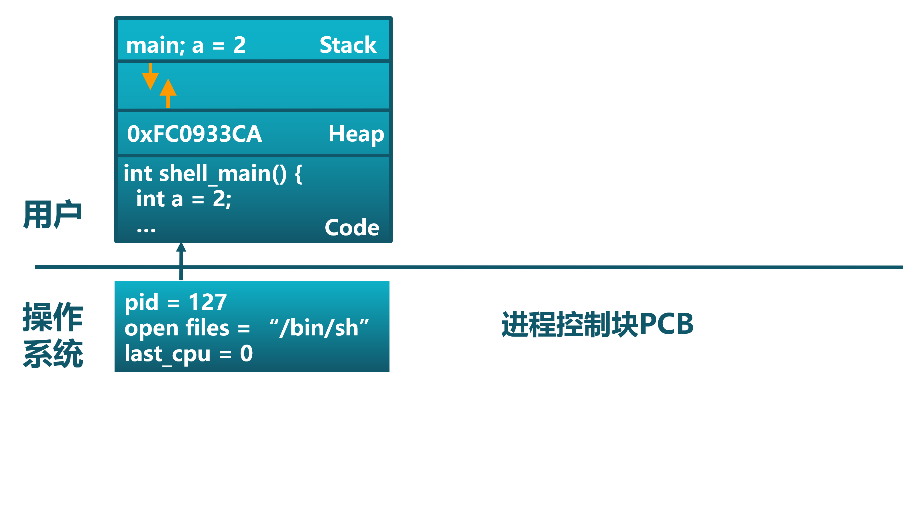
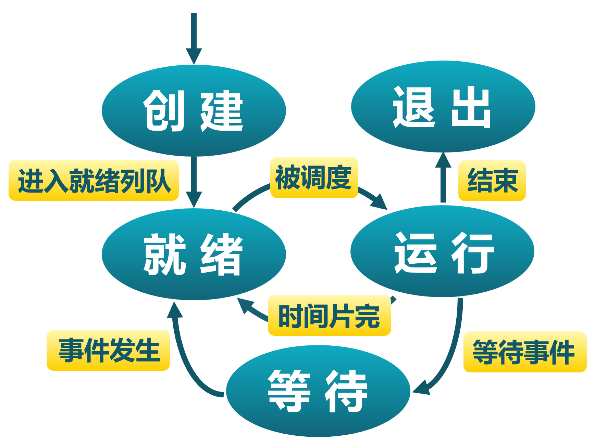
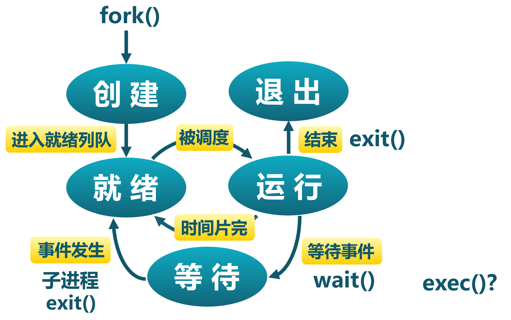
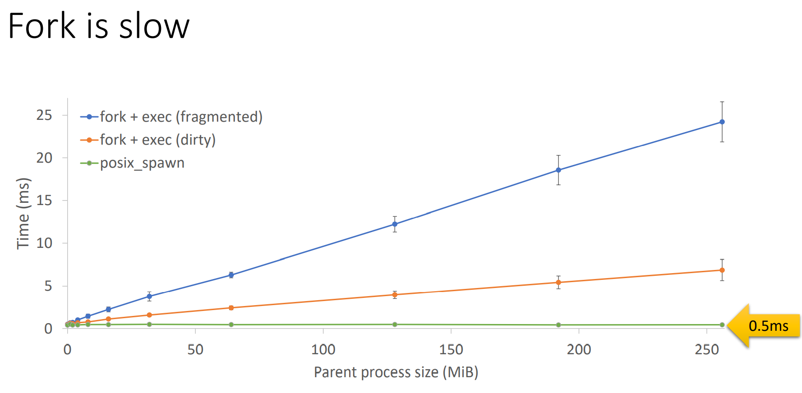

<!-- theme: gaia -->
<!-- _class: lead -->

# 第七讲 进程管理与单处理器调度
## 第一节 进程管理

<br>
<br>

向勇 陈渝 李国良 

2022年秋季

---

**提纲**

### 1. 进程的基本概念
   - 进程管理的需求背景
   - 进程的概念
   - 进程与任务
2. 进程管理
3. 关于Fork()的思考

---

#### 进程管理的需求背景

- 背景
  - **硬件**越来越强大
    - 更快的CPU with MMU/TLB/Cache
    - 更大的内存和外存
    - 更丰富的外设
  - 开发者希望能够在计算机上有更多的**动态交互和控制能力**
  - 使用者需要更**方便**的计算机交互能力
  
- 目标
  - **提高开发效率和执行效率**

---

#### 进程管理的需求背景

- 操作系统需要**与用户交互**的接口/界面
     - **命令行**界面（CLI）
        - 用户通过键盘直接输入命令
        - Shell
     - **图形**界面（GUI）
        - 用户通过鼠标/窗口等输入命令

 


---

#### 进程管理的需求背景

- 用户需要**动态管理和控制应用执行** 
- 在应用的执行过程中，用户通过界面主动给操作系统发出**请求**，来**创建并执行**新的应用程序，**暂停或停止**应用程序的执行等。

 

---

#### 引入进程(Process)概念的目的
  - 清晰地**刻画**操作系统系统中程序运行的动态内在规律
  - 有效**管理和调度**多个程序的执行和对资源的使用

 

---

#### 进程提供给应用程序的抽象

- 从应用角度看，进程提供给应用程序的**关键抽象**
    - 独立的逻辑**控制流**：好像自己的程序独占地使用处理器
    - 私有的**地址空间**：好像自己的程序独占地使用内存系统
  
 

---

#### 从实现角度看进程

从实现角度看，进程是操作系统建立程序运行中的过程管理相关的**数据结构**，以及对数据结构的**动态操作**过程

 


---
#### 从资源角度看进程

- 从资源角度看，进程是程序执行中**占用资源的集合**
  - 共享资源 v.s. 独占资源
  - 处理器、时间
  - 内存、地址空间
  - 文件、I/O、...
  
 

---

#### 什么是进程？

- 简单定义
  - 一个程序的执行**过程**
  - 一个执行中程序的**实例**
- 详细定义：一个具有一定**独立功能**的程序在某**数据集合**上的一次**执行和资源使用的动态过程**
   - 执行程序逻辑并读写数据
   - 创建并执行新进程
   - 使用共享资源：文件等

 

---

#### 任务和进程

从**资源占用**和**执行过程**两个方面分析

相同点：
- 从用户的角度看，任务和进程都表示运行的程序
- 从操作系统的角度看，任务和进程都表示为一个程序的执行过程
- 从资源使用的角度看
    - 二者都能够被操作系统打断并通过切换来分时占用 CPU 资源
    - 都需要地址空间来放置代码和数据

---

#### 任务和进程

从**资源占用**和**执行过程**两个方面分析

相同点：
- 从执行过程的角度看
  - 都有从开始到结束运行这样的**生命周期**
    - 任务生命周期 --> 进程生命周期
    - 任务的三状态模型 --> 进程的三状态模型
    - 任务切换 --> 进程切换
    - 任务上下文  --> 进程上下文


---

#### 任务和进程

从**资源占用**和**执行过程**两个方面分析

不同点：
- 任务 是这里提到的进程的**初级阶段**，不具有如下功能：
  - 进程可以在运行的过程中，创建子进程 、 用新的程序内容覆盖已有的程序内容
  - 进程成为程序执行过程中动态申请/使用/释放各种资源的载体

进程的动态功能可让程序的运行更加灵活。

---

#### 进程是计算机科学中的重要概念

**进程**是计算机科学中最深刻、最成功的概念之一(from CSAPP)
 

---

**提纲**

1. 进程的基本概念
### 2. 进程管理
  - 进程管理系统调用
  - 进程控制块PCB
  - 进程创建和程序加载
  - 进程等待与退出
3. 关于Fork()的思考

---

#### 进程管理系统调用产生背景

- 如何让应用**方便地动态执行其他应用**？
   - process_id = execute(app_name)？
- 如何让应用**了解其启动的其他应用**是否结束？
   - 被启动的其他应用 exit(status)？
   - 发起的主应用 wait(process_id)？

于是各种OS(UNIX/Windows...)都设计出了类似上面的进程管理类的各种**系统调用**

---

#### 进程管理系统调用

| 系统调用名 | 含义 |
| -------------------------- | ------ |
| ``int fork()``           |  **创建**一个进程，返回子进程的PID。    |
| ``int exec(char *file)``   |  **加载**文件并执行；仅当出错时返回。    |
| ``int exit(int status)`` | **终止**自身；报告`status`给执行waitpid()系统调用的父进程。     |
| ``int waitpid(int pid, int *status)``  |  **等待**`pid`子进程退出，得到其 ``*status``退出状态。    |
| ``int getpid()``           |  **获得**当前进程的PID。    |


---

#### 进程管理应用示例：``getpid()``

```rust
// usr/src/bin/hello_world.rs
pub fn main() -> i32 {
    // 显示自己的PID
    println!("pid {}: Hello world from user mode program!", getpid()); 
    0  // 返回的退出码
}
```

---

#### 进程管理应用示例：``fork()``和``exec()``

```rust
// usr/src/bin/forkexec.rs
pub fn main() -> i32 {
    println!("pid {}: parent start forking ...", getpid());
    let pid = fork();  // 创建子进程
    if pid == 0 {
        // 子进程
        println!("pid {}: forked child start execing hello_world app ... ", getpid());
        exec("hello_world");  // 执行hello_world程序
        100
    } else {
        // 父进程
        let mut exit_code: i32 = 0;
        println!("pid {}: ready waiting child ...", getpid());
        assert_eq!(pid, wait(&mut exit_code)); //确认等待的子进程PID
        assert_eq!(exit_code, 0);  //确认退出码是0
        println!("pid {}: got child info:: pid {}, exit code: {}", getpid() , pid, exit_code);
        0
    }
}
```

---

#### 进程管理应用示例：``fork()``和``exec()``

执行结果
```
Rust user shell
>> forkexec
pid 2: parent start forking ...
pid 2: ready waiting child ...
pid 3: forked child start execing hello_world app ...
pid 3: Hello world from user mode program!
pid 2:  got child info:: pid 3, exit code: 0
Shell: Process 2 exited with code 0
>> QEMU: Terminated

```

---

**提纲**

1. 进程的基本概念
2. 进程管理
  - 进程管理系统调用
### 进程控制块PCB
  - 进程创建和程序加载
  - 进程等待与退出
3. 关于Fork()的思考

---

#### 进程控制块PCB


---

#### shell执行用户输入命令

 


---

#### shell执行中的进程控制块


 


---

#### 进程切换

- 进程切换过程
   -   **暂停**当前运行进程，从运行状态变成其他状态
   -   **调度**另一个进程从就绪状态变成运行状态

- 进程切换的要求
  - 切换前，**保存**进程上下文
  - 切换后，**恢复**进程上下文


---

#### 进程生命周期

- 进程切换
   -   暂停当前运行进程，从运行状态变成其他状态
   -   调度另一个进程从就绪状态变成运行状态

- 进程生命周期的信息
  - **寄存器** (PC, SP, …)
  - **CPU状态**
  - **内存地址空间**

 
---

**提纲**

1. 进程的基本概念
2. 进程管理
  - 进程管理系统调用
  - 进程控制块PCB
### 进程创建和程序加载
  - 进程等待与退出
3. 关于Fork()的思考

---

#### Windows进程创建API： ``CreateProcess(filename)``

  - 创建时关闭所有在子进程里的文件描述符                
     -  ``CreateProcess(filename, CLOSE_FD)``
  - 创建时改变子进程的环境
     - ``CreateProcess(filename, CLOSE_FD, new_envp)``
 
---

#### 进程创建/加载

- Unix进程创建/加载系统调用： fork/exec
   - fork()把一个进程复制成两个进程 
      - parent (old PID), child (new PID)
   - exec()用新程序来重写当前进程
      - PID没有改变

  
---

#### 用fork和exec创建进程的示例

```C
int pid = fork()；		// 创建子进程
if(pid == 0) {			// 子进程在这里继续
     // Do anything (unmap memory, close net connections…)
     exec(“program”, argc, argv0, argv1, …);
}
```
- fork() 创建一个继承的子进程
  - **复制**父进程的所有变量和内存
  - **复制**父进程的所有CPU寄存器(有一个寄存器**例外**)
   
 
---

#### 用fork和exec创建进程的示例

```C
int pid = fork()；		// 创建子进程
if(pid == 0) {			// 子进程在这里继续
     // Do anything (unmap memory, close net connections…)
     exec(“program”, argc, argv0, argv1, …);
}
```
- fork()的返回值
  - 子进程的fork()返回0
  - 父进程的fork()返回子进程标识符
  -  fork() 返回值可方便后续使用，子进程可使用getpid()获取PID

---

#### 进程创建``fork()``的执行过程

- 对于子进程而言，fork()是对父进程地址空间的一次复制过程
  

---

#### 程序加载并执行的示例

- 系统调用exec( )加载新程序取代当前运行进程 (代码是否有问题???)
```C
main()
…
int pid = fork();			// 创建子进程
if (pid == 0) {			        // 子进程在这里继续
    exec_status = exec(“calc”, argc, argv0, argv1, …);
    printf(“Why would I execute?”);     // 这行代码能执行到吗???
}  else {				// 父进程在这里继续
    printf(“Whose your daddy?”);
    …
    child_status = wait(pid);
}

```

 
---

#### 程序加载并执行的示例

- 系统调用exec( )加载新程序取代当前运行进程
```C
main()
…
int pid = fork();			// 创建子进程
if (pid == 0) {			        // 子进程在这里继续
    exec_status = exec(“calc”, argc, argv0, argv1, …);
    printf(“Why would I execute?”);
}  else {				// 父进程在这里继续
    printf(“Whose your daddy?”);
    …
    child_status = wait(pid);
}
if (pid < 0) { /* error occurred */
```


 
---

#### 程序加载并执行的过程

在shell中调用fork()后加载计算器

  

 
 
---

#### 程序加载并执行的过程

在shell中调用fork()后加载计算器

  

 
 
---

#### 程序加载并执行的过程

在shell中调用fork()后加载计算器

  

  
---

#### 程序加载并执行的过程

在shell中调用fork()后加载计算器

  

 
 
---

#### 程序加载并执行的过程

在shell中调用fork()后加载计算器

  

 
 
---

#### 程序加载并执行的过程

在shell中调用fork()后加载计算器

  


---

#### 进程管理应用示例：``fork()``

```C
int  main()
{
     pid_t  pid;
      int  i;

      for  (i=0;  i<LOOP;  i++)
      {
           /* fork  another  process  */
           pid = fork();
           if  (pid < 0) { /*error  occurred  */
                fprintf(stderr, “Fork Failed”);
                exit(-1);
           }
           else if (pid == 0) { /* child process */
                fprintf(stdout,  “i=%d,  pid=%d,  parent  pid=%d\n”,I,      
                             getpid() ,getppid());
           }   
      }
      wait(NULL);
      exit(0);
} 

```


 ---

#### 进程管理应用示例：``fork()``

  


---

**提纲**

1. 进程的基本概念
2. 进程管理
  - 进程管理系统调用
  - 进程控制块PCB
  - 进程创建和程序加载
### 进程等待与退出
3. 关于Fork()的思考

---

#### 父进程等待子进程

- wait()系统调用用于父进程等待子进程的结束
  - 子进程结束时通过exit()向父进程返回一个值
  - 父进程通过wait()接受并处理返回值
- wait()系统调用的功能
  - 有子进程存活时，父进程进入等待状态，等待子进程的返回结果
  - 当某子进程调用exit()时，唤醒父进程，将exit()返回值作为父进程中wait的返回值

---

#### 僵尸进程与孤儿进程

- 僵尸进程：已经执行sys_exit系统调用，但还**没有**被父进程通过sys_wait系统调用回收其进程控制块的子进程。
  - 等待僵尸子进程时，wait()立即返回其中一个值
- 孤儿进程：其**父进程先退出**的子进程。
  - 孤儿进程由root进程负责等待并回收

---

#### 进程退出``exit()``

- 进程结束执行时调用exit()，完成进程资源回收
  - exit()系统调用的功能
  - 将调用参数作为进程的“结果”
  - 关闭所有打开的文件等占用资源
  - 释放内存
  - 释放大部分进程相关的内核数据结构
  - 保留结果的值，检查是否父进程存活
    - 如没有存活，设置父进程为Root进程
  - 进入僵尸（zombie/defunct）状态，等待父进程回收

---

#### 进程管理的其他相关系统调用

-  优先级控制
   - nice()指定进程的初始优先级
   - Unix系统中进程优先级会随执行时间而衰减
- 进程调试
   - ptrace()允许一个进程控制另一个进程的执行
   - 设置断点和查看寄存器等
- 定时
   - sleep()可以让进程在定时器的等待队列中等待指定


---

#### 进程管理与进程状态的关系

进程管理相关的系统调用可能会影响进程的状态
  

 
---

#### 进程管理与进程状态的关系

 


 
---

**提纲**

1. 进程的基本概念
2. 进程管理
### 3. 关于Fork()的思考
- Fork()的开销？
- 重新思考fork

---

#### Fork()的开销？

- fork()的实现开销
  - 对子进程分配内存
  - 复制父进程的内存和CPU寄存器到子进程里
  - 开销昂贵!!


---

#### Fork()的开销？

- 在99%的情况里，我们在调用fork()之后调用exec()
  - 在fork()操作中内存复制是没有作用的  --why?
  - 子进程将可能关闭打开的文件和网络连接?  --why?


---

#### Fork()的开销？

- vfork()创建进程时，不再创建一个同样的内存映像
  - 轻量级fork() 
  - 子进程应该几乎立即调用exec()
  - 现在使用 Copy on Write  (COW) 技术
 
---

#### 重新思考fork

[Andrew Baumann,etc.,   A fork() in the road，HotOS 2019](https://www.microsoft.com/en-us/research/publication/a-fork-in-the-road/)

   

---

#### 重新思考fork

    The fork system call is one of Unix's great ideas.
         -- https://cs61.seas.harvard.edu/site/2018/WeensyOS/

- It’s simple: no parameters!
- It’s elegant: fork is orthogonal to exec
- It eased concurrency    


---

#### 重新思考fork

但是！
-  Fork is no longer simple
   - Fork encourages memory overcommit
   - Fork is incompatible with a single address space
   - Fork is incompatible with heterogeneous hardware
   - Fork infects an entire system


---

#### 重新思考fork

但是！
   


---

#### 重新思考fork

   


---

#### 重新思考fork

   


---

#### 重新思考fork

For implementation expedience [Ritchie, 1979]
- fork was 27 lines of PDP-7 assembly
   - One process resident at a time
   - Copy parent’s memory out to swap
   - Continue running child
-  exec didn’t exist – it was part of the shell
   - Would have been more work to combine them  

<!--
https://www.infoq.cn/article/BYGiWI-fxHTNvSohEUNW
 当 Unix 为 PDP-11 计算机（其带有内存转换硬件，允许多个进程保留驻留）重写时，只为了在 exec 中丢弃一个进程就复制进程的全部内存就已经很没效率了。我们怀疑在 Unix 的早期发展阶段，fork 之所以能幸存下来，主要是因为程序和内存都很小（PDP-11 上有只 8 个 8 KiB 页面），内存访问速度相对于指令执行速度较快，而且它提供了一个合理的抽象。这里有两点很重要： -->

---

#### 重新思考fork

结论
- Fork is not an inspired design, but an accident of history
- Only Unix implemented it this way
- We may be stuck with fork for a long time to come
- But, let’s not pretend that it’s still a good idea today!

**Please, stop teaching students that fork is good design**
- Begin with spawn
- Teach fork, but include historical context

---

### 小结

1. 进程的基本概念
2. 进程管理
3. 关于Fork()的思考
- Fork()的开销？
- 重新思考fork