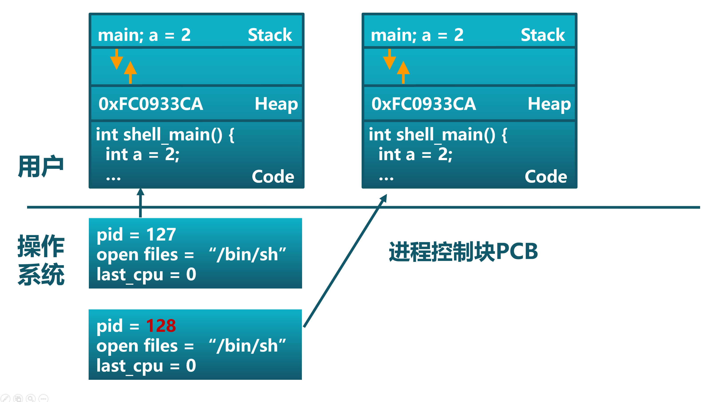
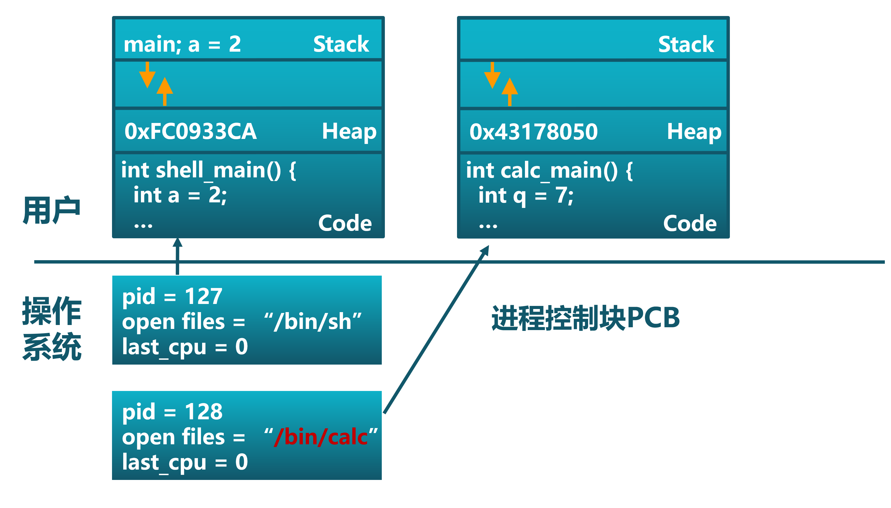
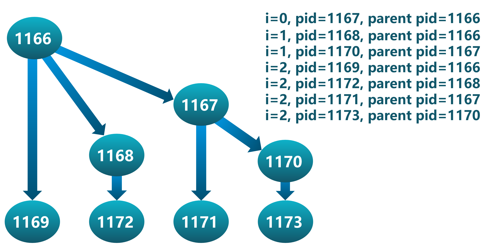

<!-- theme: gaia -->
<!-- _class: lead -->

## 第七讲 进程管理与单处理器调度

### 第一节 进程管理


<br>
<br>

向勇 陈渝 李国良 

<br>
<br>

2022年春季


---
### 第一节 进程管理
- 基本概念
   - 需求背景
   - 定义
- 进程管理
  - 进程切换
  - 进程创建/复制 
  - 程序加载并执行
  - 进程等待与退出
---
### 进程的基本概念 -- 需求背景
- 需求背景
  - 硬件越来越强大
    - 更快的CPU with MMU/TLB/Cache
    - 更大的内存和外存
    - 更丰富的外设
  - 开发者希望能够在计算机上有更多的动态交互和控制能力
  - 使用者需要更方便的计算机交互能力
  
- 目标
  - **提高开发效率 执行效率**


---
### 进程的基本概念 -- 需求背景
- 操作系统需要有一个与用户交互的接口/界面
  - OS Shell 
     - 命令行界面
        - 许用户直接输入命令，以供操作系统执行 
     - 图形界面
        - 允许用户通过图形用户界面（GUI）与操作系统交互 

---
### 进程的基本概念 -- 需求背景
- 需求
   - 用户能对应用的执行进行动态地管理和控制 
   - 在应用的执行过程中，用户通过界面主动给操作系统发出请求，来创建并执行新的应用程序，暂停或停止应用程序的执行等。

---
### 进程的基本概念 -- 定义

为什么引入**进程（Process）**的概念？
- 从理论角度看，是对程序运行过程的抽象描述；
- 从实现角度看，是一种数据结构，目的在于清晰地刻画操作系统系统的动态内在规律，有效管理和调度多个程序的执行和对资源的使用。

- **资源**
  - 共享资源 v.s. 独占资源
  - 处理器、时间
  - 内存、地址空间
  - 文件、I/O、...
  - 
---
### 进程的基本概念 -- 定义
什么是进程？
- 简单定义：一个程序的执行过程
- 详细定义：一个具有一定独立功能的程序在某数据集合上的一次执行和资源使用的动态过程。
   - 执行程序逻辑并读写数据
   - 创建并执行新进程
   - 使用共享资源：文件等

---
### 进程的基本概念 -- 定义
任务和进程的关系与区别
这需要从二者对资源的占用和执行的过程这两个方面来进行分析

相同点：站在一般用户和应用程序的角度看，任务和进程都表示运行的程序。站在操作系统的角度看，任务和进程都表示为一个程序的执行过程。二者都能够被操作系统打断并通过切换来分时占用 CPU 资源；都需要 地址空间 来放置代码和数据；都有从开始到结束运行这样的生命周期。
  

---
### 进程的基本概念 -- 定义
任务和进程的关系与区别
这需要从二者对资源的占用和执行的过程这两个方面来进行分析

相同点：二者都能够被操作系统打断并通过切换来分时占用 CPU 资源；都需要 地址空间 来放置代码和数据；都有从开始到结束运行这样的生命周期。
- 任务生命周期 --> 进程生命周期
- 任务的三状态模型 --> 进程的三状态模型
- 任务切换 --> 进程切换
- 任务上下文  --> 进程上下文


---
### 进程的基本概念 -- 定义
任务和进程的关系与区别
这需要从二者对资源的占用和执行的过程这两个方面来进行分析

不同点：任务 是这里提到的 进程 的初级阶段，任务还没进化到拥有更强大的动态变化功能：进程可以在运行的过程中，创建 子进程 、 用新的 程序 内容覆盖已有的 程序 内容。这种动态变化的功能可让程序在运行过程中动态使用更多的物理或虚拟的 资源 。

- 增加进程管理功能，以对进程用到的硬件/虚拟资源进行动态绑定和解绑 。


---
### 进程管理

- 进程切换
- 进程创建/复制
- 程序加载并执行
- 进程等待与退出


---
### 进程管理  -- 进程切换

- 进程切换
   -   暂停当前运行进程，从运行状态变成其他状态
   -   调度另一个进程从就绪状态变成运行状态

- 进程切换的要求
  - 切换前，保存进程上下文
  - 切换后，恢复进程上下文


---
### 进程管理  -- 进程切换
- 进程切换
   -   暂停当前运行进程，从运行状态变成其他状态
   -   调度另一个进程从就绪状态变成运行状态

- 进程生命周期的信息
  - 寄存器 (PC, SP, …)
  - CPU状态
  - 内存地址空间

 
---
### 进程管理 -- 进程创建/复制
- Windows进程创建API： CreateProcess(filename)
  - 创建时关闭所有在子进程里的文件描述符                
     -  ``CreateProcess(filename, CLOSE_FD)``
  - 创建时改变子进程的环境
     - ``CreateProcess(filename, CLOSE_FD, new_envp)``
 
---
### 进程管理 -- 进程创建/复制
- Unix进程创建/复制系统调用： fork/exec
   - fork()把一个进程复制成二个进程 
      - parent (old PID), child (new PID)
   - exec()用新程序来重写当前进程
      - PID没有改变

 
---
### 进程管理 -- 进程创建/复制
用fork和exec创建进程的示例
```
int pid = fork()；		// 创建子进程
if(pid == 0) {			// 子进程在这里继续
     // Do anything (unmap memory, close net connections…)
     exec(“program”, argc, argv0, argv1, …);
}
```
- fork() 创建一个继承的子进程
  - 复制父进程的所有变量和内存
  - 复制父进程的所有CPU寄存器(有一个寄存器例外)
   
 
---
### 进程管理 -- 进程创建/复制
用fork和exec创建进程的示例
```
int pid = fork()；		// 创建子进程
if(pid == 0) {			// 子进程在这里继续
     // Do anything (unmap memory, close net connections…)
     exec(“program”, argc, argv0, argv1, …);
}
```
- fork()的返回值
  - 子进程的fork()返回0
  - 父进程的fork()返回子进程标识符
  -  fork() 返回值可方便后续使用，子进程可使用getpid()获取PID


---
### 进程管理 -- 进程创建/复制
- fork()执行过程对于子进程而言，是对父进程地址空间的一次复制过程
  

 
---
### 进程管理 -- 程序加载并执行
- 系统调用exec( )加载新程序取代当前运行进程
```
main()
…
int pid = fork();			// 创建子进程
if (pid == 0) {			// 子进程在这里继续
    exec_status = exec(“calc”, argc, argv0, argv1, …);
    printf(“Why would I execute?”);
}  else {				// 父进程在这里继续
    printf(“Whose your daddy?”);
    …
    child_status = wait(pid);
}

```

 
---
### 进程管理 -- 程序加载并执行
- 系统调用exec( )加载新程序取代当前运行进程
```
main()
…
int pid = fork();			// 创建子进程
if (pid == 0) {			// 子进程在这里继续
    exec_status = exec(“calc”, argc, argv0, argv1, …);
    printf(“Why would I execute?”);
}  else {				// 父进程在这里继续
    printf(“Whose your daddy?”);
    …
    child_status = wait(pid);
}
if (pid < 0) { /* error occurred */
```


 
---
### 进程管理 -- 程序加载并执行
在shell中调用fork()后加载计算器的图示

  

 
 
---
### 进程管理 -- 程序加载并执行
在shell中调用fork()后加载计算器的图示

  

 
 
---
### 进程管理 -- 程序加载并执行
在shell中调用fork()后加载计算器的图示

  

  
---
### 进程管理 -- 程序加载并执行
在shell中调用fork()后加载计算器的图示

  

 
 
---
### 进程管理 -- 程序加载并执行
在shell中调用fork()后加载计算器的图示

  

 
 
---
### 进程管理 -- 程序加载并执行
在shell中调用fork()后加载计算器的图示

  


 ---
### 进程管理 -- fork()使用示例
```C
int  main()
{
     pid_t  pid;
      int  i;

      for  (i=0;  i<LOOP;  i++)
      {
           /* fork  another  process  */
           pid = fork();
           if  (pid < 0) { /*error  occurred  */
                fprintf(stderr, “Fork Failed”);
                exit(-1);
           }
           else if (pid == 0) { /* child process */
                fprintf(stdout,  “i=%d,  pid=%d,  parent  pid=%d\n”,I,      
                             getpid() ,getppid());
           }   
      }
      wait(NULL);
      exit(0);
} 

```


 ---
### 进程管理 -- fork()使用示例
  


 ---
### 进程管理 -- Fork()的开销？
- fork()的实现开销
  - 对子进程分配内存
  - 复制父进程的内存和CPU寄存器到子进程里
  - 开销昂贵!!


 ---
### 进程管理 -- Fork()的开销？
- 在99%的情况里，我们在调用fork()之后调用exec()
  - 在fork()操作中内存复制是没有作用的
  - 子进程将可能关闭打开的文件和连接
  - 子进程将可能关闭打开的文件和连接


 ---
### 进程管理 -- Fork()的开销？
- vfork()
  - 创建进程时，不再创建一个同样的内存映像
  - 一些时候称为轻量级fork() 
  - 子进程应该几乎立即调用exec()
  - 现在使用 Copy on Write  (COW) 技术

---
### 进程管理 -- 进程等待与退出 -- 父进程等待子进程
- wait()系统调用用于父进程等待子进程的结束
  - 子进程结束时通过exit()向父进程返回一个值
  - 父进程通过wait()接受并处理返回值
- wait()系统调用的功能
  - 有子进程存活时，父进程进入等待状态，等待子进程的返回结果
    - 当某子进程调用exit()时,唤醒父进程，将exit()返回值作为父进程中wait的返回值
- 有僵尸子进程等待时，wait()立即返回其中一个值
- 无子进程存活时，wait()立刻返回


---
### 进程管理 -- 进程等待与退出 -- 进程退出 exit() 
- 进程结束执行时调用exit()，完成进程资源回收
  - exit()系统调用的功能
  - 将调用参数作为进程的“结果”
  - 关闭所有打开的文件等占用资源
  - 释放内存
  - 释放大部分进程相关的内核数据结构
  - 保留结果的值，检查是否父进程存活
    - 如没有存活，设置父进程为Root进程
  - 进入僵尸（zombie/defunct）状态，等待父进程回收

---
### 进程管理 -- 其他进程控制
-  优先级控制
   - nice()指定进程的初始优先级
   - Unix系统中进程优先级会随执行时间而衰减
- 进程调试支持
   - ptrace()允许一个进程控制另一个进程的执行
   - 设置断点和查看寄存器等
- 定时
   - sleep()可以让进程在定时器的等待队列中等待指定


---
### 进程控制  v.s. 进程状态 

  

 
---
### 进程控制  v.s. 进程状态 

  