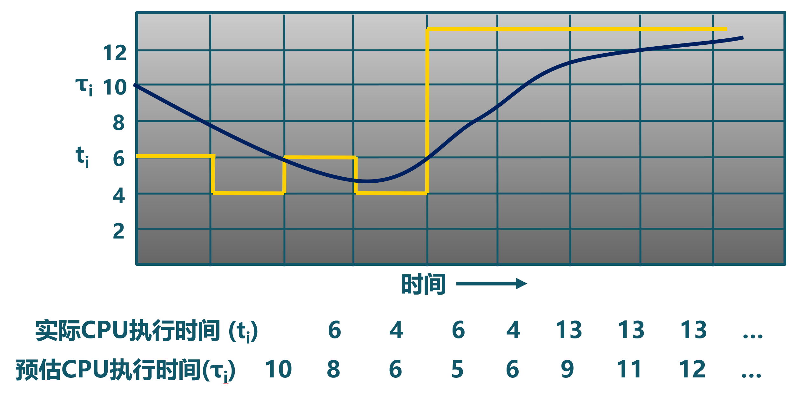
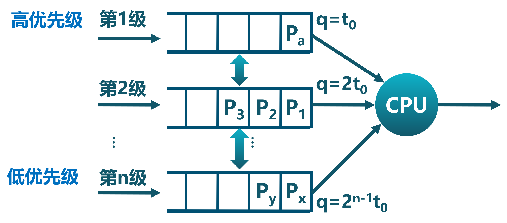
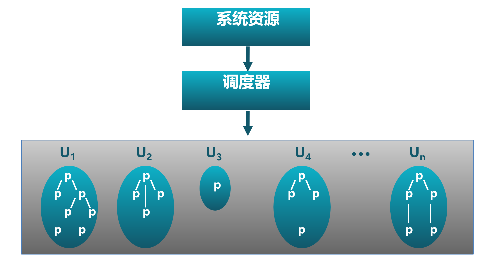

<!-- theme: gaia -->
<!-- _class: lead -->

## 第七讲 进程管理与单处理器调度

### 第二节 处理器调度

---
### 第二节 处理器调度
- 处理机调度概念
  - 处理机调度
  - 调度时机
- 调度策略
- 调度算法
- 实时调度
  - 优先级反转

---
### 处理机调度概念 -- CPU资源的时分复用

- 进程切换：CPU资源的当前占用者切换
  - 保存当前进程在PCB中的执行上下文(CPU状态)
  - 恢复下一个进程的执行上下文

- 处理机调度
   - 从就绪队列中挑选下一个占用CPU运行的进程
   - 从多个可用CPU中挑选就绪进程可使用的CPU资源
- 调度程序：挑选就绪进程的内核函数
   - 调度策略
    -   依据什么原则挑选进程？

---
### 处理机调度概念 -- CPU资源的时分复用 -- 调度时机
- 在进程/线程的生命周期中的什么时候进行调度？
- 内核执行调度的条件
   - 进程从运行状态切换到等待/就绪状态
   - 进程被终结了
- 非抢占系统
  - 当前进程主动放弃CPU时
- 可抢占系统
  - 中断请求被服务例程响应完成时

---
### 调度策略
调度策略：确定如何从就绪队列中选择下一个执行进程
- 要解决的问题
   - 挑选就绪队列中的哪一个进程？
   - 通过什么样的准则来选择？
- 调度算法
   - 在内核调度中实现的调度策略
-  比较调度算法的准则
   - 哪一个策略/算法较好?
 
---
### 处理机资源的使用模式
- 进程在CPU计算和I/O操作间交替
   - 每次调度决定在下一个CPU计算时将哪个工作交给CPU
   - 在时间片机制下，进程可能在结束当前CPU计算前被迫放弃CPU

  

 
---
### 比较调度算法的准则
- CPU使用率 : CPU处于忙状态的时间百分比
- 吞吐量：单位时间内完成的进程数量
- 周转时间：进程从初始化到结束(包括等待)的总时间
- 就绪等待时间：就绪进程在就绪队列中的总时间
- 响应时间：从提交请求到产生响应所花费的总时间
- 公平：进程占用相同的资源：CPU时间等

 
---
### 比较调度算法的准则 -- 吞吐量与延迟
- 调度算法的要求：   希望“更快”的服务
- 什么是更快？
  - 传输文件时的高带宽，调度算法的高吞吐量
  - 玩游戏时的低延迟，调度算法的低响应延迟
  - 这两个因素相互影响
- 与水管的类比
  - 低延迟：喝水的时候想要一打开水龙头水就流出来
  - 高带宽：给游泳池充水时希望从水龙头里同时流出大量的水，并且不介意是否存在延迟

 
---
### 比较调度算法的准则 -- 响应时间
- 减少响应时间
  - 及时处理用户的输入请求，尽快将输出反馈给用户
- 减少平均响应时间的波动
  - 在交互系统中，可预测性比高差异低平均更重要
- 低延迟调度改善了用户的交互体验
  - 如果移动鼠标时，屏幕中的光标没动，用户可能会重启电脑
- 响应时间是操作系统的计算延迟

 
---
### 比较调度算法的准则 -- 吞吐量
- 增加吞吐量
   - 减少开销（操作系统开销，上下文切换）
   - 系统资源的高效利用（CPU，I/O设备）
- 减少就绪等待时间
   - 减少每个就绪进程的等待时间
- 操作系统需要保证吞吐量不受用户交互的影响
  - 即使存在许多交互任务
- 吞吐量是操作系统的计算带宽

 
---
### 比较调度算法的准则 -- 公平
    一个用户比其他用户运行更多的进程时，公平吗？怎么办？
- 公平的定义
  - 保证每个进程占用相同的CPU时间
  - 保证每个进程的就绪等待时间相同
- 公平通常会增加平均响应时间

 
---
### 调度算法
- 先来先服务算法
- 短作业优先算法
- 最高响应比优先算法
- 时间片轮转算法
- 多级反馈队列算法
- 公平共享调度算法

---
### 调度算法 -- 先来先服务算法
FCFS: First Come, First Served
- 依据进程进入就绪状态的先后顺序排列
- 进程进入等待或结束状态时，就绪队列中的下一个进程占用CPU
- 指标：FCFS算法的周转时间
  
---
### 调度算法 -- 先来先服务算法
FCFS: First Come, First Served
  - 示例：3个进程，计算时间分别为12,3,3
  

   
---
### 调度算法 -- 先来先服务算法
- 优点：简单
- 缺点
  - 平均等待时间波动较大
  - 短进程可能排在长进程后面
  - I/O资源和CPU资源的利用率较低
     - CPU密集型进程会导致I/O设备闲置时，
I/O密集型进程也等待
  
---
### 调度算法 -- 短作业优先算法
Short Job First
- 选择就绪队列中执行时间最短进程占用CPU进入运行状态
- 就绪队列按预期的执行时间来排序

  

 ---
### 调度算法 -- 短作业优先算法
具有最优平均周转时间
修改进程执行顺序可能减少平均等待时间吗?
  

 ---
### 调度算法 -- 短作业优先算法 
- 可能导致饥饿
  - 连续的短进程流会使长进程无法获得CPU资源

- 需要预知未来
  - 如何预估下一个CPU计算的持续时间？
  - 简单的解决办法：询问用户
     - 用户欺骗就杀死相应进程
     - 用户不知道怎么办？

 ---
### 调度算法 -- 短作业优先算法 
- 执行时间预估
  - 用历史的执行时间来预估未来的执行时间
 $\tau_{n+1} = \alpha t_n+(1-\alpha) \tau_n，其中 0\le \alpha \le 1$
$t_n$ -- 第n次的CPU计算时间
$\tau_n+1$ -- 第n+1次的CPU计算时间预估

 $\tau_{n+1} = \alpha t_n+(1-\alpha) \alpha t_{n-1} + (1-\alpha)  (1-\alpha) \alpha t_{n-2} + ...$

---
### 调度算法 -- 短作业优先算法 
- 执行时间预估
  

---
### 调度算法 -- 最高响应比优先算法
HRRN -- Highest Response Ratio Next

- 选择就绪队列中响应比R值最高的进程

$Ｒ＝（ｗ+s)/s$   
        w: 就绪等待时间(waiting time)
         s: 执行时间(service time)
- 在短进程优先算法的基础上改进
- 关注进程的等待时间
- 防止无限期推迟

---
### 调度算法 -- 时间片轮转算法
RR -- Round-Robin
- 时间片
  - 分配处理机资源的基本时间单元
- 算法思路
  -  时间片结束时，按FCFS算法切换到下一个就绪进程
  -  每隔(n – 1)个时间片进程执行一个时间片q
  

 ---
### 调度算法 -- 时间片轮转算法

  

---
### 调度算法 -- 时间片轮转算法 -- 时间片长度

- RR算法开销： 额外的上下文切换
- 时间片太大
  - 等待时间过长，极限情况退化成FCFS
- 时间片太小
  - 反应迅速，但产生大量上下文切换
  - 大量上下文切换开销影响到系统吞吐量
- 时间片长度选择目标
  - 选择一个合适的时间片长度
  - 经验规则：维持上下文切换开销处于1%以内

---
### 调度算法 -- 时间片轮转算法
比较FCFS和RR
  

---
### 调度算法 -- 多级队列调度算法
MQ -- MultiQueue
- 就绪队列被划分成多个独立的子队列
   - 如：前台(交互)、后台(批处理)
- 每个队列拥有自己的调度策略
   - 如：前台–RR、后台–FCFS

---
### 调度算法 -- 多级队列调度算法
MQ -- MultiQueue
- 队列间的调度
  - 固定优先级
    - 先处理前台，然后处理后台
    - 可能导致饥饿
  - 时间片轮转
    - 每个队列都得到一个确定的能够调度其进程的CPU总时间
    - 如：80%CPU时间用于前台，20%CPU时间用于后台

---
### 调度算法 -- 多级反馈队列调度算法
MLFQ -- Multi-Level Feedback Queue
- 进程可在不同队列间移动的多级队列算法
   - 时间片大小随优先级级别增加而增加
   - 如进程在当前的时间片没有完成，则降到下一个优先级
  

 

---
### 调度算法 -- 多级反馈队列调度算法
MLFQ -- Multi-Level Feedback Queue
- MLFQ算法的特征
   - CPU密集型进程的优先级下降很快
   - I/O密集型进程停留在高优先级
  

 
---
### 调度算法 -- 公平共享调度算法
FSS -- Fair Share Scheduling
- FSS控制用户对系统资源的访问
   - 一些用户组比其他用户组更重要
   - 保证不重要的组无法垄断资源
   - 未使用的资源按比例分配
   - 没有达到资源使用率目标的组获得更高的优先级
  

  
---
### 调度算法小结
- 先来先服务算法
   - 不公平，平均等待时间较差 
- 短作业优先算法
   - 不公平，平均周转时间最小
   - 需要精确预测计算时间
   - 可能导致饥饿

  
---
### 调度算法小结
- 最高响应比优先算法
   -  基于SPN调度，不可抢占
- 时间片轮转算法
   - 公平，但是平均等待时间较差 
- 多级反馈队列算法
   - 多种算法的集成 
- 公平共享调度算法
   - 公平是第一要素
 