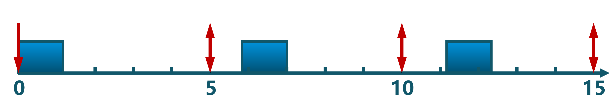
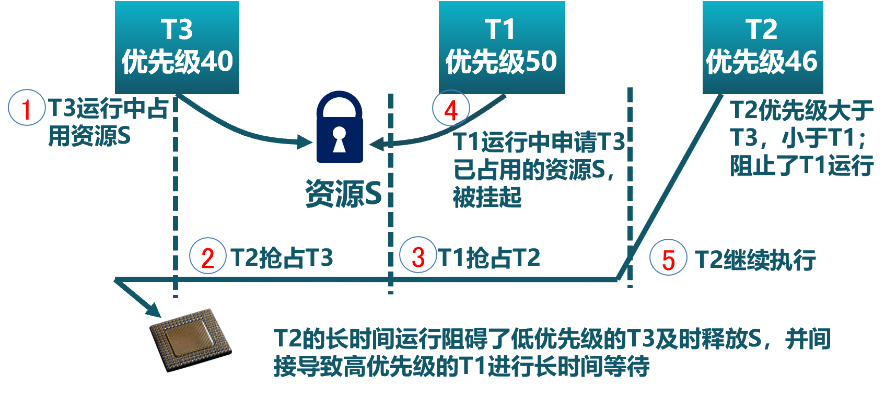
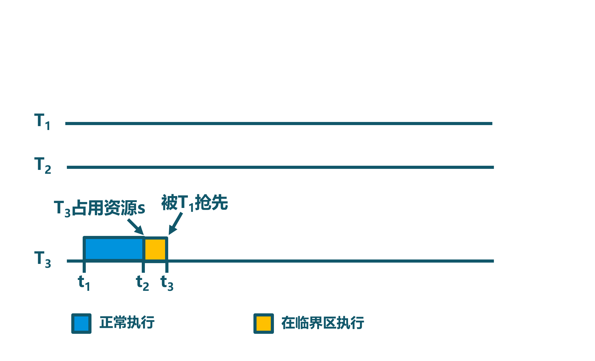
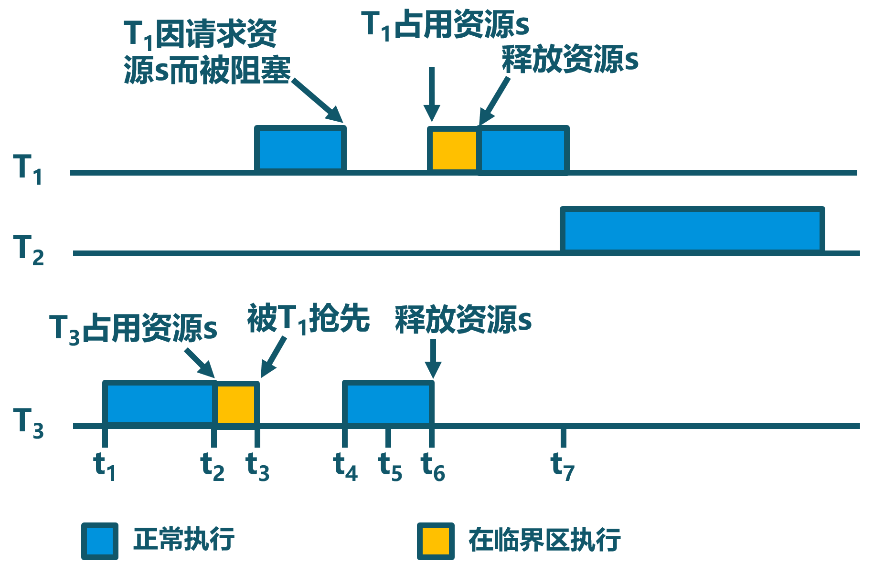

<!-- theme: gaia -->
<!-- _class: lead -->

## 第七讲 进程管理与单处理器调度

### 第三节 实时管理与调度

---
### 实时操作系统
- 实时操作系统的定义
  - 正确性依赖于其时间和功能两方面的操作系统
- 实时操作系统的性能指标
   - 时间约束的及时性（deadlines）
   - 速度和平均性能相对不重要
- 实时操作系统的特性
  - 时间约束的可预测性

---
### 实时操作系统
- 强/硬实时操作系统
   - 要求在指定的时间内必须完成重要的任务
- 弱/软实时操作系统
  - 重要进程有高优先级，要求尽量但非必须完成

---
### 实时任务
- 任务（工作单元）
  - 一次计算，一次文件读取，一次信息传递等等
- 任务属性
  - 完成任务所需要的资源
  - 定时参数

---
### 周期实时任务
- 周期实时任务：一系列相似的任务
  - 任务有规律地重复
  - 周期p = 任务请求时间间隔 (0 <p)
  - 执行时间e = 最大执行时间(0 < e < p)
  - 使用率U = e/p

---
### 软时限和硬时限
- 硬时限（Hard deadline）
  - 错过任务时限会导致灾难性或非常严重的后果
  - 必须验证，在最坏情况下能够满足时限
- 软时限(Soft deadline)
  - 通常能满足任务时限
  - 如有时不能满足，则降低要求
  - 尽力保证满足任务时限

---
###  可调度性
- 可调度表示一个实时操作系统能够满足任务时限要求
   - 需要确定实时任务的执行顺序
   - **静态**优先级调度：任务执行过程中不会改变任务的优先级
   - **动态**优先级调度：任务执行过程中会改变任务的优先级

---
###  实时调度
- **静态**优先级调度：速率单调调度算法(RM, Rate Monotonic) 
  - 通过周期安排优先级
  - 周期越短优先级越高
  - 执行周期最短的任务

- **动态**优先级调度：最早截止时间优先算法 (EDF, Earliest Deadline First) 
  - 截止时间越早优先级越高
  - 执行离截止时间最近的任务

如果任务间有**共享资源占用**的情况，高优先级任务可能会被延误执行！

---
###  优先级反置(Priority Inversion)
优先级反置：高优先级进程长时间等待低优先级进程所占用资源的现象
- 基于优先级的可抢占调度算法存在优先级反置问题
优先级：T1>T2>T3

---
###  优先级继承（Priority Inheritance)
- 占用资源的低优先级进程继承申请资源的高优先级进程的优先级
- 只在占有资源的低优先级进程被阻塞时,才提高占有资源进程的优先级

---
###  优先级继承（Priority Inheritance)
- 占用资源的低优先级进程继承申请资源的高优先级进程的优先级
- 只在占有资源的低优先级进程被阻塞时,才提高占有资源进程的优先级

---
###  优先级继承（Priority Inheritance)
- 占用资源的低优先级进程继承申请资源的高优先级进程的优先级
- 只在占有资源的低优先级进程被阻塞时,才提高占有资源进程的优先级

---
###  优先级继承（Priority Inheritance)
- 占用资源的低优先级进程继承申请资源的高优先级进程的优先级
- 只在占有资源的低优先级进程被阻塞时,才提高占有资源进程的优先级

---
###  优先级继承（Priority Inheritance)
- 占用资源的低优先级进程继承申请资源的高优先级进程的优先级
- 只在占有资源的低优先级进程被阻塞时,才提高占有资源进程的优先级

---
###  优先级继承（Priority Inheritance)
- 占用资源的低优先级进程继承申请资源的高优先级进程的优先级
- 只在占有资源的低优先级进程被阻塞时,才提高占有资源进程的优先级

---
### 优先级天花板协议（priority ceiling protocol）
- 占用资源进程的优先级和所有可能申请该资源的进程的最高优先级相同
  - 不管是否发生等待,都提升占用资源进程的优先级
  - 优先级高于系统中所有被锁定的资源的优先级上限，任务执行临界区时就不会被阻塞
