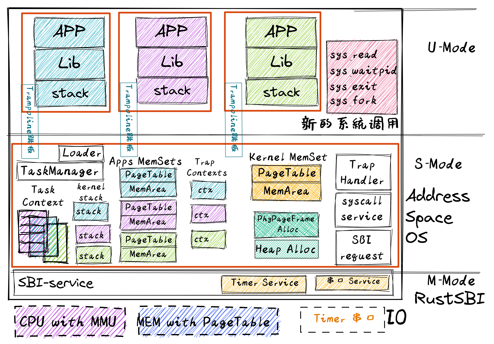
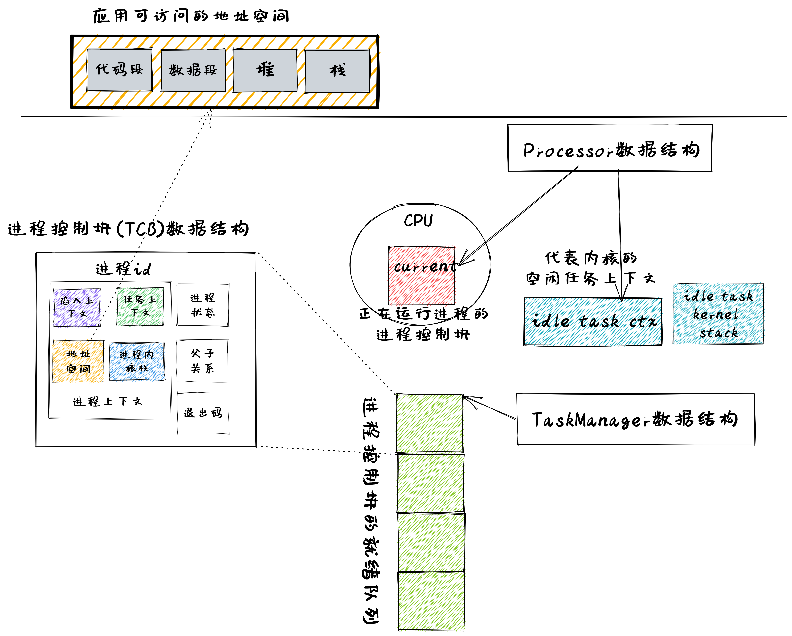

<!-- theme: gaia -->
<!-- _class: lead -->

# 第七讲 进程管理与单处理器调度
### 第四节 实践：支持进程的操作系统

Process OS(POS)

<br>
<br>

向勇 陈渝 李国良 

2022年秋季

---

**提纲**

### 1. 实验目标和步骤
- 实验目标
- 实践步骤
2. 代码结构
3. 应用程序设计
4. 内核程序设计



---

#### 以往目标

提高性能、简化开发、加强安全
- Address Space OS
    - APP不用考虑运行时的起始执行地址，隔离APP访问的地址空间
- multiprog & time-sharing
    - 让APP有效共享CPU，提高系统总体性能和效率
- BatchOS: 让APP与OS隔离，加强系统安全，提高执行效率
- LibOS: 让APP与HW隔离，简化应用访问硬件的难度和复杂性

---

#### 实验目标

增强进程管理和资源管理、提高性能、简化开发、加强安全

- 整合之前的特权级、地址空间、任务，形成进程
- 进程成为资源的拥有者
- 扩展进程动态特征，能够在应用层面发出如下系统调用请求：
   - 动态创建子进程
   - 动态构造新进程
   - 子进程退出/父进程等待子进程退出

---

#### 实验要求

- 理解进程概念
- 理解进程的动态管理机制的设计与实现
- 初步认识进程调度
- 掌握shell应用的编写与使用
- 会写支持进程的操作系统

<!-- 智商最高的白垩纪“伤齿龙” 操作系统 troodon -->


---

#### 总体思路


---

#### 总体思路



---

#### 总体思路

- 编译：应用程序和内核独立编译，合并为一个镜像
- 编译：不同应用程序可采用统一的起始地址
- 构造：系统调用服务，**进程的管理与初始化**
- 构造：建立基于页表机制的虚存空间
- 运行：特权级切换，进程与OS相互切换
- 运行：切换地址空间，跨地址空间访问数据


---
#### 历史背景
- 1965：描述未来的 MULTICS 操作系统
  - MIT 的 Fernando J. Corbató 教授牵头
  - 参与单位：MIT, GE(通用电气公司), AT&T Bell Labs
  - 提出了**进程的动态管理思想**，启发和造就了UNIX
- 1971：Thompson shell 
  - 由Ken Thompson写的第一个**UNIX Shell**
  - 按照极简主义设计，语法非常简单，是一个简单的命令行解释器
  - 它的许多特征影响了以后的操作系统命令行界面的发展
---

#### 实践步骤
```
git clone https://github.com/rcore-os/rCore-Tutorial-v3.git
cd rCore-Tutorial-v3
git checkout ch5
cd os
make run
```

---
#### 实践步骤
```
[RustSBI output]
...
yield
**************/
Rust user shell
>>
```
操作系统启动``shell``后，用户可以在``shell``中通过敲入应用名字来执行应用。


---

#### 软件架构

- 管理进程
    - 创建
    - 回收
    - fork
    - exec
  


---

**提纲**

1. 实验目标和步骤
### 2. 代码结构
3. 应用程序设计
4. 内核程序设计


---

#### 改进OS
```
├── os
    ├── build.rs(修改：基于应用名的应用构建器)
    └── src
         ├── loader.rs(修改：基于应用名的应用加载器)
         ├── main.rs(修改)
         ├── mm(修改：为了支持本章的系统调用对此模块做若干增强)
```

---

#### 改进OS
```
├── os
    └── src
         ├── syscall
             ├──fs.rs(修改：新增 sys_read)
             ├── mod.rs(修改：新的系统调用的分发处理)
             └── process.rs（修改：新增 sys_getpid/fork/exec/waitpid）
         ├── task
             ├── manager.rs(新增：任务管理器，为上一章任务管理器功能的一部分)
             ├── mod.rs(修改：调整原来的接口实现以支持进程)
             ├── pid.rs(新增：进程标识符和内核栈的 Rust 抽象)
             ├── processor.rs(新增：处理器管理结构 ``Processor`` ，为上一章任务管理器功能的一部分)
             └── task.rs(修改：支持进程管理机制的任务控制块)
         └── trap
              ├── mod.rs(修改：对于系统调用的实现进行修改以支持进程系统调用)
```


---

**提纲**

1. 实验目标和步骤
2. 代码结构
### 3. 应用程序设计
4. 内核程序设计


---

#### 理解进程

- 应用角度
    - **进程** 是正在执行的应用
  
- OS角度
    -  **进程** 是应用在其地址空间上的一次执行过程
       - 进程拥有资源，操作系统根据进程的执行状态管理其资源 


---

#### 进程管理系统调用

```
/// 功能：当前进程 fork 出来一个子进程。
/// 返回值：对于子进程返回 0，对于当前进程则返回子进程的 PID
/// syscall ID：220
pub fn sys_fork() -> isize;
```
```
/// 功能：将当前进程的地址空间清空并加载一个特定的可执行文件，返回用户态后开始它的执行。
/// 参数：path 给出了要加载的可执行文件的名字；
/// 返回值：如果出错的话（如找不到名字相符的可执行文件）则返回 -1，否则不应该返回。
/// syscall ID：221
pub fn sys_exec(path: &str) -> isize;
```
<!--  -->


---

#### 进程管理系统调用

```
/// 功能：当前进程等待一个子进程变为僵尸进程，回收其全部资源并收集其返回值。
/// 参数：pid 表示要等待的子进程的进程 ID，如果为 -1 的话表示等待任意一个子进程；
/// exit_code 表示保存子进程返回值的地址，如果这个地址为 0 的话表示不必保存。
/// 返回值：如果要等待的子进程不存在则返回 -1；否则如果要等待的子进程均未结束则返回 -2；
/// 否则返回结束的子进程的进程 ID。
/// syscall ID：260
pub fn sys_waitpid(pid: isize, exit_code: *mut i32) -> isize;
```


---

#### 应用``shell``的执行流程
1. 通过``sys_read``获取字符串（即文件名）
2. 通过``sys_fork``创建子进程
3. 在子进程中通过``sys_exec``创建新应用的进程
4. 在父进程中通过``sys_waitpid``等待子进程结束
5. 跳转到第一步循环执行

---

**提纲**

1. 实验目标和步骤
2. 代码结构
3. 应用程序设计
### 4. 内核程序设计
- 应用的链接与加载支持
- 核心数据结构
- 进程管理机制实现


---

#### 应用的链接与加载支持

在编译操作系统的过程中，会生成如下的 link_app.S 文件
```
 3 _num_app:
 4     .quad 15            #应用程序个数
 7 ......
 9 _app_names:             #app0的名字
10     .string "exit"          
12 ......
17 app_0_start:            #app0的开始位置
18     .incbin "../user/target/riscv64gc-unknown-none-elf/release/exit"
19 app_0_end:              #app0的结束位置
```


---

#### 基于应用名的应用加载

在加载器 loader.rs 中，分析 link_app.S 中的内容，并用一个全局可见的 **只读** 向量 ``APP_NAMES`` 来按照顺序将所有应用的名字保存在内存中，为通过 exec 系统调用创建新进程做好了前期准备。


---

**提纲**

1. 实验目标和步骤
2. 代码结构
3. 应用程序设计
4. 内核程序设计
- 应用的链接与加载支持
### 核心数据结构
- 进程管理机制实现


---

#### 核心数据结构间的关系


---

#### 进程控制块TCB

进程抽象的对应实现是进程控制块 -- TCB  ``TaskControlBlock``
```rust
pub struct TaskControlBlock {
    // immutable
    pub pid: PidHandle,                      // 进程id
    pub kernel_stack: KernelStack,           // 进程内核栈
    // mutable
    inner: UPSafeCell<TaskControlBlockInner>,//进程内部管理信息
}
```


---

#### 进程控制块TCB

进程抽象的对应实现是进程控制块 -- TCB  ``TaskControlBlock``
```rust
pub struct TaskControlBlockInner {
    pub trap_cx_ppn: PhysPageNum,               // 陷入上下文页的物理页号
    pub base_size: usize,                       // 进程的用户栈顶
    pub task_cx: TaskContext,                   // 进程上下文
    pub task_status: TaskStatus,                // 进程执行状态  
    pub memory_set: MemorySet,                  // 进程地址空间
    pub parent: Option<Weak<TaskControlBlock>>, // 父进程控制块
    pub children: Vec<Arc<TaskControlBlock>>,   // 子进程任务控制块组
    pub exit_code: i32,                         // 退出码
}
```

---

#### 进程管理器``TaskManager``

- 任务管理器自身仅负责管理所有就绪的进程

```rust
pub struct TaskManager {
    ready_queue: VecDeque<Arc<TaskControlBlock>>,  // 就绪态任务控制块的链表
}
```

---

#### 处理器管理结构

处理器管理结构 ``Processor`` 描述CPU 执行状态
```rust
pub struct Processor {
    current: Option<Arc<TaskControlBlock>>, // 在当前处理器上正在执行的任务
    idle_task_cx: TaskContext,              // 空闲任务
}
```
- 负责从任务管理器 `TaskManager` 中分出去的维护 CPU 状态的职责
- 维护在一个处理器上正在执行的任务，可以查看它的信息或是对它进行替换
- `Processor` 有一个 idle 控制流，功能是尝试从任务管理器中选出一个任务来在当前 CPU 核上执行，有自己的CPU启动内核栈上


---

**提纲**

1. 实验目标和步骤
2. 代码结构
3. 应用程序设计
4. 内核程序设计
- 应用的链接与加载支持
- 核心数据结构
### 进程管理机制实现


---

#### 进程管理机制实现概述

1. 创建初始进程：创建第一个用户态进程 `initproc`
2. 进程生成机制：介绍进程相关的系统调用 `sys_fork`/`sys_exec` 
3. 进程调度机制：进程主动/被动切换
4. 进程资源回收机制：调用` sys_exit` 退出或进程终止后保存其退出码
5. 进程资源回收机制：父进程通过 `sys_waitpid` 收集该进程的信息并回收其资源
6. 字符输入机制：通过`sys_read` 系统调用获得字符输入


---

#### 创建初始进程

```rust
lazy_static! {
    pub static ref INITPROC: Arc<TaskControlBlock> = Arc::new(
        TaskControlBlock::new(get_app_data_by_name("initproc").unwrap()));
}
pub fn add_initproc() {
    add_task(INITPROC.clone());
}
```
- `TaskControlBlock::new` 会解析`initproc`的ELF执行文件格式，并建立应用的地址空间、内核栈等，形成一个就绪的进程控制块
- `add_task`会把进程控制块加入就绪队列中


---

#### 创建新进程`fork()`

复制父进程内容并构造新的进程控制块

```rust
pub fn fork(self: &Arc<TaskControlBlock>) -> Arc<TaskControlBlock> {...}
```
-  建立新页表，复制父进程地址空间的内容
-  创建新的陷入上下文
-  创建新的应用内核栈
-  创建任务上下文
-  建立父子关系
-  设置`0`为`fork`返回码

---

#### 加载新应用`exec()`

用新应用的 ELF 可执行文件中的代码和数据替换原有的应用地址空间中的内容

```rust
pub fn exec(&self, elf_data: &[u8]) {...}
```
- 回收已有应用地址空间，基于ELF 文件的全新的地址空间直接替换已有应用地址空间
- 修改进程控制块的 Trap 上下文，将解析得到的应用入口点、用户栈位置以及一些内核的信息进行初始化


---

#### 进程调度机制

暂停当前任务并切换到下一个任务

- 时机
   - `sys_yield`系统调用时
   - 进程的时间片用完时
- 操作
   - 执行`suspend_current_and_run_next` 函数
      - 取出当前正在执行的任务，修改其状态，放入就绪队列队尾
      - 接着调用 schedule 函数来触发调度并切换任务

---

#### 进程资源回收机制

进程退出`exit_current_and_run_next` 
- 当前进程控制块从``PROCESSOR``中取出，修改其为僵尸进程
- 退出码 `exit_code `写入进程控制块中
- 把所有子进程挂到`initproc`的子进程集合中
- 释放应用地址空间
- 接着调用 schedule 函数来触发调度并切换任务


---

#### 进程资源回收机制

等待子进程退出`sys_waitpid`

- 不存在进程 ID 为 pid（pid==-1 或 > 0）的子进程时，返回 -1
- 存在进程 ID 为 pid 的僵尸子进程时，正常回收子进程，返回子进程pid，更新退出码参数为 exit_code 
- 子进程还没退出时，返回 -2，用户库看到是 -2 后，就进一步调用 sys_yield 系统调用，让父进程进入等待状态
- 返回前，释放子进程的进程控制块

---

#### 字符输入机制

```rust
pub fn sys_read(fd: usize, buf: *const u8, len: usize) -> isize {
   c=sbi::console_getchar(); ...}
  
```
- 目前仅支持每次只能读入一个字符
- 调用 sbi 子模块提供的从键盘获取输入的接口 `console_getchar` 

---
#### 支持进程的操作系统POS
- 进程概念与进程实现的关系
- 进程管理机制
- 基本调度机制
- 能写伤齿龙OS


---

### 小结

**提纲**

1. 实验目标和步骤
2. 代码结构
3. 应用程序设计
4. 内核程序设计
- 应用的链接与加载支持
- 核心数据结构
- 进程管理机制实现


