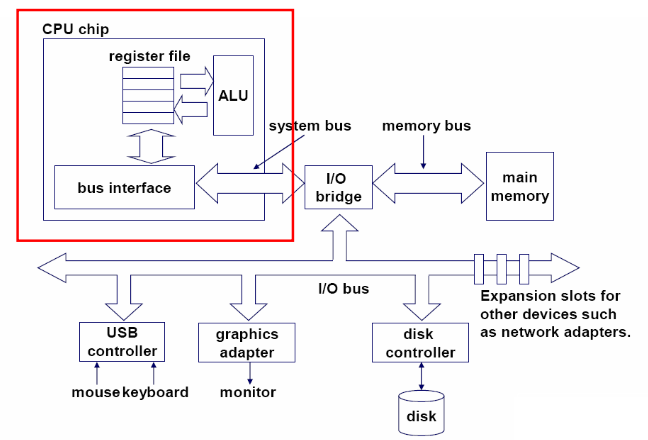
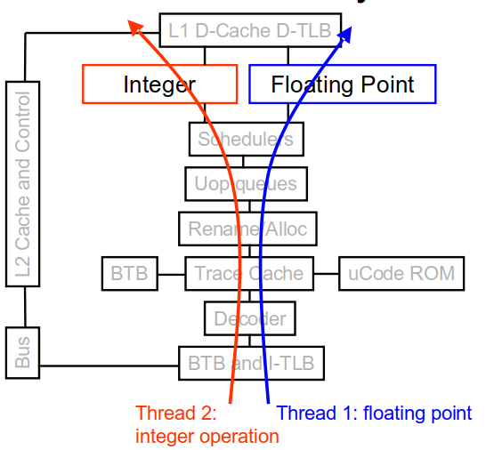
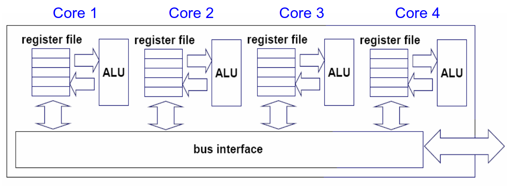
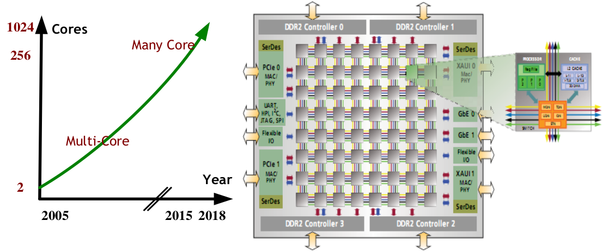
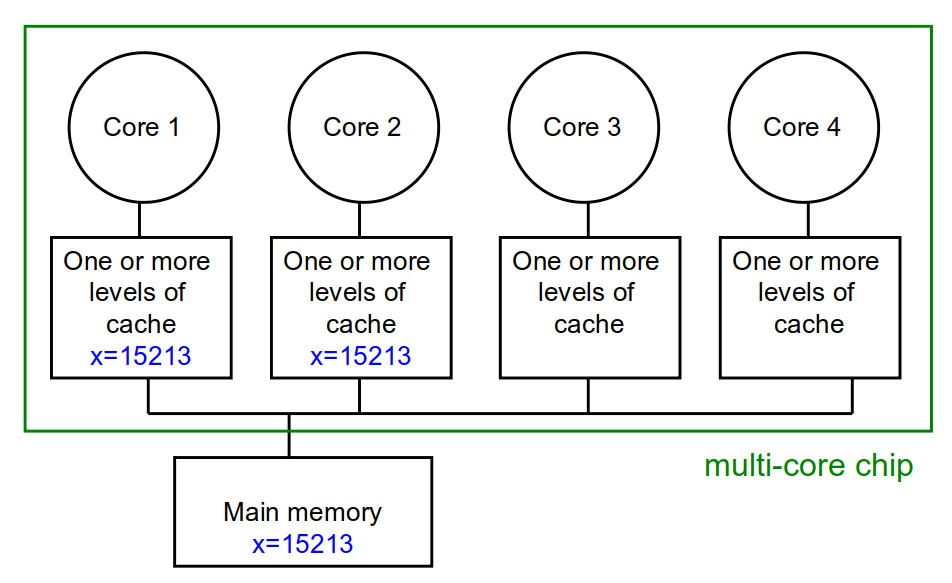

<!-- theme: gaia -->
<!-- _class: lead -->

# 第八讲 多处理器调度
## 第一节 对称多处理与多核架构

 
 

向勇 陈渝 李国良 任炬 

2024年春季

[课程幻灯片列表](https://www.yuque.com/xyong-9fuoz/qczol5/ewvhdy3epbwbkn3n)

---

**提纲**

### 1. 多处理机器
2. Cache一致性(Cache Coherence)

---

#### 单核处理器
 

---

#### 超线程(Hyperthread, Simultaneous multithreading)处理器
- 将CPU内部暂时闲置处理资源充分调动起来
  - 寄存器、程序计数器独立
  - 算术计算单元等硬件共用
  - 不适合计算密集型任务
  - 适合IO密集型任务

 

---

#### 多核(multi-core)处理器
 

---

#### 众核(many-core)处理器
 

---

**提纲**

1. 多处理机器
### 2. Cache一致性(Cache Coherence)

---

#### 对称多处理器(SMP)与非一致内存访问系统(NUMA)
 

---

#### Cache 一致性 (Cache Coherence)
 

---

#### Cache 一致性问题
