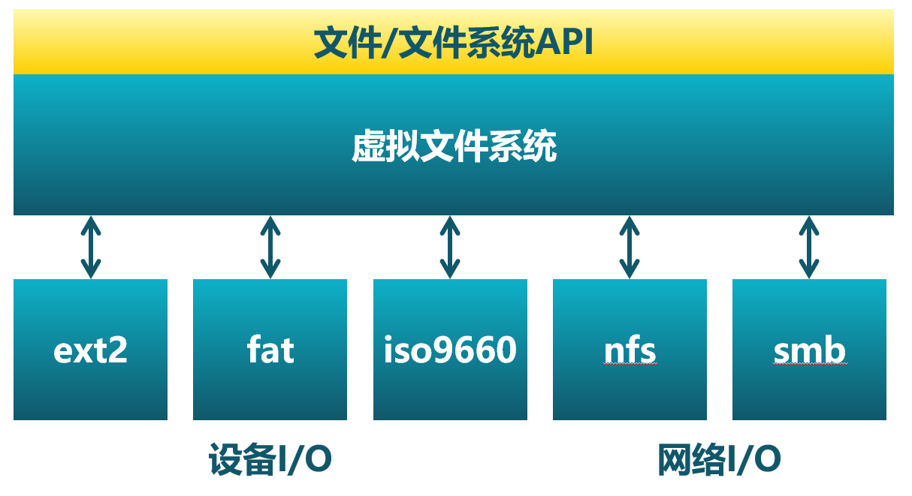
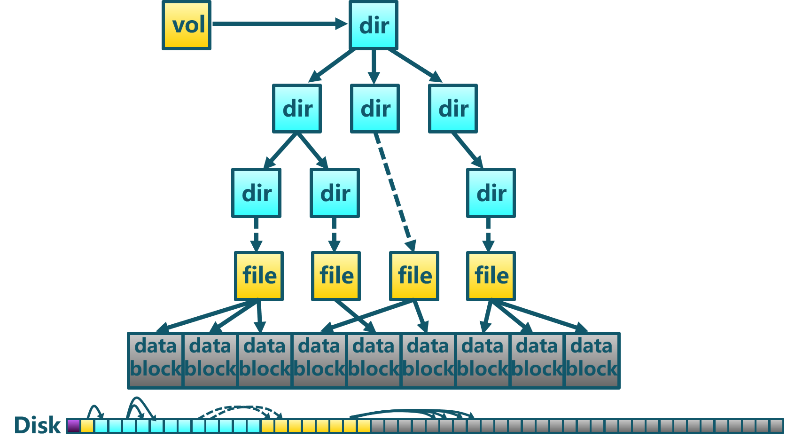
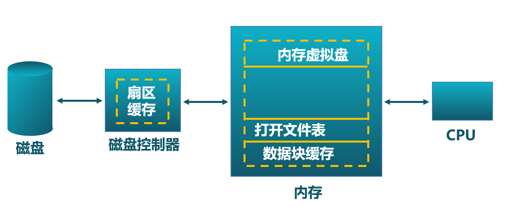
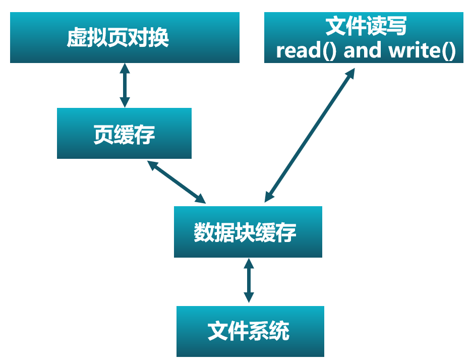
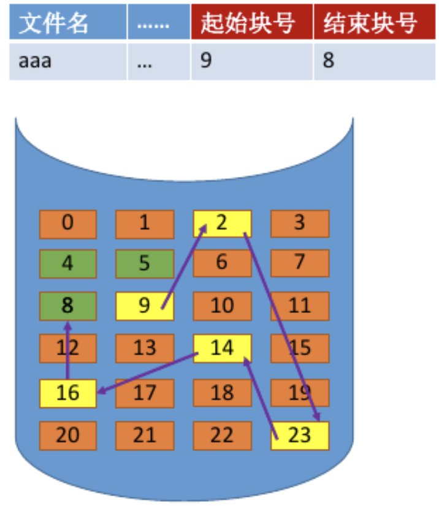
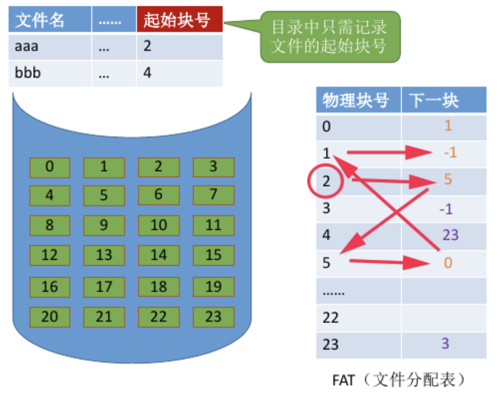
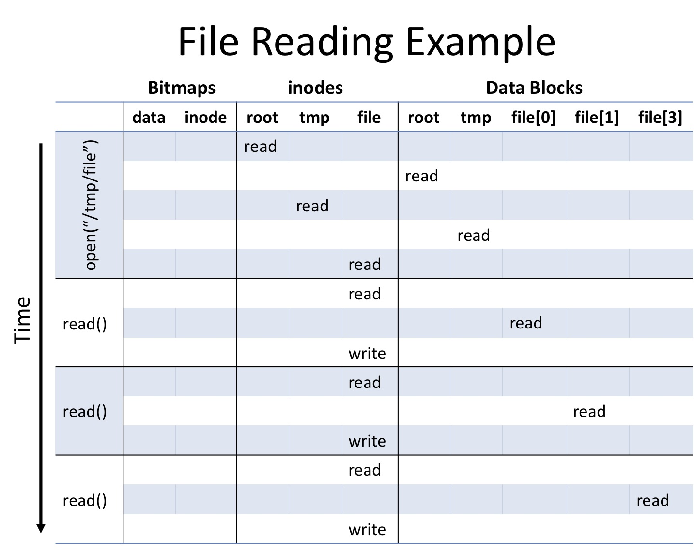

<!-- theme: gaia -->
<!-- _class: lead -->

# 第八讲 文件系统

## 第二节 文件系统的设计与实现

 
 

向勇 陈渝 李国良 任炬 

2023年春季

---

**提纲**

### 1. 概述
2. 文件系统的基本数据结构
3. 文件缓存
4. 文件分配
5. 文件访问过程示例

--- 
#### 文件系统在内核中的位置

---

#### 文件系统的分层结构

---
#### 文件系统在计算机系统中的分层结构

---

#### 文件系统的用户视图与内核视图

---

#### 虚拟文件系统

（Virtual File System，VFS）

- 定义了一组所有文件系统都支持的数据结构和标准接口。
- 磁盘的文件系统：直接把数据存储在磁盘中，比如 Ext 2/3/4、XFS。
- 内存的文件系统：内存辅助数据结构 - 例如目录项。

--- 
#### 虚拟文件系统的功能
- 目的：对所有不同文件系统的抽象
- 功能
  - 提供相同的文件和文件系统接口
  - 管理所有文件和文件系统关联的数据结构
  - 高效查询例程, 遍历文件系统
  - 与特定文件系统模块的交互

--- 
#### 虚拟文件系统统一不同文件系统的访问接口

--- 

**提纲**

1. 概述
### 2. 文件系统的基本数据结构
3. 文件缓存
4. 文件分配
5. 文件访问过程示例

--- 

#### 文件系统的存储视图
- 文件卷控制块 (`superblock`)
- 文件控制块( `inode`/`vnode`)
- 目录项 (`dir_entry`)
- 数据块（`data block`）

--- 

#### 文件系统的组织视图

---

#### 文件系统基本数据结构 

--- 
#### 文件卷控制块 (`superblock`)

每个文件系统一个文件卷控制块
- 文件系统详细信息
- 块大小、空余块数量等
- block 与inode 的总量，未使用与已使用的数量
- filesystem的挂载时间、最近一次写入时间、最近一次检验磁盘(fsck) 时间

--- 
#### 文件控制块inode
每个文件有一个文件控制块inode (`inode`/`vnode`)
  - 大小、数据块位置（指向一个或多个datablock）
  - 访问模式(read/write/excute)
  - 拥有者与群组(owner/group)
  - 时间信息：建立或状态改变的时间、最近读取时间/修改的时间
  - **文件名在目录的datablock中**
<!---->

--- 
#### bitmap块
bitmap块( `bitmap inode/dnode`) 
- inode使用或者未使用标志位
- dnode使用或者未使用标志位

--- 
#### 数据块dnode( `data node`)
- 目录和文件的数据块
    - 放置目录和文件内容
    - 格式化时确定data block的固定大小
    - 每个block都有编号，以方便inode记录
    - inode一般为128B
    - data block一般为4KB

--- 
#### 目录的数据块

--- 
#### 目录项 (`dir_entry`)
- 目录项一般会在内存中缓存
  - 每个目录项一个(目录和文件)
  - 将目录项数据结构及树型布局编码成树型数据结构
  - 指向文件控制块、父目录、子目录等

--- 

**提纲**

1. 概述
2. 文件系统的基本数据结构
### 3. 文件缓存
4. 文件分配
5. 文件访问过程示例

--- 

#### 多种磁盘缓存位置

---
#### 数据块缓存
- 数据块**按需读入**内存
  - 提供read()操作
  - 预读: 预先读取后面的数据块
- 数据块使用后被**缓存**
  - 假设数据将会再次用到
  - 写操作可能被缓存和延迟写入
 
 页缓存: 统一缓存数据块和内存页

--- 
#### 虚拟页式存储 -- 页缓存

在虚拟地址空间中虚拟页面可映射到本地外存文件中
  

<!--
--- 
#### 文件系统的设计与实现 -- 缓存
虚拟页式存储 -- 页缓存
- 在虚拟地址空间中虚拟页面可映射到本地外存文件中
- 文件数据块的页缓存
  - 在虚拟内存中文件数据块被映射成页
  - 文件的读/写操作被转换成对内存的访问
  - 可能导致缺页和/或设置为脏页
  - 问题: 页置换算法需要协调虚拟存储和页缓存间的页面数
-->

--- 
#### 虚拟页式存储 -- 页缓存

在虚拟地址空间中虚拟页面可映射到本地外存文件中
- 文件数据块的页缓存
  - 在虚拟内存中文件数据块被映射成页
  - 文件的读/写操作被转换成对内存的访问
  - 可能导致缺页和/或设置为脏页
- 问题: 页置换算法需要协调虚拟存储和页缓存间的页面数

--- 
#### 文件描述符
- 每个被打开的文件都有一个文件描述符
- 作为index，指向对应文件状态信息

--- 
#### 打开文件表
- 每个进程一个进程打开文件表
- 一个系统打开文件表

--- 
#### 文件锁
一些文件系统提供文件锁，用于协调多进程的文件访问
- 强制 – 根据锁保持情况和访问需求确定是否拒绝访问
- 劝告 – 进程可以查找锁的状态来决定怎么做

--- 

**提纲**

1. 概述
2. 文件系统的基本数据结构
3. 文件缓存
### 4. 文件分配
5. 文件访问过程示例

--- 

#### 文件大小
- 大多数文件都很小
  - 需要支持小文件
  - 数据块空间不能太大
- 一些文件非常大
  - 能支持大文件
  - 可高效读写

--- 
#### 文件分配

分配文件数据块
- 分配方式
   - 连续分配
   - 链式分配
   - 索引分配
- 评价指标
  - 存储效率：外部碎片等
  - 读写性能：访问速度

--- 
#### 连续分配
文件头指定起始块和长度

- 分配策略: 最先匹配, 最佳匹配, ...
- 优点: 
  - 高效的顺序和随机读访问
- 缺点
  - 频繁分配会带来碎片；增加文件内容开销大

--- 
#### 链式分配
数据块以链表方式存储

- 优点: 创建、增大、缩小很容易；几乎没有碎片
- 缺点：
   - 随机访问效率低；可靠性差；
   - 破坏一个链，后面的数据块就丢了

--- 
#### 链式分配

  - 显式连接
  - 隐式连接

--- 
#### 索引分配

- 文件头包含了索引数据块指针
- 索引数据块中的索引是文件数据块的指针

- 优点
  - 创建、增大、缩小很容易；几乎没有碎片；支持直接访问
- 缺点
  - 当文件很小时，存储索引的开销相对大

如何处理大文件?

--- 
#### 索引分配

- 链式索引块 (IB+IB+…)

- 多级索引块(IB*IB *…)

--- 
#### 索引分配

--- 
#### 多级索引分配

--- 
#### 多级索引分配

- 文件头包含13个指针
  - 10 个指针指向数据块
  - 第11个指针指向索引块
  - 第12个指针指向二级索引块
  - 第13个指针指向三级索引块

大文件在访问数据块时需要大量查询

--- 
#### 文件分配方式比较

--- 
#### 空闲空间管理
跟踪记录文件卷中未分配的数据块: 数据结构?
- 位图:用位图代表空闲数据块列表
  - 11111111001110101011101111...
  - $D_i = 0$ 表明数据块$i$是空闲, 否则，表示已分配
  - 160GB磁盘 --> 40M数据块 --> 5MB位图
  - 假定空闲空间在磁盘中均匀分布，
      - 找到“0”之前要扫描n/r 
        - n = 磁盘上数据块的总数 ； r = 空闲块的数目

--- 
#### 空闲空间管理 
- 链表

- 索引

 

---

**提纲**

1. 概述
2. 文件系统的基本数据结构
3. 文件缓存
4. 文件分配
### 5. 文件访问过程示例

--- 

#### 文件系统组织示例

--- 
#### 文件读操作过程

--- 
#### 文件写操作过程

--- 
#### 文件系统分区
- 多数磁盘划分为一个或多个分区，每个分区有一个独立的文件系统。

---

### 小结

1. 概述
2. 文件系统的基本数据结构
3. 文件缓存
4. 文件分配
5. 文件访问过程示例

