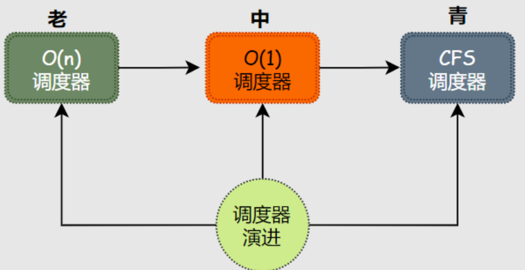
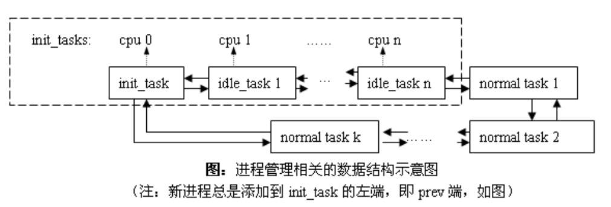
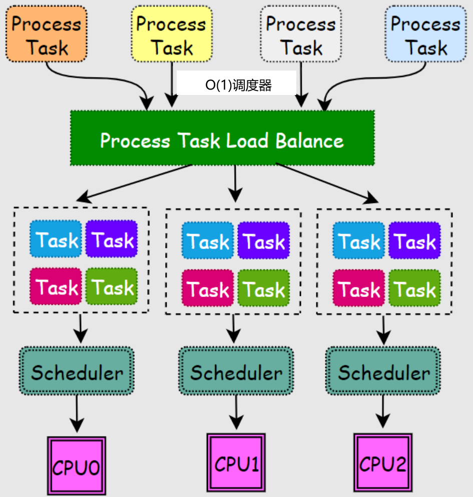
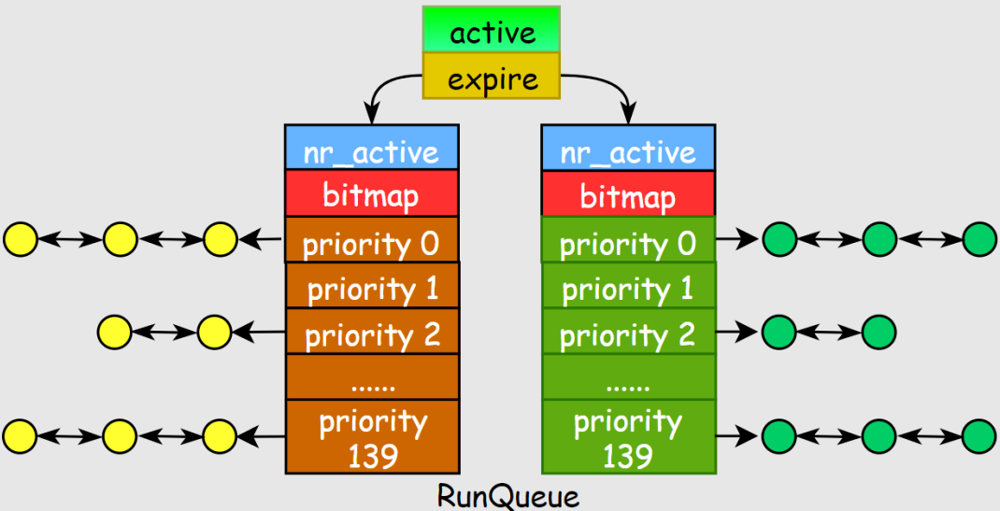
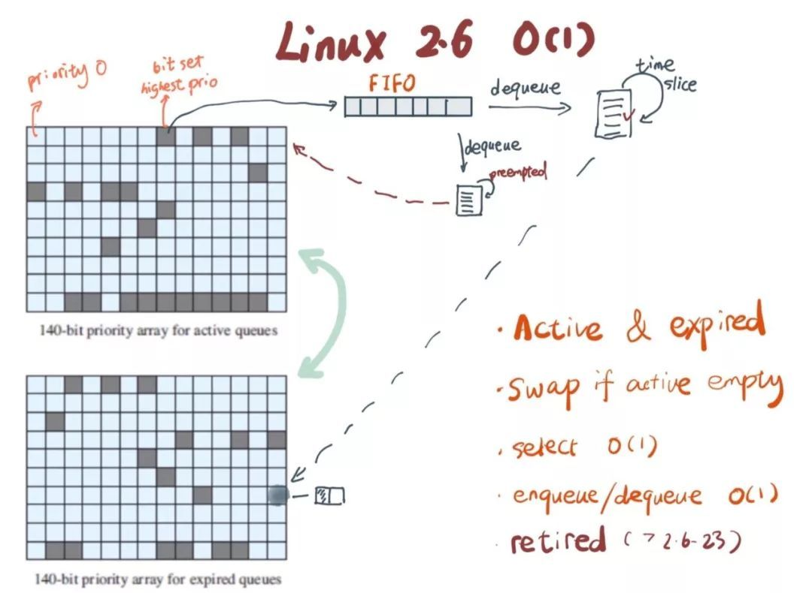

<!-- theme: gaia -->
<!-- _class: lead -->

# 第八讲 多处理器调度

## 第三节 Linux O(1) 调度

 
 

向勇 陈渝 李国良 

2022年秋季

---

**提纲**

### 1. SMP 和 早期Linux 内核
2. Linux O(n)调度器
3. Linux O(1) 调度器

---

#### Linux调度器的[演进](https://www.eet-china.com/mp/a111242.html)

* O(n) 调度器：内核版本 2.4-2.6
* O(1) 调度器：内核版本 2.6.0-2.6.22
* CFS 调度器：内核版本 2.6.23-至今

<!--
https://www.scaler.com/topics/operating-system/process-scheduling/
-->

---
#### 调度器需要考虑的关键问题

- 采用何种**数据结构**来组织进程
- 如何根据进程优先级来确定**进程运行时间**
- 如何判断**进程类型**(I/O密集，CPU密集型，实时，非实时)
- 如何确定进程的动态**优先级**：影响因素
  - 静态优先级、nice值
  - I/O密集型和CPU密集型产生的优先级奖惩
- 如何**适配多处理器**情况

---
#### SMP 和 早期Linux 内核

<!-- https://courses.engr.illinois.edu/cs423/sp2018/slides/13-linux-schedulers.pdf
Linux历史 -->

- Linux 1.2
  - 环形队列 + Round Robin调度策略
- Linux 2.0
  - SMP 支持由一个“大锁”组成，“大锁”对内核访问串行化
  - 在用户态支持并行，Linux 内核本身并不能利用多处理器加速
- Linux 2.2
  - 引入调度类（real-time, non-real-time）
<!--   -->

<!-- 调度器简介，以及Linux的调度策略 https://www.cnblogs.com/vamei/p/9364382.html -->

<!-- 万字长文，锤它！揭秘Linux进程调度器 https://www.eet-china.com/mp/a111242.html -->
---

**提纲**

1. SMP 和 早期Linux 内核
### 2. Linux O(n)调度器
3. Linux O(1) 调度器

---

#### Linux 2.4 内核：Linux $O(n)$调度器

---
#### Linux $O(n)$调度器
- 使用多处理器可以加快内核的处理速度，调度器是复杂度为 $O(n)$
  - $O(n)$ 这个名字，来源于算法复杂度的大$O$表示法 
  - 字母$n$在这里代表操作系统中的活跃进程数量
  - $O(n)$ 表示这个调度器的时间复杂度和活跃进程的数量成正比

---
#### Linux $O(n)$ 调度算法的思路

- 把时间分成大量的微小时间片（Epoch）
- 每个时间片开始时
  - 计算进程的动态优先级
  - 将进程的静态优先级映射成缺省时间片
  - 然后选择优先级最高的进程来执行
- 进程被调度器切换执行后，可不被打扰地用尽这个时间片
- 如进程没有用尽时间片，则剩余时间增加到进程的下一个时间片中

<!-- 谈谈调度 - Linux O(1) https://cloud.tencent.com/developer/article/1077507 
Linux Kernel 排程機制介紹
https://loda.hala01.com/2017/06/linux-kernel.html
-->
---
#### $O(n)$ 调度算法的复杂度
O(n)调度算法的复杂度为$O(n)$ 
- 每次使用时间片前都要**检查所有就绪进程的优先级**
- **检查时间**和进程中进程数目$n$成正比

---
#### Linux O(n)调度器数据结构
- 只用一个 global runqueue放置就绪任务
- 各个 core 需要竞争同一个 runqueue 里面的任务

---

#### Linux $O(n)$调度器的缺点

- $O(n)$的**执行开销**
   - 当有大量进程在运行时，这个调度器的性能将会被大大降低
- 多处理器**竞争访问**同一个 runqueue 里面的任务
   - $O(n)$调度器没有很好的可扩展性(scalability)

<!-- ---
#### Linux 2.4 内核：SMP 实现在内核态
- 使用多处理器可以加快内核的处理速度，调度器是复杂度为 O(n)
  - 内核调度器维护两个 queue：runqueue 和 expired queue
  - 两个 queue 都永远保持有序
  - 一个 process 用完时间片，就会被插入 expired queue
  - 当 runqueue 为空时，把 runqueue 和 expired queue 交换一下
 

---
#### Linux 2.4 内核：SMP 实现在内核态
- 使用多处理器可以加快内核的处理速度，调度器是复杂度为 O(n)
  - 全局共享的就绪队列
  - 寻找下一个可执行的 process，这个操作一般都是 O(1)
  - 每次进程用完时间片，找合适的位置执行插入操作，会遍历所有任务，复杂度为O(n)
 

---
#### Linux 2.4 内核：SMP 实现在内核态
- 使用多处理器可以加快内核的处理速度，调度器是复杂度为 O(n)
  - 现代操作系统都能运行成千上万个进程
  - O(n) 算法意味着每次调度时，对于当前执行完的process，需要把所有在 expired queue 中的 process 过一遍，找到合适的位置插入
  - 这不仅仅会带来性能上的巨大损失，还使得系统的调度时间非常不确定 -- 根据系统的负载，可能有数倍甚至数百倍的差异
    -->

<!-- 万字长文，锤它！揭秘Linux进程调度器 https://www.eet-china.com/mp/a111242.html -->
---

**提纲**

1. SMP 和 早期Linux 内核
2. Linux O(n)调度器
### 3. Linux O(1) 调度器

---

#### Linux O(1) 调度器
Linux 2.6 版本的调度器是由 Ingo Molnar 设计并实现的。
- 为唤醒、上下文切换和定时器中断开销建立一个完全 O(1) 的调度器
 

---

#### Linux O(1) 调度器的思路

- 实现了per-cpu-runqueue，每个CPU都有一个就绪进程任务队列
- 采用全局优先级
  - 实时进程0-99
  - 普通进程100-139

 

---

#### Linux O(1) 调度器的思路

- 活跃数组active：放置就绪进程
- 过期数组expire：放置过期进程
 
---

#### Linux O(1) 调度器的思路

- 每个优先级对应一个链表
- 引入bitmap数组来记录140个链表中的活跃进程情况
 

  
---
#### 常用数据结构访问的时间复杂度
- 满足 O(1) 的数据结构？
- 常用数据结构的四种基本操作和时间复杂度
  - access：**随机访问**
    - array: 平均情况和最坏情况均能达到 O(1)
    - linked list 是 O(N)
    - tree 一般是 O(log N)
 

  
---
#### 常用数据结构的搜索操作
- search：搜索
  - hash table 时间复杂度是 O(1)，但它最坏情况下是 O(N)
  - 大部分 tree（b-tree / red-black tree）平均和最坏情况都是 O(log N)
 

  
---
#### 常用数据结构的插入和删除操作
- insert/deletion：插入和删除
  - hash table 时间复杂度是 O(1)，但它最坏情况下是 O(N)
  - linked list，stack，queue 在平均和最坏情况下都是 O(1)

 

    
---

#### Linux O(1) 调度器的时间复杂度

- 进程有 140 种优先级，可用长度为 140 的数组去记录优先级。
  - access 是 $O(1)$
- 位图bitarray为每种优先级分配一个 bit
  - 如果这个优先级队列下面有进程，那么就对相应的 bit 染色，置为 1，否则置为 0。
  - 问题简化为寻找位图中最高位是 1 的 bit（left-most bit），可用一条CPU 指令实现。

 
    
---

#### Linux O(1) 调度器的时间复杂度

- 每个优先级下面用一个FIFO queue 管理这个优先级下的进程。
  - 新来的插到队尾，先进先出，insert/deletion 都是 $O(1)$

 
    
---

#### Linux $O(1)$活跃数组和过期数组

<!-- Linux 是如何调度进程的？https://jishuin.proginn.com/p/763bfbd2df25 -->

活跃数组(Active Priority Array, APA)过期数组(Expired Priority Array, EPA)

- 在 active bitarray 中寻找 left-most bit 的位置 x；
- 在 APA 中找到对应队列 APA[x]；
- 从 队列APA[x] 中取出一个进程；

 

    
---

#### Linux $O(1)$活跃数组和过期数组

- 对于当前执行完的进程，重新计算其优先级，然后 放入到 EPA 相应的队列EPA[priority]；
- 如果进程优先级在 expired bitarray 里对应的 bit 为 0，将其置 1；
- 如果 active bitarray 全为零，将 active bitarray 和 expired bitarray 交换；

   

    
---
#### Linux O(1) 调度器的多核/SMP支持
- 按一定时间间隔，分析各CPU负载
  - 在每个时钟中断后进行计算CPU负载
  - 由负载轻的 CPU pulling 进程而不是 pushing进程
   

---

### 小结

1. SMP 和 早期Linux 内核
2. Linux O(n)调度器
3. Linux O(1) 调度器

---

### 参考文献
- http://www.wowotech.net/process_management/scheduler-history.html
- https://courses.engr.illinois.edu/cs423/sp2018/slides/13-linux-schedulers.pdf
- https://www.cnblogs.com/vamei/p/9364382.html
- https://cloud.tencent.com/developer/article/1077507?from=article.detail.1603917
- https://www.eet-china.com/mp/a111242.html
- https://loda.hala01.com/2017/06/linux-kernel.html
- https://jishuin.proginn.com/p/763bfbd2df25