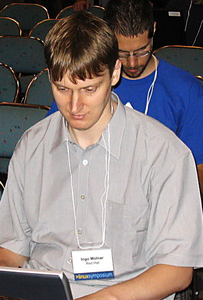
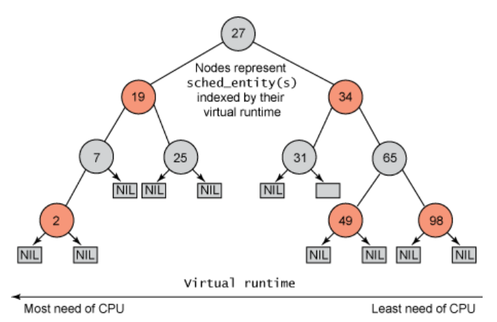

<!-- theme: gaia -->
<!-- _class: lead -->

## 第八讲 多处理器调度

### 第四节 Linux CFS（Completely Fair Schduler） 调度


---
### CFS的背景
<!-- 万字长文，锤它！揭秘Linux进程调度器 https://www.eet-china.com/mp/a111242.html -->
O(1)和O(n)都将CPU资源划分为时间片，采用了固定额度分配机制，在每个调度周期进程可使用的时间片是确定的，调度周期结束被重新分配。

O(1)调度器本质上是MLFQ算法的思想，随着时间的推移也暴露出了很多问题，主要集中在O(1)调度器对进程交互性的判断上积重难返。

无论是O(n)还是O(1)都需要去根据进程的运行状况判断它属于IO密集型还是CPU密集型，再做优先级奖励和惩罚，这种推测本身就会有误差，而且场景越复杂判断难度越大。


---
### CFS的背景

匈牙利人Ingo Molnar所提出和实现CFS调度算法
- 他也是O(1)调度算法的提出者

 

---
### CFS 的思路
<!-- - CFS 不计算优先级，而是通过计算进程消耗的 CPU 时间（标准化以后的虚拟 CPU 时间）来确定谁来调度。从而到达所谓的公平性。 -->
- CFS摒弃了固定时间片分配，采用**动态时间片分配**
- 本次调度中进程可占用的时间与进程总数、总CPU时间、进程权重等均有关系，每个调度周期的值都可能会不一样

每个进程都有一个nice值, 表示其静态优先级

 

---
### CFS 的绝对公平性：
- 把 CPU 当做一种资源，并记录下每一个进程对该资源使用的情况，在调度时，调度器总是选择消耗资源最少的进程来运行（**公平分配**）。
- 但这种绝对的公平有时也是一种不公平，因为有些进程的工作比其他进程更重要，我们希望能按照权重来分配 CPU 资源。
 

---
### CFS 的相对公平性：
- 为了区别不同优先级的进程，就是会根据各个进程的权重分配运行时间
       
      分配给进程的运行时间 = 调度周期 * 进程权重 / 所有进程权重总和  公式(1)

- 进程权重越大, 分到的运行时间越多

调度周期：将所处于 TASK_RUNNING 态进程都调度一遍的时间

<!--   -->


---
<!-- CFS（Completely Fair Scheduler） https://www.jianshu.com/p/1da5cfd5cee4 -->
### CFS 的相对公平性：
- 系统中两个进程 A，B，权重分别为 1， 2，调度周期设为 30ms，
- A 的 CPU 时间为：30ms * (1/(1+2)) = 10ms
- B 的 CPU 时间为：30ms * (2/(1+2)) = 20ms
- 在这 30ms 中 A 将运行 10ms，B 将运行 20ms

它们的运行时间并不一样。 公平怎么体现呢？

<!--   -->


---
### CFS 的实现原理：

其实公平是体现在另外一个量上，叫做virtual runtime(vruntime)，它记录着进程已经运行的时间，但是并不是直接记录，而是要根据进程的权重将运行时间放大或者缩小一个比例。

    vruntime = 实际运行时间 * 1024 / 进程权重 公式(2)


这里直接写1024，实际上它等于nice为0的进程的权重，代码中是NICE_0_LOAD。也就是说，所有进程都以nice为0的进程的权重1024作为基准，计算自己的vruntime增加速度。

---
### CFS 的实现原理：

还以上面AB两个进程为例，B的权重是A的2倍，那么B的vruntime增加速度只有A的一半。现在我们把公式(2)中的实际运行时间用公式(1)来替换，可以得到这么一个结果：

    vruntime = (调度周期 * 进程权重 / 所有进程总权重) * 1024 / 进程权重   公式(3)
             = 调度周期 * 1024 / 所有进程总权重 

虽然进程的权重不同，但是它们的 vruntime增长速度应该是一样的 ，与权重无关。

<!-- O(n)、O(1)和CFS调度器  http://www.wowotech.net/process_management/scheduler-history.html 

Virtual runtime ＝ （physical runtime） X （nice value 0的权重）/进程的权重

通过上面的公式，我们构造了一个虚拟的世界。二维的（load weight，physical runtime）物理世界变成了一维的virtual runtime的虚拟世界。在这个虚拟的世界中，各个进程的vruntime可以比较大小，以便确定其在红黑树中的位置，而CFS调度器的公平也就是维护虚拟世界vruntime的公平，即各个进程的vruntime是相等的。

-->

---
### CFS 的实现原理：
CFS的主要思想：

既然所有进程的vruntime增长速度宏观上看应该是同时推进的，那么就可以用这个vruntime来选择运行的进程。

谁的vruntime值较小就说明它以前占用cpu的时间较短，受到了“不公平”对待，因此下一个运行进程就是它。

这样既能公平选择进程，又能保证高优先级进程获得较多的运行时间。


---
### CFS 的实现原理：
CFS的主要思想：

CFS的思想就是让每个调度实体（进程或进程组）的vruntime互相追赶，而每个调度实体的vruntime增加速度不同，权重越大的增加的越慢，这样就能获得更多的cpu执行时间。

     A每周期6时间片，B每周期3时间片，C每周期2时间片
     vruntime：
     A:   0  6  6  6  6  6  6  12 12 12 12 12 12
     B:   0  0  3  3  3  6  6  6  9  9  9  12 12
     C:   0  0  0  2  4  4  6  6  6  8  10 10 12
     调度：   A  B  C  C  B  C  A  B  C  C   B  C


<!--   -->


---
### CFS 的具体实现：
- Linux 采用了一颗红黑树（对于多核调度，实际上每一个核有一个自己的红黑树），记录下每一个进程的 vruntime
- 需要调度时，从红黑树中选取一个 vruntime最小的进程出来运行
 


---
### CFS 的具体实现：
权重如何决定？
- 权重由 nice 值确定，权重跟进程 nice 值之间有一一对应的关系
- 通过全局数组 prio_to_weight 来转换，nice值越大，权重越低。
 


---
### CFS 的具体实现：
新创建进程的 vruntime 是多少？
- 假如新进程的 vruntime 初值为 0 的话，比老进程的值小很多，那么它在相当长的时间内都会保持抢占 CPU 的优势，老进程就要饿死了，这显然是不公平的。
 

---
### CFS 的具体实现：
新创建进程的 vruntime 是多少？
- 每个 CPU 的运行队列 cfs_rq 都维护一min_vruntime 字段，记录该运行队列中所有进程的 vruntime 最小值
- 新进程的初始vruntime 值就以它所在运行队列的min_vruntime 为基础来设置，与老进程保持在合理的差距范围内。
 

---
### CFS 的具体实现：
休眠进程的 vruntime 一直保持不变吗？
- 如果休眠进程的 vruntime 保持不变，而其他运行进程的 vruntime 一直在推进，那么等到休眠进程终于唤醒的时候，它的 vruntime 比别人小很多，会使它获得长时间抢占 CPU 的优势，其他进程就要饿死了。
 


---
### CFS 的具体实现：
休眠进程的 vruntime 一直保持不变吗？
- 在休眠进程被唤醒时重新设置 vruntime 值，以 min_vruntime 值为基础，给予一定的补偿，但不能补偿太多。
 


---
### CFS 的具体实现：
休眠进程在唤醒时会立刻抢占 CPU 吗？
- 休眠进程在醒来的时候有能力抢占 CPU 是大概率事件，这也是 CFS 调度算法的本意，即保证交互式进程的响应速度，因为为交互式进程等待用户输入会频繁休眠。
 


---
### CFS 的具体实现：
休眠进程在唤醒时会立刻抢占 CPU 吗？
- 主动休眠的进程同样也会在唤醒时获得补偿，这类进程往往并不要求快速响应，它们同样也会在每次唤醒并抢占，这有可能会导致其它更重要的应用进程被抢占，有损整体性能。
- sched_features 的 WAKEUP_PREEMPT 位//禁用唤醒抢占特性之后，刚唤醒的进程不会立即抢占运行中的进程，而是要等到运行进程用完时间片之后

 


---
### CFS 的具体实现：
进程在 CPU 间迁移时 vruntime 会不会变？
- 在多 CPU 的系统上，不同的 CPU 的负载不一样，有的 CPU 更忙一些，而每个 CPU 都有自己的运行队列，每个队列中的进程的vruntime 也走得有快有慢，比如我们对比每个运行队列的 min_vruntime 值，都会有不同
 


---
### CFS 的具体实现：
进程在 CPU 间迁移时 vruntime 会不会变？
- 当进程从一个 CPU 的运行队列中出来时，它的 vruntime 要减去队列的 min_vruntime 值；
- 当进程加入另一个 CPU 的运行队列时，它的vruntime 要加上该队列的 min_vruntime 值。


 


---
### CFS 的具体实现：
vruntime 溢出问题
- 红黑树中实际的作为 key 的不是 vruntime 而是 vruntime - min_vruntime。min_vruntime 是当前红黑树中最小的 key
- vruntime 的类型 usigned long


 


---
### CFS 的具体实现：
vruntime 溢出问题
- 进程的虚拟时间是一个递增的正值，因此它不会是负数，但是它有它的上限，就是unsigned long 所能表示的最大值，如果溢出了，那么它就会从 0 开始回滚，如果这样的话，结果会怎样？


 


---
### CFS 的具体实现：
vruntime 溢出问题: 一个例子
```C
unsigned char a = 251;
unsigned char b = 254;
b += 5;
//b溢出，导致a > b，应该b = a + 8
//怎么做到真正的结果呢？改为以下：
unsigned char a = 251;
unsigned char b = 254;
b += 5;
signed char c = a - 250, 
signed char d = b - 250;
//到此判断 c 和 d 的大小
```


 

---
### 参考文献
-  https://www.eet-china.com/mp/a111242.html
-  https://www.jianshu.com/p/1da5cfd5cee4
-  https://developer.ibm.com/tutorials/l-completely-fair-scheduler/
-  http://www.wowotech.net/process_management/scheduler-history.html