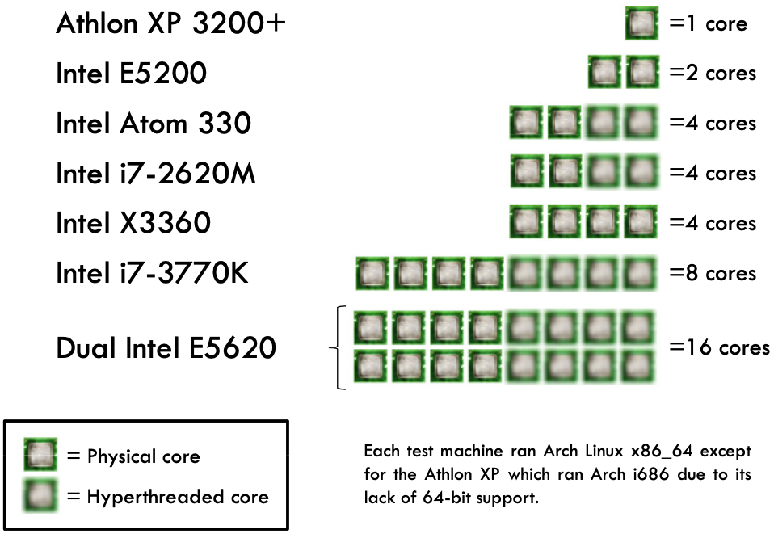
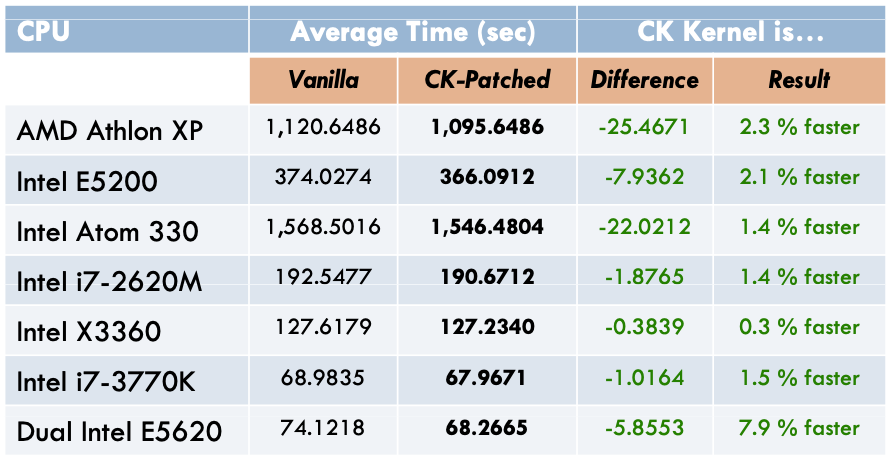
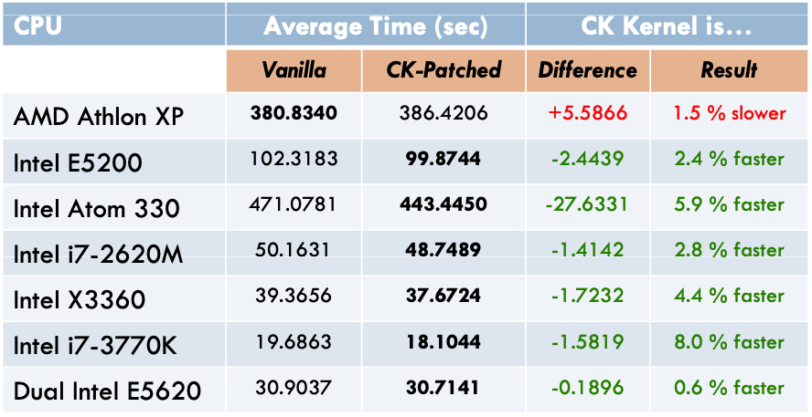
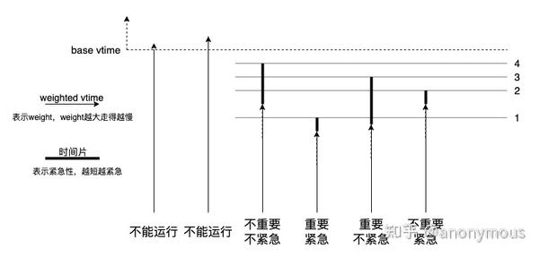

<!-- theme: gaia -->
<!-- _class: lead -->

# 第八讲 多处理器调度
## 第五节 Linux/FreeBSD BFS 调度

<br>
<br>

向勇 陈渝 李国良 任炬 

2025年秋季

[课程幻灯片列表](https://www.yuque.com/xyong-9fuoz/qczol5/glemuu?)

---

**提纲**

### 1. BFS调度器
2. BFS 与 CFS 的性能对比 (2012)

<br>
<br>
<br>
<br>
<br>
<br>

Ref: [Analysis of the BFS Scheduler in FreeBSD](http://vellvisher.github.io/papers_reports/doc/BFS_FreeBSD.pdf)

---

#### BFS 的思路
BFS全称：Brain Fuck Scheduler，脑残调度器
- BFS 调度算法是一种时间片轮转算法的变种。
- 在多处理机时使用单就绪队列（双向链表）
  - 增加了队列互斥访问的开销
  - 减少了负载均衡算法开销

---

#### BFS 的进程优先级

- 进程有 103 个优先级
  - 100 个静态的实时优先级；
  - 3 个普通优先级 
      - SCHED_ISO (isochronous) : 交互式任务
      - SCHED_NORMAL  : 普通任务
      - SCHED_IDLEPRIO ：低优先级任务


---

#### BFS 的就绪队列

- 就绪队列
  - 所有 CPU 共享一个双向链表结构的**单就绪队列**；
  - 所有进程按优先级排队；
  - 相同优先级的每个进程有一个时间片长度和虚拟截止时间；

---

#### BFS 的时间片
- 时间片大小：由算法参数指定，可在 1ms 到 1000ms 间选择，缺省设置为 6ms；
- 虚拟截止时间（Virtual Deadline）：关于就绪队列中进程等待 CPU 最长时间的排序，并不是真实的截止时间；
  - 进程**时间片用完**时，重新计算虚拟截止时间；
  - **事件等待结束**时，虚拟截止时间保持不变，以抢先相同优先级的就绪进程；
  - 为了让进程在**上次运行的 CPU** 上运行（亲和性），不同 CPU 对进程的虚拟截止时间加一个权重；


---

#### BFS 的虚拟截止时间计算
- 依据当前时间、进程优先级和时间片设置计算；
```
offset = niffies + (prio_ratio ∗ rr_interval)
prioratio increases by 10% for every nice level
```
- niffies是当前时间；prio_ratios[priority]是一个常量数组，不同的priority对应不同的prio_ratios[priority]；rr_interval是timeslice，是CPU分配给每个任务的时间片，是一个常数

- 虚拟截止时间计算结果：https://wikimili.com/en/Brain_Fuck_Scheduler


---

#### BFS 的调度思路
使用O(1)调度器中的**位图**概念，所有进程被安排到103个queue中，各个进程不是按照优先级而是按照**优先级区间**被排列到各自所在的区间，每一个区间拥有一个queue。
<!-- https://www.cnblogs.com/dragonsuc/p/7144265.html -->


---

#### BFS 的调度思路
按照O(1)调度器的方式首先查找位图中不为0的那个queue，然后在该queue中执行$O(n)$查找，查找到virtual deadline最小的那个进程投入执行。


---

#### BFS 的就绪队列插入

- 时间片用完：重新设置虚拟截止时间后，插入就绪队列；
- 等待事件出现：虚拟截止时间保持不变，抢先低优先级进程或插入就绪队列；

---

**提纲**

1. BFS调度器
### 2. BFS 与 CFS 的性能对比 (2012)

<br>
<br>
<br>
<br>
<br>
<br>

Ref: [Analysis of the BFS Scheduler in FreeBSD](http://vellvisher.github.io/papers_reports/doc/BFS_FreeBSD.pdf)

---

#### BFS 与 CFS 的[性能对比](http://repo-ck.com/bench/cpu_schedulers_compared.pdf) (2012)
测试用例集
- Linux kernel v3.6.2.2 的 GCC **编译**
- Linux kernel v3.6.2 内核源代码树的 lrzip **压缩**
- 从 720p 到 360p 的 MPEG2 视频 ffmpeg **压缩**



---

#### BFS 与 CFS 的性能对比: 压缩测试


---

#### BFS 与 CFS 的性能对比: 测试编译


---

#### BFS 与 CFS 的性能对比: 视频编码测试


---

#### 最早可执行虚拟截止时间优先调度算法EEVDF



延迟敏感进程较多时，EEVDF(Earliest Eligible Virtual Deadline First)可显著降低调度延迟，提高响应速度，而不会牺牲吞吐量和能耗。

<!--
https://zhuanlan.zhihu.com/p/683775984
-->

---

### 参考文献
- http://repo-ck.com/bench/cpu_schedulers_compared.pdf
- https://zhuanlan.zhihu.com/p/351876567
- https://blog.csdn.net/dog250/article/details/7459533
- https://www.cnblogs.com/dragonsuc/p/7144265.html