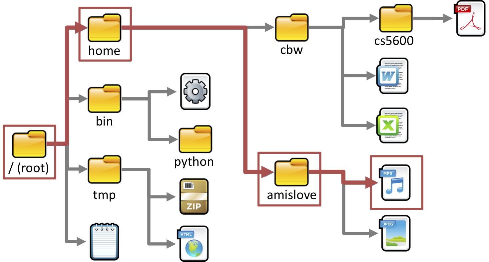

<!-- theme: gaia -->
<!-- _class: lead -->

# 第九讲 文件系统
## 第一节 文件和文件系统

<br>
<br>

向勇 陈渝 李国良 任炬 

2024年秋季

[课程幻灯片列表](https://www.yuque.com/xyong-9fuoz/qczol5/oqo14u60786offgg)

---

**提纲**
<style>
.container{
    display: flex;    
}
.col{
    flex: 1;
}
</style>

<div class="container">

<div class="col">

### 1. 文件
2. 文件系统和文件组织

</div>

<div class="col">

#### 1.1 文件的概念
1.2 文件操作
1.3 文件描述符

</div>

</div>

---

##### 什么是文件系统？

* [文件系统](https://blog.csdn.net/wsmzyzdw/article/details/82908736)是存储设备上组织文件的**方法**和**数据结构**。



---

##### 什么是文件系统？

* [文件系统](https://chinese.freecodecamp.org/news/file-systems-architecture-explained/)是操作系统中负责文件命名、存储和检索的**子系统**。


---

##### 什么是文件？
- 文件是具有符号名，由字节序列构成的**数据项集合**
  - 文件是文件系统的基本**数据单位**
- **文件名**是文件的标识符号

- **文件头**：文件系统元数据中的**文件信息**
  - 文件属性：名称、类型、位置、创建时间、…
  - 文件存储位置和顺序

---

##### 一切都是文件
- UNIX类操作系统的设计哲学：**一切皆文件**
  - 普通文件，目录文件
  - 字符设备文件（如键盘，鼠标...）
  - 块设备文件（如硬盘，光驱...）
  - 网络文件（socket ...）等等
- 所有一切均抽象成文件，提供了**统一的接口**，方便应用程序调用

---

##### 文件视图

- **用户的文件视图**
  - 持久存储的数据结构
  - 系统调用接口：**字节序列**的集合(UNIX)
- **操作系统的文件视图**
  - **数据块**的集合
  - 数据块是逻辑存储单元，而**扇区**是物理存储单元

---

##### 文件中数据的内部结构

- 与应用相关
  - 无结构：文本文件
  - 简单结构：CSV、JSON等格式化文件
  - 复杂结构：Word文件、ELF可执行文件

---

**提纲**
<style>
.container{
    display: flex;    
}
.col{
    flex: 1;
}
</style>

<div class="container">

<div class="col">

1. **文件**
2. 文件系统和文件组织

</div>

<div class="col">

1.1 文件的概念
#### 1.2 文件操作
1.3 文件描述符

</div>

</div>

---

##### 文件的基本操作

- 进程**读文件**
  - 获取文件所在的数据块
  - 返回数据块内对应部分
- 进程**写文件**
  - 获取数据块
  - 修改数据块中对应部分
  - 写回数据块


---

##### 文件的基本操作单位

- 文件系统中的基本操作单位是**数据块**
  - 例如, getc()和putc()即使每次只访问1字节的数据，也需要缓存目标数据4096字节

---

##### 文件的访问模式
- **顺序访问**: 按字节依次读取
  - 把一维数据映射到文件中 
- **随机访问**: 从任意位置读写
  - 把一个复杂结构(矩阵)映射到文件中
- **索引访问**: 依据数据特征索引
  - 数据库访问是一种基于索引的访问

---

##### 文件访问控制

- 多用户操作系统中的**文件共享**是很必要的
- 访问控制
  - 用户对文件的访问权限
  - 读、写、执行、删除
- 文件访问控制列表(ACL-Access Control List)
  - <文件实体, 权限>

---

##### 文件访问控制

- UNIX模式
  - <用户|组|所有人, 读|写|可执行>
  - 用户标识ID
  - 组标识ID


---

##### 多进程如何访问共享文件？
- 文件是一类共享资源
  - 需要互斥访问
  - 采用类似的同步互斥技术
    - 读写锁

<!-- ---

##### 文件的共享访问

UNIX 文件系统(UFS)语义
- 对打开文件的写入内容，立即对其他打开同一文件的其他用户可见
- 共享文件指针允许多用户读取和写入文件 -->

<!-- 文件锁的读锁和写锁 https://blog.csdn.net/Scroll_C/article/details/123804611 -->

---

**提纲**
<style>
.container{
    display: flex;    
}
.col{
    flex: 1;
}
</style>

<div class="container">

<div class="col">

1. **文件**
2. 文件系统和文件组织

</div>

<div class="col">

1.1 文件的概念
1.2 文件操作
#### 1.3 文件描述符

</div>

</div>

---

##### 应用程序如何访问文件？
- 应用访问文件数据前必须先“打开”文件，**获得文件描述符**
- 再进一步通过文件描述符（File Descriptor，fd）**读写文件**
```C
fd = open(name, flag);
read(fd, …);
close(fd);
```

---

##### 文件描述符

当应用程序请求内核打开/新建一个文件时，内核返回一个文件描述符用于**对应这个打开/新建的文件**。
- 形式上，文件描述符是一个**非负整数**
- 实际上，文件描述符是一个**索引值**，指向内核为每一个进程所维护的该进程打开文件的记录表

 


---

##### 打开文件表

- 内核**跟踪**进程打开的所有文件
  - 操作系统为**每个进程**维护一个打开的文件描述符表
  - 一个**系统级**的打开文件表
  - i-node表指中向具体的文件内容
 


---

##### 打开文件表

- 内核在打开文件表中**维护**打开文件状态和信息
  - **文件指针**
     - 最近一次读写位置
     - 每个进程分别维护自己的打开文件指针

 

---

##### 打开文件表

- 内核在打开文件表中**维护**的打开文件**状态和信息**
  - **文件打开计数**
     - 当前打开文件的次数
     - 最后一个进程关闭文件时，将其从打开文件表中移除

 


---

##### 打开文件表

- 操作系统在打开文件表中维护的打开文件**状态和信息**
  - **文件的磁盘位置**
     - 缓存数据访问信息
  - **访问权限**
    -  每个进程的文件访问模式信息
 

---

**提纲**
<style>
.container{
    display: flex;    
}
.col{
    flex: 1;
}
</style>

<div class="container">

<div class="col">

1. 文件
### 2. 文件系统和文件组织

</div>

<div class="col">

#### 2.1 文件系统的功能
2.2 目录

</div>

</div>

---

##### 文件系统类型
- 磁盘文件系统：FAT, NTFS, ext2/3, ISO9660,等
- 网络/分布式文件系统：NFS, SMB, AFS, GFS
- 特殊文件系统：procfs, sysfs

---

##### 虚拟文件系统（VFS）

 

---

##### 文件系统功能
- 文件系统是操作系统中**管理持久性数据的子系统**，提供数据**文件命名、存储和检索**功能。
  - 组织、检索、读写访问数据
  - 大多数计算机系统都有文件系统

---

##### 文件系统功能
- 分配文件磁盘空间
  - 管理文件块（位置和顺序）
  - 管理空闲空间(位置)
  - 分配算法 (策略)

---

##### 文件系统功能
- 管理文件集合
  - 组织：组织文件的控制结构和数据结构
  - 命名：给文件取名字 
  - 定位：通过名字找到文件文件及其内容

---

##### 文件系统功能
- 数据可靠和安全
  - 安全：多层次保护数据安全
  - 可靠
    - 持久保存文件
    - 避免系统崩溃、数据丢失等
 
---

##### 文件系统组织形式
**分层文件系统**
- 文件以目录的方式组织起来
- **目录**是一类特殊的文件
- 目录的内容是文件索引表<文件名, 指向文件的指针>

 

 
---

**提纲**
<style>
.container{
    display: flex;    
}
.col{
    flex: 1;
}
</style>

<div class="container">g

<div class="col">

1. 文件
2. **文件系统和文件组织**

</div>

<div class="col">

2.1 文件系统的功能
#### 2.2 目录

</div>

</div>

---

##### 目录操作

应用程序通过系统调用对目录进行操作
- 搜索文件
- 创建文件 
- 删除文件
- 列目录
- 重命名文件
- 重命名文件

 

 
---

##### 目录实现
- 文件名的**线性列表**，包涵了指向数据块的指针
  - 编程简单、执行耗时
- 哈希表 – 哈希数据结构的线性表
  - 减少目录搜索时间
  - 可能有冲突 - 两个文件名的哈希值相同

---

##### 遍历目录路径
举例: 解析`./fs/inode.rs`
- 读取当前目录文件`.`的数据内
- 找到`fs`项，读取目录文件`fs`的数据内容
- 找到`inode.rs`项，读取一般文件`inode.rs`的数据内容

 

---

##### 文件别名
多个文件名关联同一个文件
- **硬链接**(hard link)
  - 多个文件项指向一个文件
- **软链接**(soft link, symbolic link)
  - 新建文件，以存储文件名称的方式来指向其他文件
- **inode**：管理文件数据的结构

 


---

##### 文件别名

- 硬链接是对一个文件的引用，而软链接则是一个指向文件路径的指针。

- 硬链接不能跨文件系统，也不能链接到目录。
  - 避免目录循环，所以不能链接到目录。

- 软链接可以跨文件系统，也可以链接到目录。

---

##### 如何避免目录中没有形成循环？
  - 只允许对文件的链接，不允许对子目录的链接
  - 增加链接时，用循环检测算法确定是否合理
  - 限制遍历文件目录的路径数量

  

 ---

##### 文件系统挂载
  - 文件系统需要先挂载才能被访问
 
 
 ---

### 小结

1. 文件
- 文件的概念
- 文件操作
- 文件描述符
2. 文件系统和文件组织
- 文件系统的功能
- 目录

 