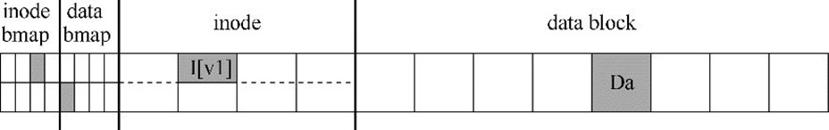
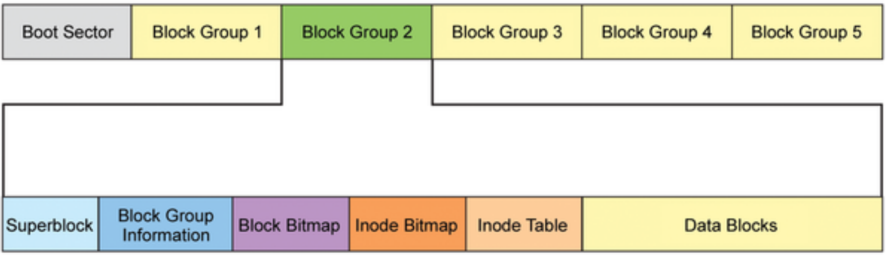
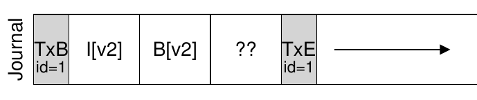
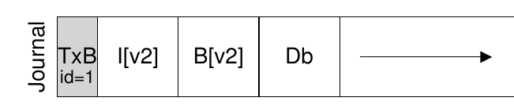
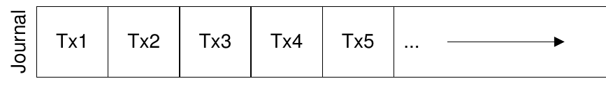

<!-- theme: gaia -->
<!-- _class: lead -->

# 第九讲 文件系统

## 第三节 支持崩溃一致性的文件系统

 
 

向勇 陈渝 李国良 

2022年秋季

---

**提纲**

### 1. 崩溃一致性问题
- 崩溃一致性
- 崩溃场景
2. 文件系统检查程序 fsck
3. 日志文件系统

---

#### 文件系统的持久数据更新挑战

如何在出现断电（power loss）或系统崩溃（system crash）的情况下，更新持久数据结构。

崩溃可能导致磁盘文件系统映像中的文件系统数据结构出现**不一致**性。如，有空间泄露、将垃圾数据返回给用户等。

---

#### 崩溃一致性问题

**崩溃一致性**问题（crash-consistency problem）也称**一致性更新**问题（consistent-update problem）
- 特定操作需要更新磁盘上的**两个结构**A和B。
- 磁盘一次只为一个请求提供服务，因此其中一个请求将首先到达磁盘（A或B）。
- 如果在一次写入完成后系统崩溃或断电，则磁盘上的结构将处于不一致（inconsistent）的状态。

---

#### 崩溃一致性的需求

* 目标
  * 将文件系统从一个一致状态（在文件被追加之前），原子地（atomically）变迁到另一个一致状态（在inode、位图和新数据块被写入磁盘之后）。
* 困难
  * 磁盘一次只提交一次写入，更新之间可能会发生崩溃或断电。

---

#### 文件更新过程示例

一个应用以某种方式更新磁盘结构：将单个数据块附加到原有文件。
- 通过打开文件，调用`lseek()`将文件偏移量移动到文件末尾，然后在关闭文件之前，向文件发出单个4KB写入来完成追加。

---

#### 文件系统数据结构

* inode位图（inode bitmap，只有8位，每个inode一个）
* 数据位图（data bitmap，也是8位，每个数据块一个）
* inode（总共8个，编号为0到7，分布在4个块上）
* 数据块（总共8个，编号为0～7）。

<!--
文件系统的示意图
-->

---

#### 文件更新中的磁盘操作

一个应用以某种方式更新磁盘结构：将单个数据块附加到原有文件
- 必须对磁盘执行**3次单独写入**
  - inode（I[v2]）、位图（B[v2]）和数据块（Db）
- 发出write()系统调用时，这些写操作通常不会立即发生。
  - 脏的inode、位图和新数据先在**内存**（页面缓存page cache，或缓冲区缓存buffer cache）中存在一段时间。
- 当文件系统最终决定将它们写入磁盘时（比如说5s或30s），文件系统将向磁盘发出必要的**写入请求**。

<!---->

---

**提纲**

1. 崩溃一致性问题
- 崩溃一致性
### 崩溃场景
2. 文件系统检查程序 fsck
3. 日志文件系统

---

#### 文件操作中的崩溃
在文件操作过程中可能会发生崩溃，从而干扰磁盘的这些更新。
* 如果写入操作中的一个或两个完成后发生崩溃，而不是全部 3个，则文件系统可能处于**有趣**（不一致）的状态。
<!--  -->

---

#### 崩溃场景一

只将数据块（Db）写入磁盘
* **数据在磁盘上**，但没有指向它的inode，也没有表示块已分配的位图
* **好像写入从未发生过**一样

<!--  -->

---

#### 崩溃场景二 

只有**更新的inode**（I[v2]）写入了磁盘
* inode指向磁盘块5，其中Db即将写入，但Db尚未写入
* **从磁盘读取垃圾数据**（磁盘块5的旧内容）。

<!--  -->

---

#### 崩溃场景三

只有**更新后的位图**（B [v2]）写入了磁盘
* 位图指示已分配块5，但没有指向它的inode
* 这种写入将导致**空间泄露**（space leak），文件系统永远不会使用块5

<!--  -->

---

#### 崩溃场景四

**inode（I[v2]）和位图（B[v2]）写入了磁盘**，但没有写入数据（Db）
* inode有一个指向块5的指针，位图指示5正在使用，因此从文件系统的元数据的角度来看，一切**看起来很正常**
* 但**磁盘块5中又是垃圾**。

<!--  -->

---

#### 崩溃场景五

**写入了inode（I[v2]）和数据块（Db）**，但没有写入位图（B[v2]）
* inode指向了磁盘上的正确数据
* 在inode和位图（B1）的旧版本之间存在**不一致**

<!--  -->

---

#### 崩溃场景六

**写入了位图（B[v2]）和数据块（Db）**，但没有写入inode（I[v2]）
* inode和数据位图之间再次存在**不一致**
* 不知道它属于哪个文件，因为没有inode指向该块

---

**提纲**

1. 崩溃一致性问题
### 2. 文件系统检查程序 fsck
3. 日志文件系统

---

#### 崩溃解决方案

* 文件系统检查程序 fsck
* 基于预写日志（write ahead log）的文件系统

---

#### 文件系统检查程序 fsck

早期的文件系统采用了一种简单的方法来处理崩溃一致性。
* 让不一致的事情发生，然后再修复它们（重启时）
* 目标：确保文件系统**元数据内部一致**。

---

#### 超级块检查

检查超级块是否合理，主要是进行健全性检查
* 确保文件系统大小大于分配的块数
* 找到超级块的**内容不合理（冲突）**，系统（或管理员）可以决定使用超级块的**备用副本**

注：可靠性高的文件系统，会有多处放置超级块备份的磁盘扇区。

---

#### 位图与inode间的一致性检查

扫描inode、间接块、双重间接块等，以了解当前在文件系统中分配的块，生成正确版本的分配位图
* 如果位图和inode之间存在任何不一致，则通过信任inode内的信息来解决它
* 对所有inode执行相同类型的检查，确保所有看起来像在用的inode，都在inode位图中有标记

---

#### inode状态检查

检查每个inode是否存在损坏或其他问题
* 每个分配的inode具有有效的类型字段（即常规文件、目录、符号链接等）
* 如果inode字段存在问题，不易修复，则inode被认为是可疑的，并被fsck清除，inode位图相应地更新。

---

#### 链接计数检查

inode链接计数表示包含此特定文件的引用（即链接）的不同目录的数量。
* 从根目录开始扫描整个目录树，并为文件系统中的每个文件和目录构建自己的链接计数
* 如果新计算的计数与inode中找到的计数不匹配，则通常是修复inode中的计数
* 如果发现已分配的inode但没有目录引用它，则会将其移动到lost + found目录。

---

#### 重复指针检查

两个不同的inode引用同一个块的情况
* 如果一个inode明显错误，可能会被清除或复制指向的块，从而为每个inode提供其自己的文件数据。
* inode有很多错误可能性，比如其inode内的元数据不一致
  * inode有文件的长度记录，但其实际指向的数据块大小小于其文件长度。

---

#### 坏块检查

在扫描所有指针列表时，检查坏块指针。如果指针显然指向超出其有效范围的某个指针，则该指针被认为是“坏的”。
* 地址指向大于分区大小的块
* 从inode或间接块中删除（清除）该指针

---

#### 目录检查

fsck不了解用户文件的内容，但目录包含由文件系统本身创建的特定格式的信息。对每个目录的内容执行额外的完整性检查。
  - 确保“.”和“..”是前面的条目，目录条目中引用的每个inode都已分配
  - 确保整个层次结构中没有目录的引用超过一次。

---

#### 文件系统检查程序 fsck 的不足

- 对于非常大的磁盘卷，扫描整个磁盘，以查找所有已分配的块并读取整个目录树，可能需要几分钟或几小时。
- 可能丢数据！

---

**提纲**

1. 崩溃一致性问题
2. 文件系统检查程序 fsck
### 3. 日志文件系统
- 日志
- 数据日志（data journaling）
- 日志文件系统的性能优化

---

#### 日志（或预写日志）

预写日志（write-ahead logging）
- 从数据库管理系统的世界中借鉴的想法
- 在文件系统中，出于历史原因，通常将预写日志称为日志（journaling）
- 第一个实现它的文件系统是[Cedar](https://www.microsoft.com/en-us/research/publication/the-cedar-file-system/)
- 许多现代文件系统都使用这个想法，包括Linux ext3和ext4、reiserfs、IBM的JFS、SGI的XFS和Windows NTFS。

---

#### 预写日志的思路

* 更新磁盘时，在覆写结构之前，首先写下一点小注记（在磁盘上的其他地方，在一个众所周知的位置），描述你将要做的事情
* 写下这个注记就是“预写”部分，把它写入一个结构，并组织成“日志”

---

#### 预写日志的崩溃恢复

- 通过将注释写入磁盘，可以保证在更新（覆写）正在更新的结构期间发生崩溃时，能够返回并查看你所做的注记，然后重试
- 在崩溃后准确知道要修复的内容（以及如何修复它），而不必扫描整个磁盘
- 日志功能通过在更新期间增加了一些工作量，大大减少了恢复期间所需的工作量

---

**提纲**

1. 崩溃一致性问题
2. 文件系统检查程序 fsck
3. 日志文件系统
- 日志
### 数据日志（data journaling）
- 日志文件系统的性能优化

---

#### 数据日志（data journaling）

- TxB: transaction 开始
- TxE: transaction 结束
- logical logging: 中间 3 块数据
---

#### 数据日志（data journaling）

- 数据日志写到磁盘上
- 更新磁盘，覆盖相关结构 (checkpoint)
  - I[V2] B[v2] Db

---

#### 写入日志期间发生崩溃

磁盘内部可以（1）写入TxB、I[v2]、B[v2]和TxE，然后才写入Db。
* 如果磁盘在（1）和（2）之间断电，那么磁盘上会变成：

---

#### 数据日志的两步事务写入

为避免该问题，文件系统分两步发出事务写入。
- 将除TxE块之外的所有块写入日志，同时发出这些写入操作
- 当这些写入完成时，日志将看起来像这样（假设又是文件追加的工作负载）：

---

#### 数据日志的两步事务写入

当这些写入完成时，文件系统会发出TxE块的写入，从而使日志处于最终的安全状态：

---

#### 数据日志的更新流程

当前更新文件系统的协议如下，3个阶段中的每一个都标上了名称。
1. **日志写入**
   - 将事务的内容（包括TxB、元数据和数据）写入日志，等待这些写入完成。
2. **日志提交**
   - 将事务提交块（包括TxE）写入日志，等待写完成，事务被认为已提交（committed）。
3. **加检查点**
   - 将更新内容（元数据和数据）写入其最终的磁盘位置。

---

#### 数据日志的崩溃恢复

在此更新序列期间的任何时间都可能发生崩溃。

- 如果崩溃发生在将事务安全地写入日志之前
- 如果崩溃是在事务提交到日志之后，但在检查点完成之前发生

太多写，慢！

---

**提纲**

1. 崩溃一致性问题
2. 文件系统检查程序 fsck
3. 日志文件系统
- 日志
- 数据日志（data journaling）
### 日志文件系统的性能优化

---

#### 日志超级块 journal superblock

- 批处理日志更新
- 使日志有限：循环日志

---

#### 日志超级块的更新过程
- Journal write
- Journal commit
- Checkpoint
- Free: 一段时间后，通过更新日记帐，超级块将交易记录标记为空闲

---

#### 元数据日志 Metadata Journaling

什么时候应该将数据块 Db 写入磁盘？
  - 数据写入的顺序对于仅元数据的日志记录很重要
  - 如果在事务（包含 I [v2] 和 B [v2]）完成后将 Db 写入磁盘，这样有问题吗？

---

#### 元数据日志的更新过程
- Data write
- Journal metadata write
- Journal commit
- Checkpoint metadata
- Free

通过强制首先写入数据，文件系统可保证指针永远不会指向垃圾数据。

--- 

#### Data Journaling时间线 v.s. Metadata Journaling时间线	

---

### 小结

1. 崩溃一致性问题
- 崩溃一致性
- 崩溃场景
2. 文件系统检查程序 fsck
3. 日志文件系统
- 日志
- 数据日志（data journaling）
- 日志文件系统的性能优化
