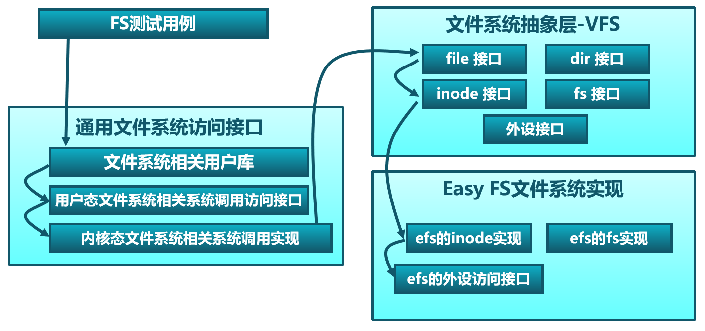
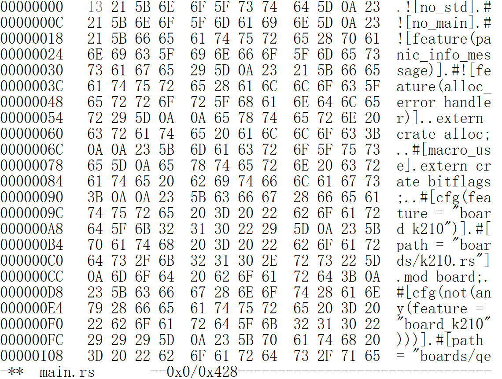
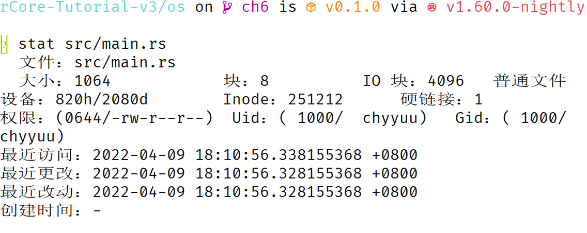
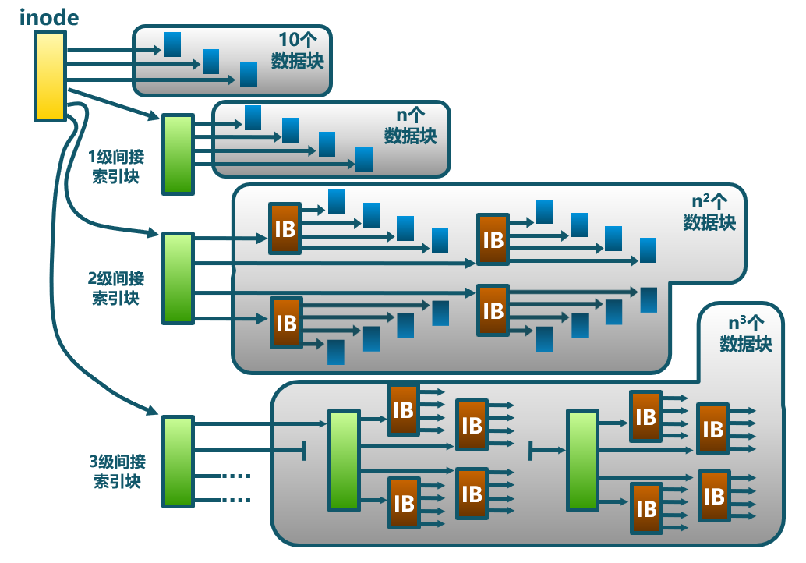

<!-- theme: gaia -->
<!-- _class: lead -->

## 第九讲 文件系统

### 第四节 支持文件的操作系统

Filesystem OS(FOS)


---
## 实践：FOS
- **进化目标**
- 总体思路
- 历史背景
- 实践步骤
- 软件架构
- 相关硬件
- 程序设计


---
## 实践：FOS -- 以往目标
提高性能、简化开发、加强安全
- Process OS: 增强进程管理和资源管理
- Address Space OS: APP不用考虑其运行时的起始执行地址，隔离APP访问的内存地址空间
- multiprog & time-sharing OS目标: 让APP有效共享CPU，提高系统总体性能和效率
- BatchOS目标: 让APP与OS隔离，加强系统安全，提高执行效率
- LibOS目标: 让APP与HW隔离，简化应用访问硬件的难度和复杂性
---
## 实践：FOS -- 进化目标
支持数据持久保存
- 以文件形式保存持久数据，并能进行文件数据读写
- 进程成为文件资源的使用者
- 能够在应用层面发出如下系统调用请求：
   - open/read/write/close


---
## 实践：FOS
### 同学的进化目标
- 理解文件系统/文件概念
- 理解文件系统的设计与实现
- 理解应用<->库<->...<->设备驱动的整个文件访问过程
- 会写支持文件系统的OS

<!-- 霸王龙即雷克斯暴龙（Tyrannosaurus Rex） 操作系统  -->


---
## 实践：FOS
- 进化目标
- **总体思路**
- 历史背景
- 实践步骤
- 软件架构
- 相关硬件
- 程序设计


---

**总体思路**


---

**总体思路**
- 文件类型
- 当前
  - Regular file 常规文件
  - Directory 目录文件
- 未来
  - Link file 链接文件
  - Device 设备文件
  - Pipe 管道文件


---

**总体思路**
**需要考虑的问题**
- 硬盘上的文件系统如何组织？硬盘布局？
- 如何管理空闲磁盘块？
- 如何表示一个文件/目录？
  - 文件是啥？目录是啥？
- 如何表示文件/目录数据内容？
- 如何访问一个文件？


---

**总体思路**


---

**总体思路**


---

**总体思路**


---

**总体思路**


---

**总体思路**


---

**总体思路**




---

**总体思路**


---
### 总体思路
- 编译：内核独立编译，单独的内核镜像
- 编译：应用程序编译后，组织形成文件系统镜像
- 构造：进程的管理与初始化，建立基于页表机制的虚存空间
- 构造：构建文件系统
- 运行：特权级切换，进程与OS相互切换
- 运行：切换地址空间，跨地址空间访问数据
- 运行：从文件系统加载应用，形成进程
- 运行：数据切换：内存--磁盘，基于文件的读写


---
## 实践：FOS
- 进化目标
- 总体思路
- **历史背景**
- 实践步骤
- 软件架构
- 相关硬件
- 程序设计


---
### 历史
- 1965：描述未来的 MULTICS 操作系统
  - 指明方向的舵手：Multics文件系统
    - 文件数据看成是一个无格式的字节流 
    - 第一次引入了层次文件系统的概念
  - 启发和造就了UNIX
     - 眼中一切皆文件的UNIX文件系统
---
## 实践：FOS
- 进化目标
- 总体思路
- 历史背景
- **实践步骤**
- 软件架构
- 相关硬件
- 程序设计


---
### 实践步骤 
```
git clone https://github.com/rcore-os/rCore-Tutorial-v3.git
cd rCore-Tutorial-v3
git checkout ch6
cd os
make run
```

---
### 实践步骤 
```
[RustSBI output]
...
filetest_simple
fantastic_text
**************/
Rust user shell
>>
```
操作系统启动``shell``后，用户可以在``shell``中通过敲入应用名字来执行应用。

从用户界面上，没看出文件系统的影子


---
### 实践步骤 
在这里我们运行一下本章的测例 filetest_simple ：
```
>> filetest_simple
file_test passed!
Shell: Process 2 exited with code 0
>>
```
它会将 Hello, world! 输出到另一个文件 filea ，并读取里面的内容确认输出正确。

---
### 实践步骤 

我们也可以通过命令行工具 cat_filea 来更直观的查看 filea 中的内容：

```
>> cat_filea
Hello, world!
Shell: Process 2 exited with code 0
>>
```
---
## 实践：FOS
- 进化目标
- 总体思路
- 历史背景
- 实践步骤
- **软件架构**
- 相关硬件
- 程序设计


---
**软件架构**

- 文件操作
    - open
    - read
    - write
    - close
  


---
### 代码结构
添加easy-fs
```
   ├── easy-fs(新增：从内核中独立出来的一个简单的文件系统 EasyFileSystem 的实现)
   │   ├── Cargo.toml
   │   └── src
   │       ├── bitmap.rs(位图抽象)
   │       ├── block_cache.rs(块缓存层，将块设备中的部分块缓存在内存中)
   │       ├── block_dev.rs(声明块设备抽象接口 BlockDevice，需要库的使用者提供其实现)
   │       ├── efs.rs(实现整个 EasyFileSystem 的磁盘布局)
   │       ├── layout.rs(一些保存在磁盘上的数据结构的内存布局)
   │       ├── lib.rs
   │       └── vfs.rs(提供虚拟文件系统的核心抽象，即索引节点 Inode)
   ├── easy-fs-fuse(新增：将当前 OS 上的应用可执行文件按照 easy-fs 的格式进行打包)
   │   ├── Cargo.toml
   │   └── src
   │       └── main.rs
```

---
### 代码结构
改进OS
```
├── os
   │   ├── build.rs
   │   ├── Cargo.toml(修改：新增 Qemu 和 K210 两个平台的块设备驱动依赖 crate)
   │   ├── Makefile(修改：新增文件系统的构建流程)
   │   └── src
   │       ├── config.rs(修改：新增访问块设备所需的一些 MMIO 配置)
   │       ├── console.rs
   │       ├── drivers(修改：新增 Qemu 和 K210 两个平台的块设备驱动)
   │       │   ├── block
   │       │   │   ├── mod.rs(将不同平台上的块设备全局实例化为 BLOCK_DEVICE 提供给其他模块使用)
   │       │   │   ├── sdcard.rs(K210 平台上的 microSD 块设备, Qemu不会用)
   │       │   │   └── virtio_blk.rs(Qemu 平台的 virtio-blk 块设备)
   │       │   └── mod.rs

```

---
### 代码结构
改进OS
```
├── os
   │       ├── fs(修改：在文件系统中新增常规文件的支持)
   │       │   ├── inode.rs(新增：将 easy-fs 提供的 Inode 抽象封装为内核看到的 OSInode
   │       │            并实现 fs 子模块的 File Trait)
   │       ├── loader.rs(移除：应用加载器 loader 子模块，本章开始从文件系统中加载应用)
   │       ├── mm
   │       │   ├── memory_set.rs(修改：在创建地址空间的时候插入 MMIO 虚拟页面)
   │       ├── syscall
   │       │   ├── fs.rs(修改：新增 sys_open)
   │       │   └── process.rs(修改：sys_exec 改为从文件系统中加载 ELF，并支持命令行参数)
   │       ├── task
   │       │   ├── mod.rs(修改初始进程 INITPROC 的初始化)
```


---
## 实践：FOS
- 进化目标
- 总体思路
- 历史背景
- 实践步骤
- 软件架构
- **相关硬件 **
  - 块设备
- 程序设计


---
## 实践：FOS
- 进化目标
- 总体思路
- 历史背景
- 实践步骤
- 软件架构
- 相关硬件
- **程序设计** 
  <!-- 主要的事情就是**实现文件抽象* -->


---
## 实践：FOS - 理解文件
<!-- **程序设计**  -->
  - 对持久存储（persistent storage）的虚拟化和抽象
     - Tape，Disk，SSD... 
     - 用户用它们保存真正关心的数据


---
### 实践：FOS  -- 理解文件
应用角度：
- **文件** 是一个特殊的文件，线性字节数组，每个字节都可以读取或写入。
-  每个文件都有一个给用户可理解的字符串名字
-  每个文件都有一个应用程序员可理解的某种低级名称-file descriptor
- 显示文件的线性字节内容
 ```
  $ hexedit os/src/main.rs
```



---
### 实践：FOS  -- 理解文件
内核角度：
- **文件** 是存储设备上的数据，需要通过文件系统进行管理
- 管理文件的结构称为inode，inode描述了文件的各种属性和数据位置
- 显示文件的线性字节内容
 ```
  $ cd os ; stat src/main.rs
```


---
### 实践：FOS  -- 理解目录

应用角度：
-   **目录** 是一个特殊的文件，它的内容包含一个位于该目录下的文件名列表
- 显示目录内容  

```
  $ cd os ; ls -la
```
 


---
### 实践：FOS  -- 理解目录

内核角度：
-   **目录** 是一个特殊的文件，它的内容包含一个（用户可读文件名字，inode）对的数组
-   ``DirEntry``数组

```rust
pub struct DirEntry {
    name: [u8; NAME_LENGTH_LIMIT + 1],
    inode_number: u32,
}
```
 


---
## 实践：FOS -- 应用程序设计 
- 系统调用
```
/// 功能：打开一个常规文件，并返回可以访问它的文件描述符。
/// 参数：path 描述要打开的文件的文件名
/// （简单起见，文件系统不需要支持目录，所有的文件都放在根目录 / 下），
/// flags 描述打开文件的标志，具体含义下面给出。
/// 返回值：如果出现了错误则返回 -1，否则返回打开常规文件的文件描述符。
/// 可能的错误原因是：文件不存在。
/// syscall ID：56
fn sys_open(path: &str, flags: u32) -> isize
```
---
## 实践：FOS -- 应用程序设计 
- 系统调用

```
/// 功能：当前进程关闭一个文件。
/// 参数：fd 表示要关闭的文件的文件描述符。
/// 返回值：如果成功关闭则返回 0 ，否则返回 -1 。
/// 可能的出错原因：传入的文件描述符并不对应一个打开的文件。

/// syscall ID：57
fn sys_close(fd: usize) -> isize
```

---
## 实践：FOS -- 应用程序设计 
- 系统调用

```
/// 功能：当前进程读取文件。
/// 参数：fd 表示要读取文件的文件描述符。
/// 返回值：如果成功读入buf，则返回 读取的字节数，否则返回 -1 。
/// 可能的出错原因：传入的文件描述符并不对应一个打开的文件。

/// syscall ID：63
sys_read(fd: usize, buf: *const u8, len: usize) -> isize
```


---
## 实践：FOS -- 应用程序设计 
- 系统调用

```
/// 功能：当前进程写入一个文件。
/// 参数：fd 表示要写入文件的文件描述符。
/// 返回值：如果成功把buf写入，则返回写入字节数 ，否则返回 -1 。
/// 可能的出错原因：传入的文件描述符并不对应一个打开的文件。

/// syscall ID：64
fn sys_write(fd: usize, buf: *const u8, len: usize) -> isize
```


---
## 实践：FOS -- 应用程序设计 
  - 系统调用
```
/// 功能：当前进程等待一个子进程变为僵尸进程，回收其全部资源并收集其返回值。
/// 参数：pid 表示要等待的子进程的进程 ID，如果为 -1 的话表示等待任意一个子进程；
/// exit_code 表示保存子进程返回值的地址，如果这个地址为 0 的话表示不必保存。
/// 返回值：如果要等待的子进程不存在则返回 -1；否则如果要等待的子进程均未结束则返回 -2；
/// 否则返回结束的子进程的进程 ID。
/// syscall ID：260
pub fn sys_waitpid(pid: isize, exit_code: *mut i32) -> isize;
```


---
## 实践：FOS -- 应用程序设计 
```
pub fn main() -> i32 {
    let test_str = "Hello, world!";
    let filea = "filea\0";
    //创建文件filea，返回文件描述符fd
    let fd = open(filea, OpenFlags::CREATE | OpenFlags::WRONLY);
    write(fd, test_str.as_bytes());           //把test_str写入文件中
    close(fd);                                //关闭文件
    let fd = open(filea, OpenFlags::RDONLY);  //只读方式打开文件
    let mut buffer = [0u8; 100];
    let read_len = read(fd, &mut buffer) as usize;//读取文件内容
    close(fd);
}
```

---
## 实践：FOS - 程序设计
<!-- **程序设计**  -->
- 理解进程
- 应用程序设计
- **内核程序设计**


---
### 内核程序设计
- 核心数据结构
    - 进程管理文件
    - 文件系统管理
- 文件管理机制
   - 文件系统初始化 
   - 打开与关闭文件
   - 读写文件
   - 基于文件来加载并执行应用


---
### 内核程序设计
- 核心数据结构
    - 进程管理文件
      - 目录、文件
      - 文件描述符
      - 文件描述符表
      - inode


---
### 内核程序设计 -- 核心数据结构
- 文件位于根目录``ROOT_INODE``中
- 目录的内容是``DirEntry``组成的数组
- 文件/目录用``inode``表示
```rust
pub struct DirEntry {
    name: [u8; NAME_LENGTH_LIMIT + 1],
    inode_number: u32,
}
... 
let fd = open(filea, OpenFlags::RDONLY);
```


---
### 内核程序设计 -- 核心数据结构
- 打开的文件在进程中``fd_table``中
- ``fd_table``是``OSInode``组成的数组
```rust
pub struct TaskControlBlockInner {
    pub fd_table: ... //文件描述符表

pub struct OSInode {//进程管理的inode
    readable: bool,  writable: bool,
    inner: UPSafeCell<OSInodeInner>,
}

pub struct OSInodeInner {
    offset: usize, //文件读写的偏移位置
    inode: Arc<Inode>,//存储设备inode
}
```


---
### 内核程序设计
- 核心数据结构
    - 文件系统管理
      - 超级块
      - inode/data位图
      - disk_inode
      - disk_data
      - blk_cache


---
### 内核程序设计 -- 核心数据结构
超级块(SuperBlock)描述文件系统全局信息
```rust
pub struct SuperBlock {
    magic: u32,
    pub total_blocks: u32,
    pub inode_bitmap_blocks: u32,
    pub inode_area_blocks: u32,
    pub data_bitmap_blocks: u32,
    pub data_area_blocks: u32,
}
```


---
### 内核程序设计 -- 核心数据结构
位图(bitmap)描述文件系统全局信息
在 easy-fs 布局中存在两类不同的位图，分别对索引节点和数据块进行管理。
```rust
pub struct Bitmap {
    start_block_id: usize,
    blocks: usize,
}
```


---
### 内核程序设计 -- 核心数据结构
磁盘索引节点(DiskInode)描述文件信息和数据
```rust
pub struct DiskInode {
    pub size: u32,
    pub direct: [u32; INODE_DIRECT_COUNT],
    pub indirect1: u32,
    pub indirect2: u32,
    type_: DiskInodeType,
}
```



---
### 内核程序设计 -- 核心数据结构
- ``read_at``和``write_at``把文件偏移量和buf长度转换为一系列的数据块编号，并进行通过``get_block_cache``数据块的读写。
- ``get_block_id`` 方法体现了 DiskInode 最重要的数据块索引功能，它可以从索引中查到它自身用于保存文件内容的第 block_id 个数据块的块编号，这样后续才能对这个数据块进行访问：


---
### 内核程序设计 -- 核心数据结构
数据块与目录项
```rust
type DataBlock = [u8; BLOCK_SZ];

pub struct DirEntry {
    name: [u8; NAME_LENGTH_LIMIT + 1],
    inode_number: u32,
}
```


---
### 内核程序设计 -- 核心数据结构
块缓存``BlockCache``
```rust
pub const BLOCK_SZ: usize = 512;

pub struct BlockCache {
    cache: [u8; BLOCK_SZ], //512 字节数组
    block_id: usize, //对应的块编号
    //底层块设备的引用，可通过它进行块读写
    block_device: Arc<dyn BlockDevice>, 
    modified: bool, //它有没有被修改过
}
```
``get_block_cache`` 方法尝试获取一个编号为 ``block_id`` 的块缓存


---
### 内核程序设计 -- 设计实现  -- 概述
1. 文件系统初始化
2. 打开与关闭文件
3. 基于文件加载应用
4. 读写文件


---
### 内核程序设计 -- 设计实现 
文件系统初始化
1. 打开块设备 BLOCK_DEVICE ；
2. 从块设备 BLOCK_DEVICE 上打开文件系统；
3. 从文件系统中获取根目录的 inode 。

```rust
lazy_static! {
    pub static ref BLOCK_DEVICE = Arc::new(BlockDeviceImpl::new());
......
lazy_static! {
    pub static ref ROOT_INODE: Arc<Inode> = {
        let efs = EasyFileSystem::open(BLOCK_DEVICE.clone());
        Arc::new(EasyFileSystem::root_inode(&efs))
```


---
### 内核程序设计 -- 设计实现 
打开(创建)文件

```rust
fn open_file(name: &str, flags: OpenFlags) -> Option<Arc<OSInode>> {
  ......
 ROOT_INODE.create(name) //在根目录中创建一个DireEntry<name，inode>
                .map(|inode| {//创建进程中fd_table[OSInode]
                    Arc::new(OSInode::new( 
                        readable,
                        writable,
                        inode,
```
在根目录``ROOT_INODE``中创建一个文件，返回``OSInode``


---
### 内核程序设计 -- 设计实现 
打开(查找)文件

```rust
fn open_file(name: &str, flags: OpenFlags) -> Option<Arc<OSInode>> {
  ......
 ROOT_INODE.find(name) //在根目录中查找DireEntry<name，inode>
            .map(|inode| { //创建进程中fd_table[OSInode]
                Arc::new(OSInode::new(
                    readable,
                    writable,
                    inode
```
在根目录``ROOT_INODE``中找到一个文件，返回``OSInode``


---
### 内核程序设计 -- 设计实现 
关闭文件
```rust
pub fn sys_close(fd: usize) -> isize {
    let task = current_task().unwrap();
    let mut inner = task.inner_exclusive_access();
    ......
    inner.fd_table[fd].take();
    0
}
```
sys_close ：将进程控制块中的文件描述符表对应的一项改为 None 代表它已经空闲即可，同时这也会导致文件的引用计数减一，当引用计数减少到 0 之后文件所占用的资源就会被自动回收。


---
### 内核程序设计 -- 设计实现 
基于文件加载应用
```rust
    pub fn sys_exec(path: *const u8) -> isize {
        if let Some(app_inode) = open_file(path.as_str(), ...) {
            let all_data = app_inode.read_all();
            let task = current_task().unwrap();
            task.exec(all_data.as_slice());
```

当获取应用的 ELF 文件数据时，首先调用 ``open_file`` 函数，以只读方式打开应用文件并获取它对应的 ``OSInode`` 。接下来可以通过 ``OSInode::read_all`` 将该文件的数据全部读到一个向量 ``all_data`` 中


---
### 内核程序设计 -- 设计实现
读写文件
- 基于文件抽象接口和文件描述符表
- 可以按照无结构的字节流在处理基本的文件读写
```rust
  pub fn sys_write(fd: usize, buf: *const u8, len: usize) -> isize {
        if let Some(file) = &inner.fd_table[fd] {
            file.write(
                UserBuffer::new(translated_byte_buffer(token, buf, len))
            ) as isize
```
操作系统都是通过文件描述符在当前进程的文件描述符表中找到某个文件，无需关心文件具体的类型。

---
### 内核程序设计 -- 设计实现
读写文件
- 基于文件抽象接口和文件描述符表
- 可以按照无结构的字节流在处理基本的文件读写
```rust
  pub fn sys_read(fd: usize, buf: *const u8, len: usize) -> isize {
        if let Some(file) = &inner.fd_table[fd] {
            file.read(
                UserBuffer::new(translated_byte_buffer(token, buf, len))
            ) as isize
```
操作系统都是通过文件描述符在当前进程的文件描述符表中找到某个文件，无需关心文件具体的类型。

---
## 小结
- 文件/目录的概念与实现
- 文件系统设计与实现
- 进程与文件系统
- 能写霸王龙OS

