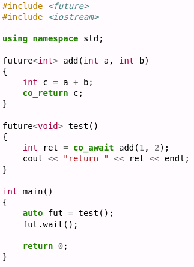
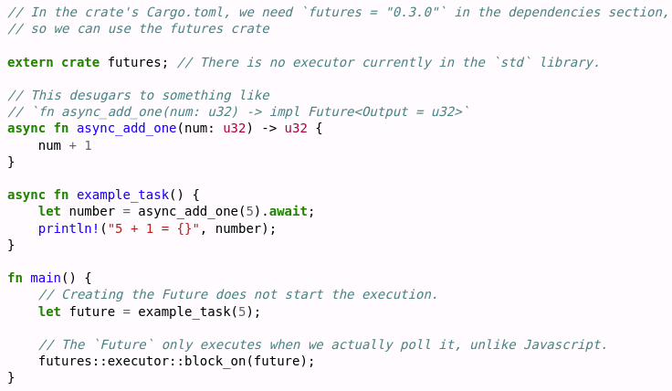
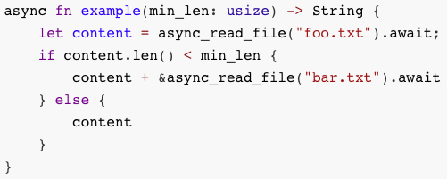
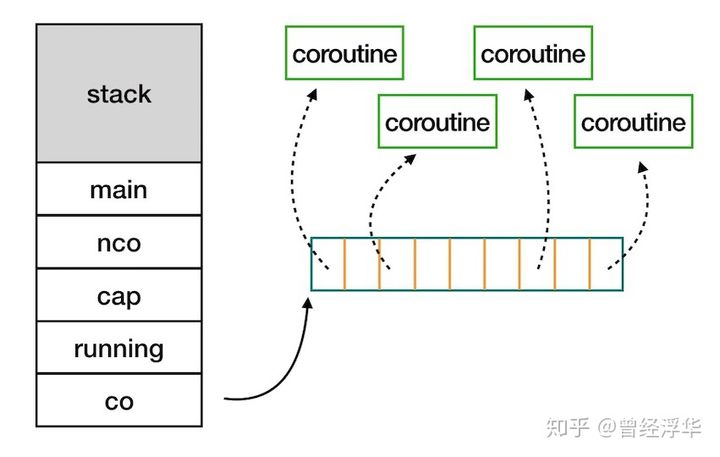
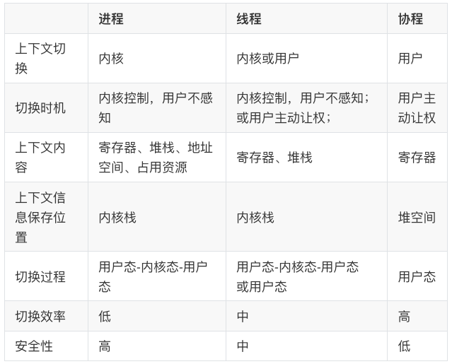

### 9.3 协程(coroutine)

* [v1](https://github.com/LearningOS/os-lectures/blob/f7d4a00f5a0d55b5240d33175b29d8f1ccce72aa/lecture09/slide-09-03.md)
* [v2](https://github.com/LearningOS/os-lectures/blob/a19431e2d7bf6d57f5616773478fba30551a8922/lecture09/slide-09-03.md)
* [v3](https://github.com/LearningOS/os-lectures/blob/9e6eb145a3381fb65a584531bae0f229a4030c05/lecture09/slide-09-03.md)
* v4

#### 协程引入

##### 问题[描述](https://os.phil-opp.com/async-await/#example)

多线程系统的并发执行效率仍然不高，特别是在一些并发线程数目较多且需要频繁与外界进行交互中的短时等待场景。

##### 引入协程的目的

1. 提高线程内代码执行的并发性能和稳定性
2. 代码以顺序性书写：代码逻辑易于理解，减弱异步调用复杂性，提高可维护性，方便错误排查。
3. 执行时则是异步调用：减少协程切换开销，避免线程内的并发操作冲突，提高线程内代码并发执行的性能。

#### 协程的概念

##### 协程

协程(Coroutine)是基于状态机机制实现的允许在执行过程中主动暂停和恢复的异步函数实现机制。

* [ Design of a Separable Transition-Diagram Compiler](http://melconway.com/Home/pdf/compiler.pdf)：1963年关于协程的论文；
* 同步函数(ordinary function)：当一个函数是同步执行时，那么当该函数被调用时不会立即返回，直到该函数所要做的事情全都做完了才返回。
* [异步函数](https://www.cnblogs.com/balingybj/p/4780442.html)(asynchronous function)：如果一个异步函数被调用时，该函数会立即返回；当该函数规定的操作任务完成时，通过回调、事件或消息机制将结果通知调用者。

##### 协程的模型描述

1. 状态机：每个状态是一个连续的代码片段执行，状态间是协程的切换；
2. 演员模型：并发和合作的演员模型。每个演员有自己的任务，自愿地由调度器协调各演员的执行顺序；
3. 生成器：可在指定位置暂停的执行流，由调度器遍历协调执行顺序；

#### 协程的例子

##### Python的协程示例

[Async/await](https://en.wikipedia.org/wiki/Async/await)：对多种支持异步的语言中给出协程的示例程序；

##### C++的协程示例

##### Rust协程示例

#### 协程的工作原理

##### 协程的工作原理

当协程在执行中出现阻塞时，由协程调度器主动保存当前栈上数据，让出权给其他可以执行的协程；阻塞完后再通过协程调度器恢复栈上数据，并恢复原协程的执行。

* yield，将控制权返还给协程A的创建协程
* resume，将控制权交给一个子协程

##### 协程的状态机[描述](https://os.phil-opp.com/async-await/#the-async-await-pattern)

##### 支持协程的线程堆栈结构

##### 协程切换

协程运行需要栈空间，所有协程公用一块大的栈空间。当协程切出时，把自己的栈内容拷贝，当控制权再次切回时，把自己的栈内容还原到公共栈空间。

* 每个协程单独申请一块栈空间，就是用户线程。
* 与协程相比，用户线程的单独栈空间过小会栈溢出；太大则浪费严重。 

#### 进程、线程和协程

##### [协程与函数](https://zh.wikipedia.org/wiki/%E5%8D%8F%E7%A8%8B)

* 函数可以调用其他函数，调用函数等待被调用函数结束后继续执行；协程可以调用其他协程，但调用协程在等待被调用协程结束前可以执行其他协程。
* 函数的入口点是唯一的，函数被调用时是从入口点开始执行；协程可有多个入口点，协程被调用时是第一个入口点开始执行，每个暂停返回出口点都是再次被调用执行时的入口点。
* 函数在结束时一次性返回全部结果；协程在暂停返回时可返回部分结果。

##### [协程与线程](https://www.cnblogs.com/theRhyme/p/14061698.html)

1. 协程的开销远远小于线程的开销：不需要独立的栈空间；切换时需要保存和恢复的数据少；
2. 在多核处理器的环境下, 多个线程是可并行的；协程是并发的，任何时刻同一线程内只有一个协程在执行，其他协程处于暂停状态。
3. 线程切换可以是抢先式或非抢先式；而同线程内的协程切换只有非抢先式。

##### 进程、线程和协程[比较](https://www.cnblogs.com/theRhyme/p/14061698.html)

