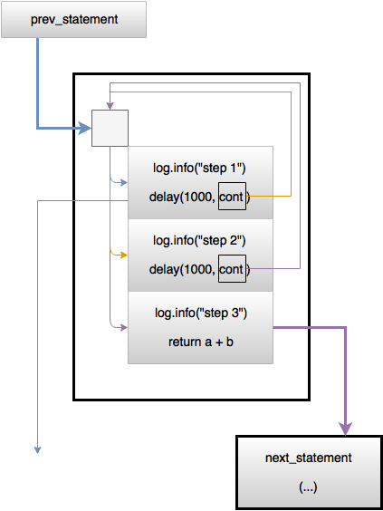

### 9.3 协程(coroutine)

* [v1](https://github.com/LearningOS/os-lectures/blob/f7d4a00f5a0d55b5240d33175b29d8f1ccce72aa/lecture09/slide-09-03.md)
* V2

#### 协程引入

问题描述：系统的并发执行效率仍然不高，特别是在一些需要与外界进行交互的场景中的短时等待。

[concept of futures](https://os.phil-opp.com/async-await/#example)


[协程原理解析(1)](https://zhuanlan.zhihu.com/p/52061644)：

C++中的协程
微信开源的协程库libco

引入协程库后，代码以顺序性书写，易于理解，而执行时则是异步调用，性能不减。
性能高、稳定性好
解决异步调用复杂，代码逻辑难以梳理，维护性差，出bug后不易排查等问题。

协程版网络库封装：SendAndRecv、yield、resume、DoTask

[协程（coroutine）工作原理](https://www.jianshu.com/p/c958a3331169)：

协程特点在于**单线程**执行。极高的执行效率，因为在任务切换的时候是程序之间的切换；单线程工作，没有多线程需要考虑的同时写变量冲突，所以不需要多线程的[锁机制](https://www.liaoxuefeng.com/wiki/0014316089557264a6b348958f449949df42a6d3a2e542c000/00143192823818768cd506abbc94eb5916192364506fa5d000)，故执行效率比多线程更高。

只说了用法，没有原理介绍。

用的是python的例子；


#### 协程的概念

[协程-维基百科，自由的百科全书](https://zh.wikipedia.org/wiki/%E5%8D%8F%E7%A8%8B)：（[本地副本](file:///Users/xyong/Desktop/OS2021spring/coroutine.html)）：

[Coroutine - From Wikipedia, the free encyclopedia](https://en.wikipedia.org/wiki/Coroutine)：英文版本的更新是到2020年；

**Coroutines** are [computer program](https://en.wikipedia.org/wiki/Computer_program) components that generalize [subroutines](https://en.wikipedia.org/wiki/Subroutine) for [non-preemptive multitasking](https://en.wikipedia.org/wiki/Non-preemptive_multitasking), by allowing execution to be suspended and resumed. Coroutines are well-suited for implementing familiar program components such as [cooperative tasks](https://en.wikipedia.org/wiki/Cooperative_multitasking), [exceptions](https://en.wikipedia.org/wiki/Exception_handling), [event loops](https://en.wikipedia.org/wiki/Event_loop), [iterators](https://en.wikipedia.org/wiki/Iterator), [infinite lists](https://en.wikipedia.org/wiki/Lazy_evaluation) and [pipes](https://en.wikipedia.org/wiki/Pipeline_(software)).

协程(Coroutine)是允许在执行过程中主动暂停和恢复的函数组件。

子例程的起始处是惟一的入口点，每当子例程被调用时，执行都从被调用子例程的起始处开始。协程可以有多个入口点，协程的起始处是第一个入口点，每个yield返回出口点都是再次被调用执行时的入口点。

子例程可以看作是特定状况的协程[[4\]](https://zh.wikipedia.org/wiki/协程#cite_note-KnuthVol1_1_4_2-4)，任何子例程都可转写为不调用yield的协程[[5\]](https://zh.wikipedia.org/wiki/协程#cite_note-Perlis1982_6-5)。 

生产者和消费者问题的协程实现：yield、

协程的模型描述：

1. 状态机：每个状态是一个连续的代码片段执行，状态间是协程的切换；
2. 演员模型：并发和合作的演员模型。每个演员有自己的任务，自愿地由调度器协调各演员的执行顺序；
3. 生成器：可在指定位置暂停的执行流，由调度器遍历协调执行顺序；

[Async/await](https://en.wikipedia.org/wiki/Async/await)：这里对各种支持异步的语言中都给出协程的例子程序；

[Async/Await in Rust](https://os.phil-opp.com/async-await/#state-machine-transformation)：这是介绍Rust异步机制的帖子，有很好的插图；

[ Design of a Separable Transition-Diagram Compiler](http://melconway.com/Home/pdf/compiler.pdf)：1963年关于协程的论文；

[ The Async/Await Pattern](https://os.phil-opp.com/async-await/#the-async-await-pattern)

```rust
async fn example(min_len: usize) -> String {
    let content = async_read_file("foo.txt").await;
    if content.len() < min_len {
        content + &async_read_file("bar.txt").await
    } else {
        content
    }
}
```


#### 协程原理

当协程在执行中出现阻塞时，由协程调度器主动保存当前栈上数据，让出权给其他可以执行的协程；阻塞完后再通过协程调度器恢复栈上数据，并恢复原协程的执行。

[协程原理解析(1)](https://zhuanlan.zhihu.com/p/52061644)

协程原理：
yield，将控制权返还给协程A的创建协程
resume，将控制权交给一个子协程

[协程原理解析(2)](https://zhuanlan.zhihu.com/p/52061886)：探讨与分析实现协程依赖的四大函数

协程的实现需要依赖四大函数：

- `int getcontext(ucontext_t *ucp);`：用当前执行环境初始化`ucontext_t`结构、[getcontext在线代码](https://code.woboq.org/userspace/glibc/sysdeps/unix/sysv/linux/x86_64/getcontext.S.html)
- `void makecontext(ucontext_t *ucp, void (*func)(), int argc, ...);`：更改ucp结构，进行栈准备工作，该context执行完毕后自动激活`uc_link`并执行；进行context切换，把执行流程切到另外一个context。[makecontext在线代码](https://code.woboq.org/userspace/glibc/sysdeps/unix/sysv/linux/x86_64/makecontext.c.html)
- `int swapcontext(ucontext_t *oucp, ucontext_t *ucp);`：把当前执行环境保存到oucp，并激活ucp进行执行、[swapcontext在线代码](https://code.woboq.org/userspace/glibc/sysdeps/unix/sysv/linux/x86_64/swapcontext.S.html)
- `int setcontext(const ucontext_t *ucp);`：激活ucp并进行执行；与`swapcontext`类似，将控制权转移到`ucp`中。[setcontext在线代码](https://code.woboq.org/userspace/glibc/sysdeps/unix/sysv/linux/x86_64/setcontext.S.html)

[协程原理解析(3)](https://zhuanlan.zhihu.com/p/52495120)：分析cloudwu(云风)协程库的具体实现

用C语言实现过一个协程库，采用非对称式、`stackful`模式、未hook系统函数、不提供协程调度功能。 源码只有200多行，实现简洁，非常教科书式，对于协程刚入门用户可谓佳品。

代码库地址：[云风协程库](https://github.com/cloudwu/coroutine)

通过调用`coroutine_open`创建协程环境，调用`coroutine_new`创建协程并传递工作函数指针，调用`coroutine_resume`授予协程运行权，在协程中调用`coroutine_yield`将运行权切出。

内存布局(有一个很好的插图)


协程切换时栈空间复制：（(有一个很好的插图)）


由于协程运行时需要栈空间，我们可以选择给每个协程单独申请一块空间(例如：1M大小)，而每个协程运行时候所需空间大小不一，如果空间过小协程运行时候会由于空间不足而栈溢出，如果空间太大则整体空间浪费严重。 所以这里采用所有协程公用一块大空间，当协程切出时，把自己运行时候的栈内容一并拷贝，当控制权再次切回来时候，把自己的栈内容还原到公共栈空间。

#### 协程切换的状态机

[Suspending functions, coroutines and state machines](https://labs.pedrofelix.org/guides/kotlin/coroutines/coroutines-and-state-machines)：有一个很好的插图。异步函数可以分成若干个挂起函数加一个状态机；

suspending function and coroutines:

- A suspending function defines a state machine.
- A coroutine is an instance of that state machine, created as a result of a call to the associated suspending function.

The following suspend function and associated diagram illustrates this process.

```kotlin
suspend fun suspendFunctionWithDelay3(a: Int, b: Int): Int {
    log.info("step 1")
    delay(1000)
    log.info("step 2")
    delay(2000)
    log.info("step 3")
    return a + b
}
```




#### 协程与函数的关系

[协程-维基百科，自由的百科全书](https://zh.wikipedia.org/wiki/%E5%8D%8F%E7%A8%8B)：（[本地副本](file:///Users/xyong/Desktop/OS2021spring/coroutine.html)）：

* 函数可以调用其他函数，调用函数等待被调用函数结束后继续执行；协程可以调用其他协程，但调用协程在等待被调用协程结束前可以执行其他协程。

- 函数的入口点是唯一的，函数被调用时是从入口点开始执行；协程可有多个入口点，协程被调用时是第一个入口点开始执行，每个暂停返回出口点都是再次被调用执行时的入口点。
- 函数在结束时一次性返回全部结果；协程在暂停返回时可返回部分结果。

#### 协程与线程的关系

[协程的原理以及与线程的区别](https://www.cnblogs.com/theRhyme/p/14061698.html)

1. 协程的开销远远小于线程的开销：不需要独立的栈空间；切换时需要保存和恢复的数据少；
2. 在多核处理器的环境下, 多个线程是可并行的；协程是并发的，任何时刻同一线程内只有一个协程在执行，其他协程处于暂停状态。
3. 线程切换可以是抢先式或非抢先式；而同线程内的协程切换只有非抢先式。

#### 进程、线程和协程比较

[协程的原理以及与线程的区别](https://www.cnblogs.com/theRhyme/p/14061698.html)

|                    | 进程                             | 线程                                   | 协程         |
| ------------------ | -------------------------------- | -------------------------------------- | ------------ |
| 上下文切换         | 内核                             | 内核或用户                             | 用户         |
| 切换时机           | 内核控制，用户不感知             | 内核控制，用户不感知；或用户主动让权； | 用户主动让权 |
| 上下文内容         | 寄存器、堆栈、地址空间、占用资源 | 寄存器、堆栈                           | 寄存器       |
| 上下文信息保存位置 | 内核栈                           | 内核栈                                 | 堆空间       |
| 切换过程           | 用户态-内核态-用户态             | 用户态-内核态-用户态  或用户态         | 用户态       |
| 切换效率           | 低                               | 中                                     | 高           |
| 安全性             | 高                               | 中                                     | 低           |

#### refs

[Distinguishing coroutines and fibers](http://www.open-std.org/jtc1/sc22/wg21/docs/papers/2014/n4024.pdf)：很好的一份文档；

we can regard the term ‘fiber’ to mean ‘user-space thread.’

When a coroutine yields, it passes control directly to its caller

When a fiber blocks, it implicitly passes control to the fiber scheduler.

[Chapter 1. Coroutine](https://www.boost.org/doc/libs/1_55_0/libs/coroutine/doc/html/index.html)：这是关于C++协程库的原始文档，很深入，但不太直观。

[Async programming in Rust with async-std](https://book.async.rs/introduction.html)：Rust的协程文档；官方的版本；

[Coroutine in Python](https://www.geeksforgeeks.org/coroutine-in-python/)：这是一个关于python协程的介绍，用例子来说明，有插图。很好的。