# 第十讲 进程和线程控制
https://tablesgenerator.com/

[v1](https://github.com/LearningOS/os-lectures/blob/3f429b1e5c7fba1ae1dde052794698dc85024ec4/lecture10/ref.md)

[v2](https://github.com/LearningOS/os-lectures/blob/89a0b1654c051eee1070a8253c38f06234aa90ac/lecture10/ref.md)

[v3](https://github.com/LearningOS/os-lectures/blob/92dc37fecb82c3844fd7ec2aad2beead492c7683/lecture10/ref.md)

## 10.1 进程切换 
## 10.2 进程创建 
## 10.3 进程加载 
## 10.4 进程等待与退出 
## 10.5 rCore的进程和线程控制

#### 进程和线程数据结构

##### 1-rCore的进程控制块结构struct Process

https://github.com/rcore-os/rCore/blob/master/kernel/src/process/structs.rs#L61
/Users/xyong/github/rCore/kernel/src/process/structs.rs
Line 61
pub struct Process


/Users/xyong/github/rCore/kernel/src/process/structs.rs
Line 42:
pub struct Pid(usize);

##### 2-rCore的内存地址空间结构MemorySet

/Users/xyong/github/rCore/crate/memory/src/memory_set/mod.rs
Line 119:
pub struct MemorySet

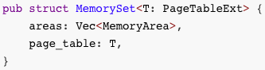

```rust
pub struct MemorySet<T: PageTableExt> {
    areas: Vec<MemoryArea>,
    page_table: T,
}
```


/Users/xyong/github/rCore/crate/memory/src/memory_set/mod.rs
Line 17:
pub struct MemoryArea

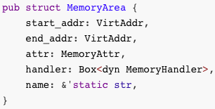

```rust
pub struct MemoryArea {
    start_addr: VirtAddr,
    end_addr: VirtAddr,
    attr: MemoryAttr,
    handler: Box<dyn MemoryHandler>,
    name: &'static str,
}
```

/Users/xyong/github/rCore/kernel/src/memory.rs
Line 29:

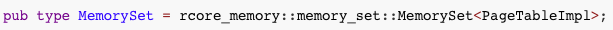

```rust
pub type MemorySet = rcore_memory::memory_set::MemorySet<PageTableImpl>;
```
/Users/xyong/github/rCore/kernel/src/arch/riscv/paging.rs
Line 20:
pub struct PageTableImpl

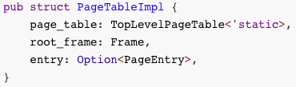

```rust
pub struct PageTableImpl {
    page_table: TopLevelPageTable<'static>,
    root_frame: Frame,
    entry: Option<PageEntry>,
}
```
/Users/xyong/github/riscv/src/paging/multi_level.rs
Line 8:
pub struct Rv32PageTable


```rust
pub struct Rv32PageTable<'a> {
    root_table: &'a mut PageTable,
    linear_offset: usize, // VA = PA + linear_offset
}
```
Line 16:

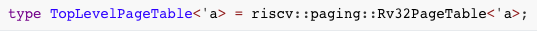

```rust
type TopLevelPageTable<'a> = riscv::paging::Rv32PageTable<'a>;
```
/Users/xyong/github/rCore/crate/memory/src/paging/mod.rs
Line 111:
unsafe fn activate(&self)


```rust
    /// Activate this page table
    unsafe fn activate(&self) {
        let old_token = Self::active_token();
        let new_token = self.token();
        debug!("switch table {:x?} -> {:x?}", old_token, new_token);
        if old_token != new_token {
            Self::set_token(new_token);
            Self::flush_tlb();
        }
    }
```
/Users/xyong/github/rCore/kernel/src/arch/riscv/paging.rs
Line 258:
unsafe fn set_token(token: usize)


```rust
    unsafe fn set_token(token: usize) {
        asm!("csrw satp, $0" :: "r"(token) :: "volatile");
    }
```

##### 3-线程
/Users/xyong/github/rCore/kernel/src/process/structs.rs
Line 28
pub struct Thread

https://github.com/rcore-os/rcore-thread/blob/master/src/thread_pool.rs#L8
struct Thread
/Users/xyong/github/rcore-thread/src/thread_pool.rs

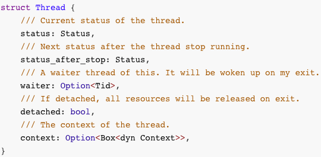

```rust
struct Thread {
    /// Current status of the thread.
    status: Status,
    /// Next status after the thread stop running.
    status_after_stop: Status,
    /// A waiter thread of this. It will be woken up on my exit.
    waiter: Option<Tid>,
    /// If detached, all resources will be released on exit.
    detached: bool,
    /// The context of the thread.
    context: Option<Box<dyn Context>>,
}
```

https://github.com/rcore-os/rcore-thread/blob/master/src/thread_pool.rs#L25
pub enum Status

https://doc.rust-lang.org/src/std/thread/mod.rs.html#1052
Line 1054:
fn new() -> ThreadId

/Users/xyong/github/rCore/kernel/src/process/mod.rs
Line 106:
pub fn thread_manager() -> &'static ThreadPool

#### 线程状态转换

##### 4-线程状态数据结构

/Users/xyong/github/rcore-thread/src/thread_pool.rs

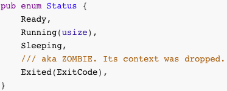

```rust
pub enum Status {
    Ready,
    Running(usize),
    Sleeping,
    /// aka ZOMBIE. Its context was dropped.
    Exited(ExitCode),
}
```
##### 4-线程状态转换

/Users/xyong/github/rcore-thread/src/thread_pool.rs

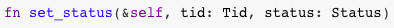

```rust
fn set_status(&self, tid: Tid, status: Status)
```

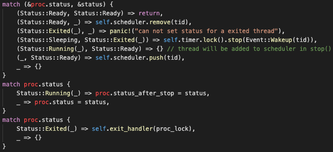

#### 线程上下文切换

##### 5-上下文切换数据结构

/Users/xyong/github/rCore/docs/2_OSLab/g2/context.md
上下文切换的文档

相关数据结构


1. `TrapFrame`:

    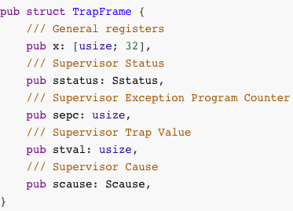

    ```rust
    pub struct TrapFrame {
        /// General registers
        pub x: [usize; 32],
        /// Supervisor Status
        pub sstatus: Sstatus,
        /// Supervisor Exception Program Counter
        pub sepc: usize,
        /// Supervisor Trap Value
        pub stval: usize,
        /// Supervisor Cause
        pub scause: Scause,
    }
    ```

    在陷入异常时向栈中压入的内容，由 [trap.S](../../../kernel/src/arch/aarch64/interrupt/trap.S#L92) 的 `__alltraps` 构建。

2. `ContextData`:

3. 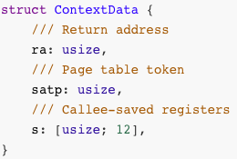

    ```rust
    struct ContextData {
        /// Return address
        ra: usize,
        /// Page table token
        satp: usize,
        /// Callee-saved registers
        s: [usize; 12],
    }
    ```

    执行上下文切换时向栈中压入的内容，由 `__switch()` 函数构建。

4. `InitStack`:

    

    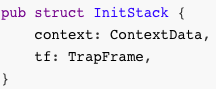

    ```rust
    pub struct InitStack {
        context: ContextData,
        tf: TrapFrame,
    }
    ```

    对于新创建的线程，不仅要向栈中压入 `ContextData` 结构，还需手动构造 `TrapFrame` 结构。为了方便管理就定义了 `InitStack` 包含这两个结构体。

5. `Context`:

    

    ```rust
    pub struct Context {
        /// The stack pointer of the suspended thread.
        /// A `ContextData` is stored here.
        sp: usize,
    }
    ```

    每个进程控制块 `Process` ([kernel/src/process/context.rs](../../../kernel/src/process/structs.rs#L13)) 都会维护一个平台相关的 `Context` 对象。

##### 6-切换函数

/Users/xyong/github/rCore/kernel/src/process/structs.rs
Line 89：

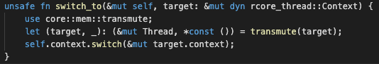

/Users/xyong/github/rCore/kernel/src/arch/riscv/context.rs
Line 141:

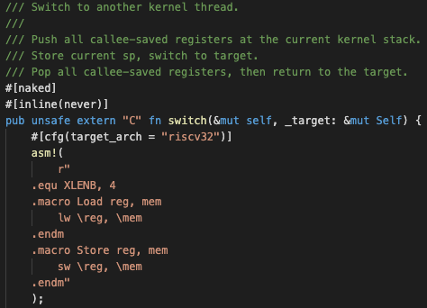

##### 7-线程切换过程

/Users/xyong/github/rcore-thread/src/processor.rs

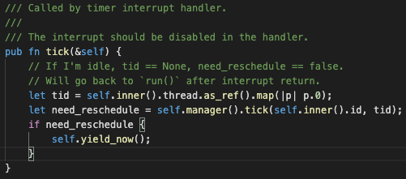

/Users/xyong/github/rcore-thread/src/scheduler/mod.rs


#### 进程和线程控制接口

##### 8-进程控制系统调用

/Users/xyong/github/rCore/kernel/src/syscall/proc.rs
与进程管理相关的系统调用

/Users/xyong/github/rCore/kernel/src/syscall/proc.rs
fn sys_

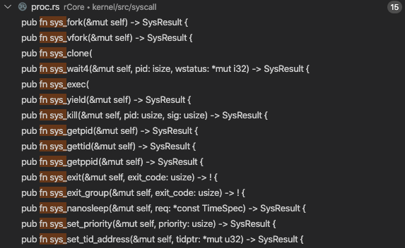

##### 9-线程模块接口
/Users/xyong/github/rcore-thread/src/std_thread.rs

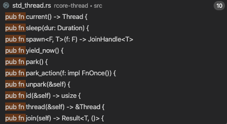

https://doc.rust-lang.org/std/thread/#functions

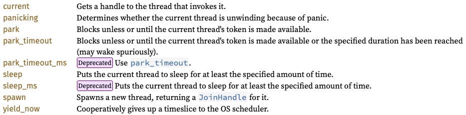

##### 