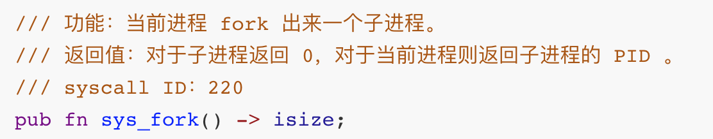
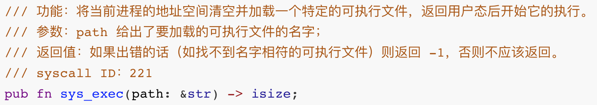
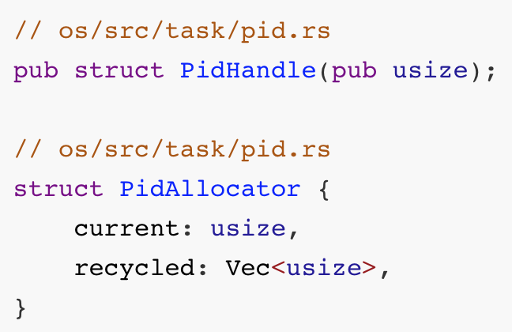
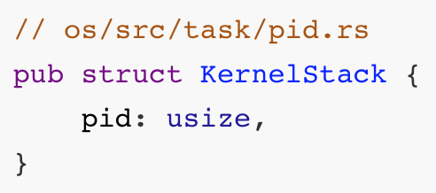
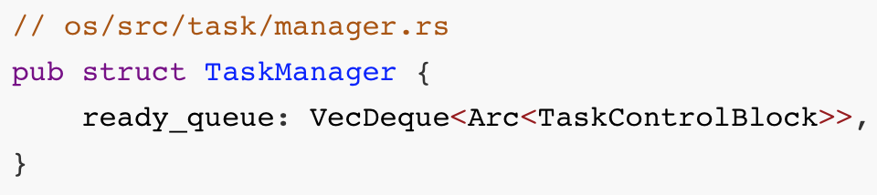
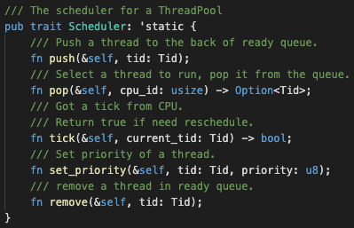

## rCore进程管理

* [v1](https://github.com/LearningOS/os-lectures/blob/d3a86df7dd85020cc35dacebd4f438619d25355b/lecture10/slide-10-02.md)
* [v2](https://github.com/LearningOS/os-lectures/blob/e096bea06a5b054aa9b87ffde6373c0a4cb3cda7/lecture10/slide-10-02.md)
* v3

### [rCore中的进程管理系统调用](https://rcore-os.github.io/rCore-Tutorial-Book-v3/chapter5/1process.html#id4)

#### `fork`

* 内核会创建一个子进程
* 子进程和调用 `fork` 父的进程在返回用户态时的状态几乎完全相同：为子进程创建一个和父进程几乎完全相同的应用地址空间。
* 父子进程的系统调用返回值`a0` 寄存器内容不同

#### `waitpid`

* 进程通过 `exit` 系统调用退出后，无法立即全部地回收所占用资源
  * 内核栈
* 父进程通过 `waitpid` 系统调来获取子进程的返回状态并回收所占据的全部资源，从而彻底销毁子进程
  * 回收子进程的资源并收集它的一些信息

#### `exec`

* 执行不同的可执行文件：加载一个新的 ELF 可执行文件替换原有的应用地址空间并开始执行。
* `path` 作为 `&str` 类型是一个胖指针

调用方法

#### `exit`

* 进程退出：当应用调用 `sys_exit` 系统调用主动退出或者出错由内核终止之后，会在内核中调用 `exit_current_and_run_next` 函数退出当前任务并切换到下一个。

用户初始程序-initproc

外壳程序-user_shell

### 进程管理的核心数据结构

#### 进程标识符

#### 内核栈

#### 进程控制块

#### 任务管理器

#### 处理器监视器

### 任务切换

