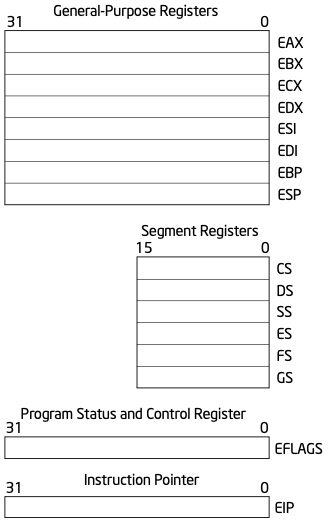
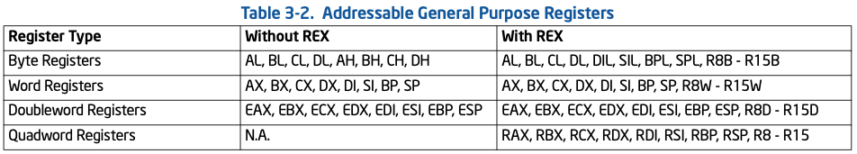
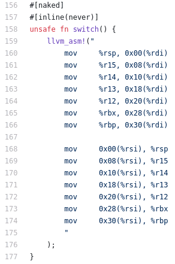
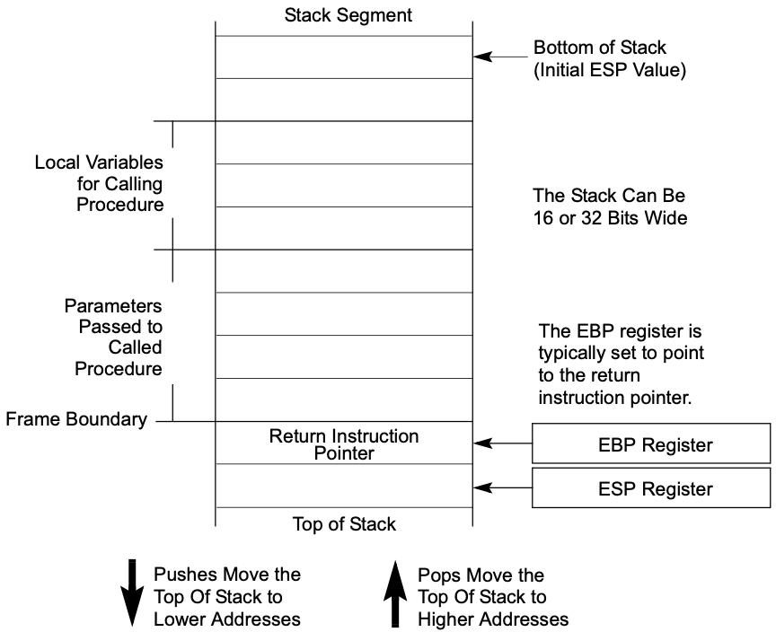
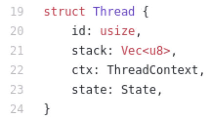
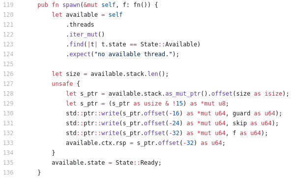
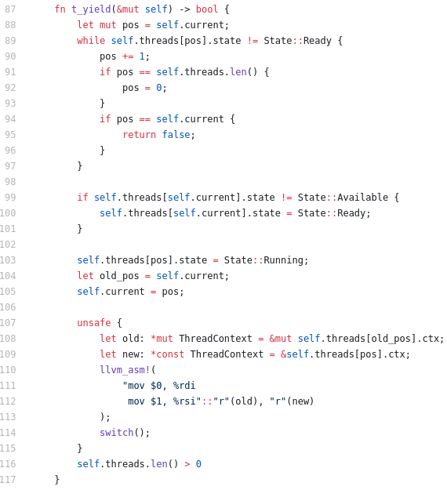

### 10.2 用户线程的实现

参考文献：

1. [Green Threads Explained in 200 Lines of Rust...](https://cfsamson.gitbook.io/green-threads-explained-in-200-lines-of-rust/)
2. [完整源代码](https://github.com/cfsamson/example-greenthreads)
3. 知乎上的中文版本：[两百行Rust代码解析绿色线程原理（四）一个绿色线程的实现](https://zhuanlan.zhihu.com/p/101061389)

#### 1. 线程与CPU架构

##### CPU体系结构

用户线程调度是非抢占式的；

CPU体系结构：通用寄存器

出处：[Combined Volume Set of Intel® 64 and IA-32 Architectures Software Developer’s Manuals](https://software.intel.com/content/www/us/en/develop/articles/intel-sdm.html#combined)、[325462-sdm-vol-1-2abcd-3abcd.pdf](https://software.intel.com/content/dam/develop/external/us/en/documents-tps/325462-sdm-vol-1-2abcd-3abcd.pdf) P76 Figure 3-4. General System and Application Programming Registers

出处：[325462-sdm-vol-1-2abcd-3abcd.pdf](https://software.intel.com/content/dam/develop/external/us/en/documents-tps/325462-sdm-vol-1-2abcd-3abcd.pdf) P77 Table 3-2. Addressable General Purpose Registers

##### X86汇编语言

#### 2. 线程上下文和线程栈

##### 线程上下文[数据结构](https://github.com/cfsamson/example-greenthreads/blob/master/src/main.rs#L28)`ThreadContext`

##### 栈空间大小

1. 现代操作系统中启动进程时，标准栈大小通常为8MB；
2. 可能出现“栈溢出”；
3. 当我们自己控制栈时，我们可以选择我们想要的大小；
4. 可增长栈：当栈空间用完时，会分配一个更大的栈并将栈内容移到更大的栈上，并恢复程序继续执行，不会导致栈溢出；（Go 语言）

##### 栈布局

出处：[325462-sdm-vol-1-2abcd-3abcd.pdf](https://software.intel.com/content/dam/develop/external/us/en/documents-tps/325462-sdm-vol-1-2abcd-3abcd.pdf) P152 Figure 6-1. Stack Structure

#### 3. 线程控制块和运行时支持

##### 线程控制块[数据结构](https://github.com/cfsamson/example-greenthreads/blob/master/src/main.rs#L19)`Thread`

[裸函数](https://docs.microsoft.com/zh-cn/cpp/c-language/naked-functions?view=msvc-160)naked_functions：为了与编译器协调处理函数调用和中断处理中栈的使用，而定义的一个约定。它仅影响函数的 prolog 和 epilog 序列的编译器代码生成的性质。

##### 线程[运行时](https://github.com/cfsamson/example-greenthreads/blob/master/src/main.rs#L49)支持`Runtime`

new
run
t_return
t_yield

#### 4. 用户线程API和线程切换

##### [线程API](https://github.com/cfsamson/example-greenthreads/blob/master/src/main.rs#L119)：`spawn`

##### [线程API](https://github.com/cfsamson/example-greenthreads/blob/master/src/main.rs#L119)：yield_thread

##### [线程切换](https://github.com/cfsamson/example-greenthreads/blob/master/src/main.rs#L158)`switch`

用户线程的操作系统依赖：示例适用于 OSX、Linux 和 Windows

