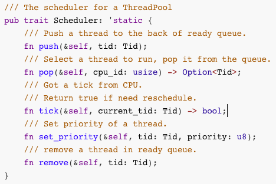
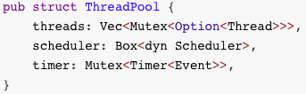
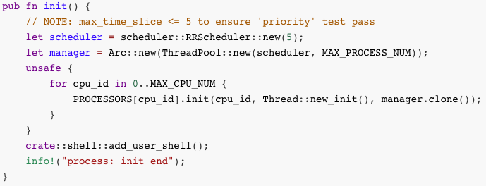
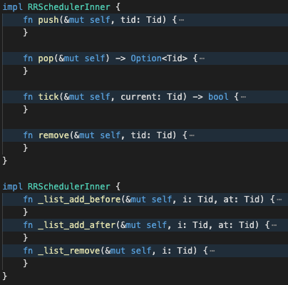

## 20200319-第十一讲准备
2020春,操作系统课,准备
第十一讲 处理机调度

[v1](https://github.com/LearningOS/os-lectures/blob/2ee6a37e314bd4fe2e9d57899b66d5cacd0ebada/lecture11/ref.md)

[v2](https://github.com/LearningOS/os-lectures/blob/3b6dbf6f3fca2abceed7a872b773d1c1758d5880/lecture11/ref.md)

### ref

http://os.cs.tsinghua.edu.cn/oscourse/OS2019spring/lecture15
2019年第十五讲 处理机调度

rCore调度框架

### 11.1 处理机调度概念 
### 11.2 调度准则 
### 11.3 先来先服务、短进程优先和最高响应比优先调度算法 
### 11.4 时间片轮转、多级反馈队列、公平共享调度算法和ucore调度框架 
### 11.5 实时调度
### 11.6 优先级反置 
### 11.7 rCore调度框架和时间片轮转调度算法

#### 调度框架与线程控制
/Users/xyong/github/rcore-thread/src/scheduler/mod.rs
pub trait Scheduler: 'static



```rust
/// The scheduler for a ThreadPool
pub trait Scheduler: 'static {
    /// Push a thread to the back of ready queue.
    fn push(&self, tid: Tid);
    /// Select a thread to run, pop it from the queue.
    fn pop(&self, cpu_id: usize) -> Option<Tid>;
    /// Got a tick from CPU.
    /// Return true if need reschedule.
    fn tick(&self, current_tid: Tid) -> bool;
    /// Set priority of a thread.
    fn set_priority(&self, tid: Tid, priority: u8);
    /// remove a thread in ready queue.
    fn remove(&self, tid: Tid);
}
```

/Users/xyong/github/rcore-thread/src/thread_pool.rs
self.scheduler.
与调度相关的线程控制函数


```rust
pub fn add(&self, mut context: Box<dyn Context>) -> Tid
pub(crate) fn tick(&self, cpu_id: usize, tid: Option<Tid>) -> bool
pub fn set_priority(&self, tid: Tid, priority: u8)
pub(crate) fn run(&self, cpu_id: usize) -> Option<(Tid, Box<dyn Context>)>
pub(crate) fn stop(&self, tid: Tid, context: Box<dyn Context>)
fn set_status(&self, tid: Tid, status: Status)
pub fn wakeup(&self, tid: Tid)
```
#### 调度数据结构

/Users/xyong/github/rcore-thread/src/scheduler/mod.rs
pub trait Scheduler: 'static
调度算法接口

/Users/xyong/github/rcore-thread/src/thread_pool.rs
pub struct ThreadPool
线程池数据结构
记录调度算法相关信息和参数；



```rust 
pub struct ThreadPool {
    threads: Vec<Mutex<Option<Thread>>>,
    scheduler: Box<dyn Scheduler>,
    timer: Mutex<Timer<Event>>,
}
```

/Users/xyong/github/rCore/kernel/src/process/mod.rs
pub fn init()
初始化函数
指定调度算法；
初始化线程池；



```rust
pub fn init() {
    // NOTE: max_time_slice <= 5 to ensure 'priority' test pass
    let scheduler = scheduler::RRScheduler::new(5);
    let manager = Arc::new(ThreadPool::new(scheduler, MAX_PROCESS_NUM));
    unsafe {
        for cpu_id in 0..MAX_CPU_NUM {
            PROCESSORS[cpu_id].init(cpu_id, Thread::new_init(), manager.clone());
        }
    }
    crate::shell::add_user_shell();
    info!("process: init end");
}
```

#### 时间片轮转调度算法

/Users/xyong/github/rcore-thread/src/scheduler/rr.rs
pub struct RRScheduler RR调度算法数据结构
struct RRSchedulerInner 线程双向链表表头数据结构
struct RRProcInfo 线程双向链表节点数据结构


```rust
pub struct RRScheduler {
    inner: Mutex<RRSchedulerInner>,
}
struct RRSchedulerInner {
    max_time_slice: usize,
    infos: Vec<RRProcInfo>,
}
#[derive(Debug, Default, Copy, Clone)]
struct RRProcInfo {
    present: bool,
    rest_slice: usize,
    prev: Tid,
    next: Tid,
}
```
impl RRSchedulerInner
具体的调度接口实现函数




#### 时间片用完时的线程调度和切换过程

/Users/xyong/github/rCore/kernel/src/arch/riscv/interrupt.rs
pub extern "C" fn rust_trap(tf: &mut TrapFrame)
Trap::Interrupt(I::SupervisorTimer) => timer(),

/Users/xyong/github/rCore/kernel/src/trap.rs
pub fn timer()
processor().tick();

/Users/xyong/github/rcore-thread/src/processor.rs
pub fn tick(&self)
let need_reschedule = self.manager().tick(self.inner().id, tid);

/Users/xyong/github/rcore-thread/src/processor.rs
pub(crate) fn yield_now(&self)
.switch_to(&mut *inner.loop_context);

```rust
/Users/xyong/github/rCore/kernel/src/arch/riscv/interrupt.rs
	pub extern "C" fn rust_trap(tf: &mut TrapFrame)
/Users/xyong/github/rCore/kernel/src/trap.rs
	pub fn timer()
/Users/xyong/github/rcore-thread/src/processor.rs
	pub fn tick(&self)
/Users/xyong/github/rcore-thread/src/processor.rs
	pub(crate) fn yield_now(&self)
```

