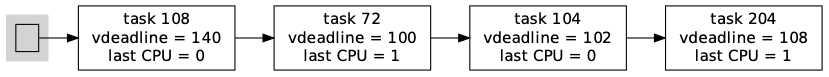
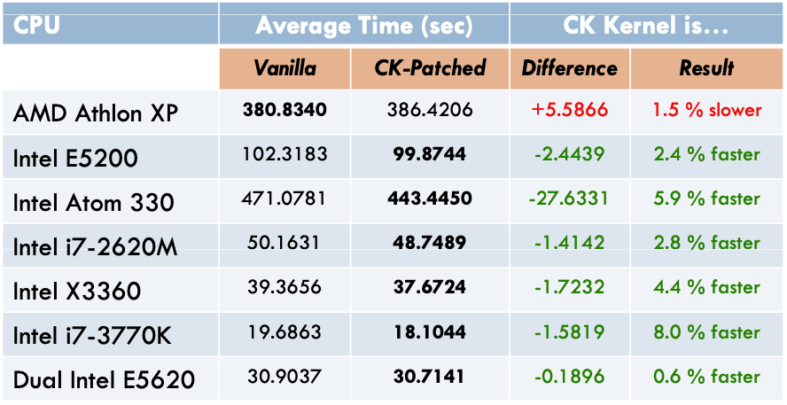

## BFS算法
### 幻灯片

#### BFS数据结构
https://www.cs.unm.edu/~eschulte/classes/cs587/data/bfs-v-cfs_groves-knockel-schulte.pdf
BFS vs.CFS Scheduler Comparison

P7: Figure4: BFS data structure

在多处理机情况的单就绪队列（双向链表）选择，增加了队列互斥访问的开销，但减少了负载均衡算法开销。

#### BFS工作原理

http://vellvisher.github.io/papers_reports/doc/BFS_FreeBSD.pdf
Analysis of the BFS Scheduler in FreeBSD

BFS调度算法是一种时间片轮转算法的变种。

##### 单就绪队列

1. 所有CPU共享一个双向链表结构的单就绪队列；
2. 所有线程按优先级排队；
3. 相同优先级的每个线程有一个时间片长度和虚拟最长等待时间；

##### 时间片大小选择

由算法参数指定，可在1ms到1000ms间选择，缺省设置为6ms；

##### 虚拟截止时间（Virtual Deadline）

 1. 它是一个关于就绪队列中线程等待CPU最长时间的排序，并不是真实的截止时间；
 2. 为了让线程在上次运行的CPU上运行，不同CPU对线程的虚拟截止时间加一个权重；
  3. 线程时间片用完时，重新计算虚拟截止时间；
  4. 事件等待结束时，虚拟截止时间保持不变，以抢先相同优先级的就绪线程；

##### 线程优先级

BFS有103个优先级，其中100个静态的实时优先级，3个普通优级SCHEDISO (isochronous)、SCHEDNORMAL和SCHEDIDLEPRIO (idle priority scheduling)；

##### 相关线程状态置换

时间片用完：重新设置虚拟截止时间后，插入就绪队列；

事件等待结束：虚拟截止时间保持不变，抢先低优先级线程或插入就绪队列；

##### 虚拟截止时间计算

依据当前时间、线程优先级和时间片设置计算；

offset = jiffies + (prior_atio ∗ rr_interval)
prioratio increases by 10% for every nice level

虚拟截止时间计算结果： https://wikimili.com/en/Brain_Fuck_Scheduler

#### BFS与CFS的性能对比(2012)
http://repo-ck.com/bench/cpu_schedulers_compared.pdf
CPU SCHEDULERS COMPARED

##### 测试用例集

1. Linux kernel v3.6.2.2的GCC编译
2. Linux kernel v3.6.2内核源代码树的lrzip压缩
3. 从720p到360p的MPEG2视频ffmpeg压缩

##### 测试硬件环境

##### 压缩测试

##### 编译测试

##### 视频编码测试

### ref

https://www.cs.unm.edu/~eschulte/classes/cs587/data/bfs-v-cfs_groves-knockel-schulte.pdf
BFS vs. CFS - SchedulerComparison

cpu-sched-multi.pdf - 10.6 Linux Multiprocessor Schedulers - BF Scheduler (BFS)

https://wikimili.com/en/Brain_Fuck_Scheduler
Brain Fuck Scheduler

https://www.cs.mcgill.ca/~mxia3/pdfs/Case_study__formal_verification_of_the_brain_fuck_scheduler.pdf
Formal verification of the Brain Fuck Scheduler

https://www.linux-magazine.com/Online/News/Con-Kolivas-Introduces-New-BFS-Scheduler
Con Kolivas Introduces New BFS Scheduler

http://ck.kolivas.org/patches/bfs/bfs-faq.txt
FAQS about BFS

http://ck.kolivas.org/
The BFS patch along with benchmark diagrams and other details are on ck.kolivas.org.

https://wikimili.com/en/Brain_Fuck_Scheduler
Brain Fuck Scheduler

##### BFS vs.CFS Scheduler Comparison
https://www.cs.unm.edu/~eschulte/classes/cs587/data/bfs-v-cfs_groves-knockel-schulte.pdf
BFS vs.CFS Scheduler Comparison

P7: Figure4: BFS data structure

BFS has only one system-wide runqueue containing all non-running tasks.
BFS removes the need for these complicated heuristics and algorithms by using a single system-wide queue to determine the next scheduled task.
BFS implements an earliest effective virtual deadline first policy and keeps track of the  virtual deadline of each task.
P7：这一段文字大致描述了BFS的思路：只使用一个队列；所有线程按优先级排队；相同优先级的每个线程有一个时间片长度和虚拟最长等待时间；线程时间片用完时，重新计算时间片长度；线程进入等待状态时，等待时间保持；为了让线程在上次运行的CPU上运行，不同CPU对线程的虚拟截止时间加一个权重；

##### BFS的算法描述

##### wikimili

https://wikimili.com/en/Brain_Fuck_Scheduler
Brain Fuck Scheduler

BFS uses a doubly linked list data structure.
The execution behavior is still a weighted variation of the Round-Robin Scheduler

virtual deadline formula

##### 新加坡的项目报告

http://vellvisher.github.io/papers_reports/doc/BFS_FreeBSD.pdf
Analysis of the BFS Scheduler in FreeBSD

###### Single Runqueue

single run-queue which is a double linked list shared by all the CPU’s

###### Interactivity

I/O Bound tasks or interactive tasks are decided basis on thefact that the tasks which wake uphave not used their quota of CPU time and have earlier effectivedeadlines making them likelyto preempt CPU bound tasks of same priority.

###### Round Robin Interval

This is the only tunable value and it is set to 6ms by default with a range from 1ms to 1000ms.

###### Task Insertion

The task is inserted as an O(1) insertion to the double link list run-queue.
Thelookup is O(n) in the worst casewhere n is the number of CPUs on the system.

###### Task Lookup

BFS has 103 priority queues with 100 dedicated to the static priority of realtime tasks, and theremaining 3 are, in order of best to worst priority, SCHEDISO (isochronous), SCHEDNORMAL,and SCHEDIDLEPRIO (idle priority scheduling).

a bitmap of running priorities
the lookup is O(n) in the worst case, where n is the totalnumber of CPUs.

###### Task Switching

Time Slice:  its time slicereplenished and the virtual deadline reset
Sleep: virtual deadline remain the same and the same values will be used again
Preemption: higher priority than a currently running task on any CPUs.

###### Virtual Deadline

no guarantee
a quota (time slice)equal to the rr_interval and a virtual deadline.

The virtual deadline is offset from the current time in jiffies.
jiffies + (prior_atio ∗ rr_interval)
prioratio increases by 10% for every nice level

##### BFS的性能分析
http://repo-ck.com/bench/cpu_schedulers_compared.pdf
CPU SCHEDULERS COMPARED