## 第十四讲 信号量与管程

[v1](https://github.com/LearningOS/os-lectures/blob/b054e185e1fceeace368bb5dc255ea06ab1235b5/lecture14/ref.md)

[v2](https://github.com/LearningOS/os-lectures/blob/1a5b66d056c2f3f73e5e8e7bd91837e5bb84e0fe/lecture14/ref.md)

[v3](https://github.com/LearningOS/os-lectures/blob/37757c3a41a3b40e59680279417730b9a6105730/lecture14/ref.md)
### 14.6 Synchronization in Rust

#### Higher-level synchronization objects in Rust

https://doc.rust-lang.org/std/sync/index.html#higher-level-synchronization-objects
Higher-level synchronization objects


Arc: A thread-safe reference-counting pointer.

Atomically Reference-Counted pointer, which can be used in multithreaded environments to prolong the lifetime of some data until all the threads have finished using it.

Barrier: Ensures multiple threads will wait for each other to reach a point in the program, before continuing execution all together.

Condvar: Condition Variable, providing the ability to block a thread while waiting for an event to occur.

mpsc: Multi-producer, single-consumer queues, used for message-based communication. Can provide a lightweight inter-thread synchronisation mechanism, at the cost of some extra memory.

Mutex: Mutual Exclusion mechanism, which ensures that at most one thread at a time is able to access some data.

Once: Used for thread-safe, one-time initialization of a global variable.

RwLock: Provides a mutual exclusion mechanism which allows multiple readers at the same time, while allowing only one writer at a time. In some cases, this can be more efficient than a mutex.

#### Rc：单线程引用计数

https://doc.rust-lang.org/rust-by-example/std/rc.html
Rc(Reference Counting)

A single-threaded reference-counting pointer. 'Rc' stands for 'Reference Counted'.

https://doc.rust-lang.org/1.37.0/src/alloc/rc.rs.html#273-276

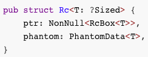

```rust
pub struct Rc<T: ?Sized> {
    ptr: NonNull<RcBox<T>>,
    phantom: PhantomData<T>,
}
```

#### Example of Reference Counting

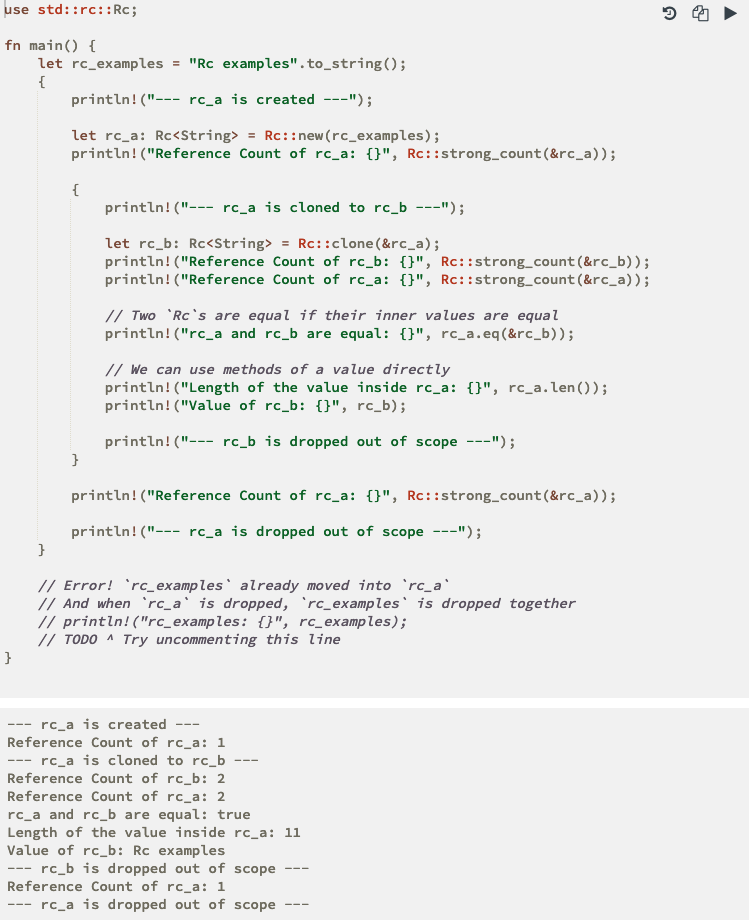


#### Arc: Atomically Reference-Counted pointer

https://doc.rust-lang.org/std/sync/struct.Arc.html
Struct std::sync::Arc

A thread-safe reference-counting pointer. 'Arc' stands for 'Atomically Reference Counted'.

https://doc.rust-lang.org/src/alloc/sync.rs.html#196-199

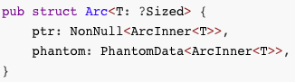

```rust
pub struct Arc<T: ?Sized> {
    ptr: NonNull<ArcInner<T>>,
    phantom: PhantomData<ArcInner<T>>,
}
```

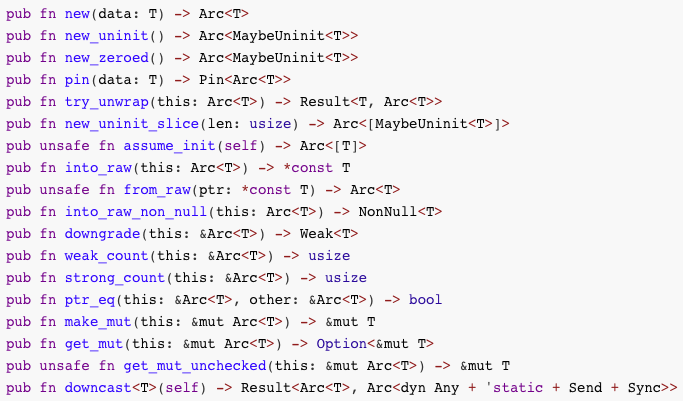

```rust
pub fn new(data: T) -> Arc<T>
pub fn new_uninit() -> Arc<MaybeUninit<T>>
pub fn new_zeroed() -> Arc<MaybeUninit<T>>
pub fn pin(data: T) -> Pin<Arc<T>>
pub fn try_unwrap(this: Arc<T>) -> Result<T, Arc<T>>
pub fn new_uninit_slice(len: usize) -> Arc<[MaybeUninit<T>]>
pub unsafe fn assume_init(self) -> Arc<[T]>
pub fn into_raw(this: Arc<T>) -> *const T
pub unsafe fn from_raw(ptr: *const T) -> Arc<T>
pub fn into_raw_non_null(this: Arc<T>) -> NonNull<T>
pub fn downgrade(this: &Arc<T>) -> Weak<T>
pub fn weak_count(this: &Arc<T>) -> usize
pub fn strong_count(this: &Arc<T>) -> usize
pub fn ptr_eq(this: &Arc<T>, other: &Arc<T>) -> bool
pub fn make_mut(this: &mut Arc<T>) -> &mut T
pub fn get_mut(this: &mut Arc<T>) -> Option<&mut T>
pub unsafe fn get_mut_unchecked(this: &mut Arc<T>) -> &mut T
pub fn downcast<T>(self) -> Result<Arc<T>, Arc<dyn Any + 'static + Send + Sync>> 
```

https://doc.rust-lang.org/src/alloc/sync.rs.html#943
fn clone(&self)

#### atomic(原子操作)
https://doc.rust-lang.org/core/sync/atomic/index.html
Module core::sync::atomic

Atomic types provide primitive shared-memory communication between threads, and are the building blocks of other concurrent types.

https://doc.rust-lang.org/src/core/sync/atomic.rs.html#1229-1231

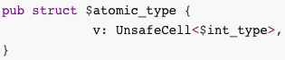

```rust
pub struct $atomic_type {
            v: UnsafeCell<$int_type>,
}
```

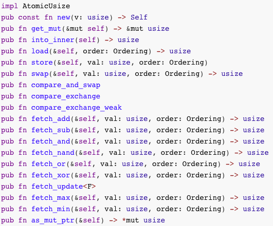


```rust
impl AtomicUsize
pub const fn new(v: usize) -> Self
pub fn get_mut(&mut self) -> &mut usize
pub fn into_inner(self) -> usize
pub fn load(&self, order: Ordering) -> usize
pub fn store(&self, val: usize, order: Ordering)
pub fn swap(&self, val: usize, order: Ordering) -> usize
pub fn compare_and_swap
pub fn compare_exchange
pub fn compare_exchange_weak
pub fn fetch_add(&self, val: usize, order: Ordering) -> usize
pub fn fetch_sub(&self, val: usize, order: Ordering) -> usize
pub fn fetch_and(&self, val: usize, order: Ordering) -> usize
pub fn fetch_nand(&self, val: usize, order: Ordering) -> usize
pub fn fetch_or(&self, val: usize, order: Ordering) -> usize
pub fn fetch_xor(&self, val: usize, order: Ordering) -> usize
pub fn fetch_update<F>
pub fn fetch_max(&self, val: usize, order: Ordering) -> usize
pub fn fetch_min(&self, val: usize, order: Ordering) -> usize
pub fn as_mut_ptr(&self) -> *mut usize
```

#### Barrier(内存屏障)

https://doc.rust-lang.org/std/sync/struct.Barrier.html
Struct std::sync::Barrier

A barrier enables multiple threads to synchronize the beginning of some computation.

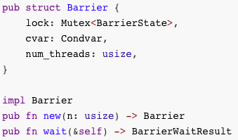

```rust
pub struct Barrier {
    lock: Mutex<BarrierState>,
    cvar: Condvar,
    num_threads: usize,
}

impl Barrier
pub fn new(n: usize) -> Barrier
pub fn wait(&self) -> BarrierWaitResult
```

##### Example of Barrier

https://doc.rust-lang.org/std/sync/struct.Barrier.html

有一个例子可演示；


https://doc.rust-lang.org/src/std/sync/barrier.rs.html#128-145
pub fn wait(&self) -> BarrierWaitResult

lock = self.cvar.wait(lock).unwrap();

#### Condvar(条件变量)

https://doc.rust-lang.org/std/sync/struct.Condvar.html
Struct std::sync::Condvar

Condition variables represent the ability to block a thread such that it consumes no CPU time while waiting for an event to occur. Condition variables are typically associated with a boolean predicate (a condition) and a mutex. The predicate is always verified inside of the mutex before determining that a thread must block.


```rust
pub struct Condvar {
    inner: Box<sys::Condvar>,
    mutex: AtomicUsize,
}

impl Condvar
pub fn new() -> Condvar
pub fn wait<'a, T>
pub fn wait_while<'a, T, F>
pub fn wait_timeout_ms<'a, T>
pub fn wait_timeout<'a, T>
pub fn wait_timeout_while<'a, T, F>
pub fn notify_one(&self)
pub fn notify_all(&self)
```

```rust 

```
##### Example of Condvar

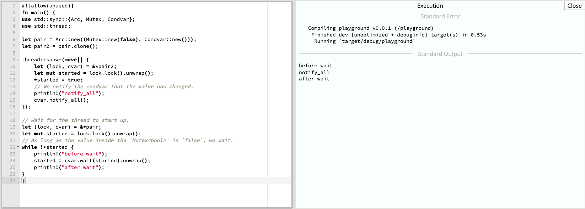

```rust
#![allow(unused)]
fn main() {
use std::sync::{Arc, Mutex, Condvar};
use std::thread;

let pair = Arc::new((Mutex::new(false), Condvar::new()));
let pair2 = pair.clone();

thread::spawn(move|| {
    let (lock, cvar) = &*pair2;
    let mut started = lock.lock().unwrap();
    *started = true;
    // We notify the condvar that the value has changed.
    println!("notify_all");
    cvar.notify_all();
});

// Wait for the thread to start up.
let (lock, cvar) = &*pair;
let mut started = lock.lock().unwrap();
// As long as the value inside the `Mutex<bool>` is `false`, we wait.
while !*started {
    println!("before wait");
    started = cvar.wait(started).unwrap();
    println!("after wait");
}
}
```
#### Mutex(互斥信号量)

https://doc.rust-lang.org/std/sync/struct.Mutex.html
Struct std::sync::Mutex
A mutual exclusion primitive useful for protecting shared data

这里有mutex的例子和实现描述；

https://doc.rust-lang.org/src/std/sync/mutex.rs.html#111
struct Mutex的实现


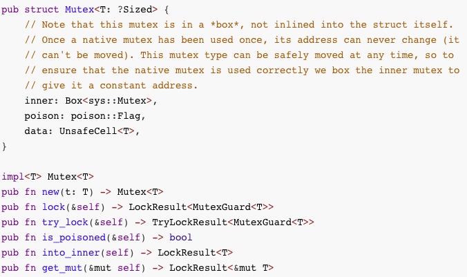

```rust
pub struct Mutex<T: ?Sized> {
    // Note that this mutex is in a *box*, not inlined into the struct itself.
    // Once a native mutex has been used once, its address can never change (it
    // can't be moved). This mutex type can be safely moved at any time, so to
    // ensure that the native mutex is used correctly we box the inner mutex to
    // give it a constant address.
    inner: Box<sys::Mutex>,
    poison: poison::Flag,
    data: UnsafeCell<T>,
}

impl<T> Mutex<T>
pub fn new(t: T) -> Mutex<T>
pub fn lock(&self) -> LockResult<MutexGuard<T>>
pub fn try_lock(&self) -> TryLockResult<MutexGuard<T>>
pub fn is_poisoned(&self) -> bool
pub fn into_inner(self) -> LockResult<T>
pub fn get_mut(&mut self) -> LockResult<&mut T>
```

#### RwLock(读写锁)

https://doc.rust-lang.org/std/sync/struct.RwLock.html
Struct std::sync::RwLock

This type of lock allows a number of readers or at most one writer at any point in time. The write portion of this lock typically allows modification of the underlying data (exclusive access) and the read portion of this lock typically allows for read-only access (shared access).

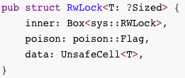

```rust
pub struct RwLock<T: ?Sized> {
    inner: Box<sys::RWLock>,
    poison: poison::Flag,
    data: UnsafeCell<T>,
}
```
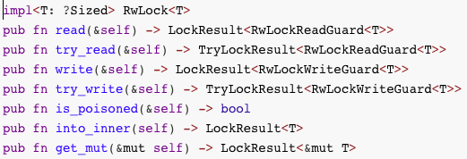

```rust
impl<T: ?Sized> RwLock<T>
pub fn read(&self) -> LockResult<RwLockReadGuard<T>>
pub fn try_read(&self) -> TryLockResult<RwLockReadGuard<T>>
pub fn write(&self) -> LockResult<RwLockWriteGuard<T>>
pub fn try_write(&self) -> TryLockResult<RwLockWriteGuard<T>>
pub fn is_poisoned(&self) -> bool
pub fn into_inner(self) -> LockResult<T>
pub fn get_mut(&mut self) -> LockResult<&mut T>
```

#### 

