# 20200407-第十五讲 死锁和并发错误

[v1](https://github.com/LearningOS/os-lectures/blob/02180890691ccfd54d6d5664831c2a9663419266/lecture15/ref.md)

## 15.5 并发错误分析和检测

### ref

Shan Lu, University of Chicago
Detecting and Fixing Concurrency Bugs
20200407-lecture2.zip-Lec2.pdf

### Concurrency bug
#### Concurrency bug

20200407-lecture2.zip-Lec2.pdf-P22

What ordering is guaranteed?

#### Concurrency bug: voilation
20200407-lecture2.zip-Lec2.pdf-P40-41

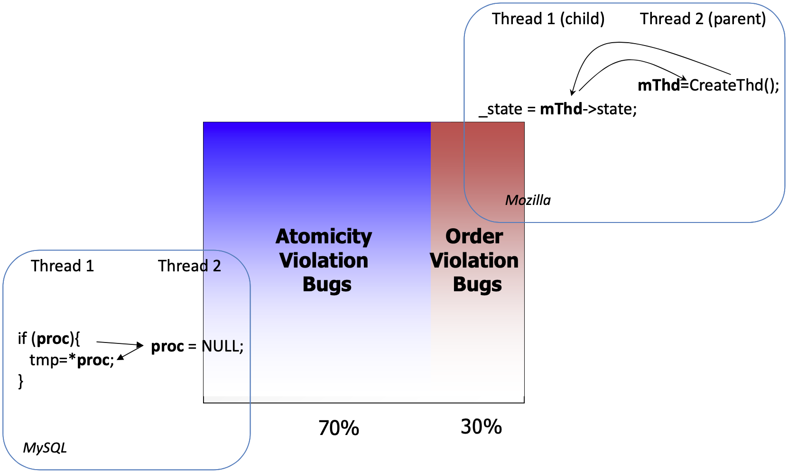

#### Concurrency bug: variable

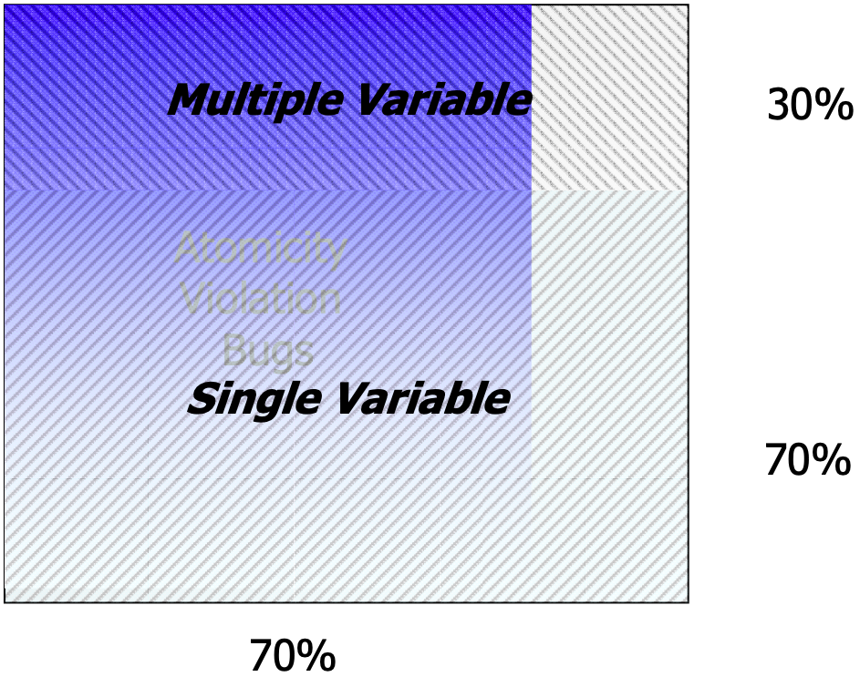

#### Which code regions are expected to be atomic?

20200407-lecture2.zip-Lec2.pdf-P47

#### What are order violations?
20200407-lecture2.zip-Lec2.pdf-P51

#### What are multi‐var order violations?
20200407-lecture2.zip-Lec2.pdf-P54

Untimely accesses to correlated Multiple variables

#### The lifecycle of bugs

20200407-lecture2.zip-Lec2.pdf-P64

Data races
Atomicity violations
	single variable
	multiple variables
Order violations

### Concurrency bug detection

#### What is the causality relationship here?
20200407-lecture2.zip-Lec2.pdf-P28

Example1

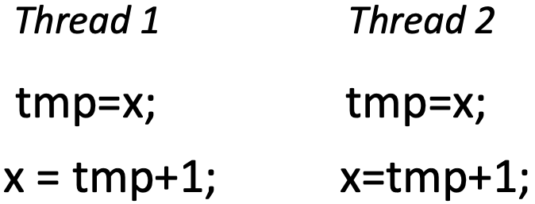

Example2

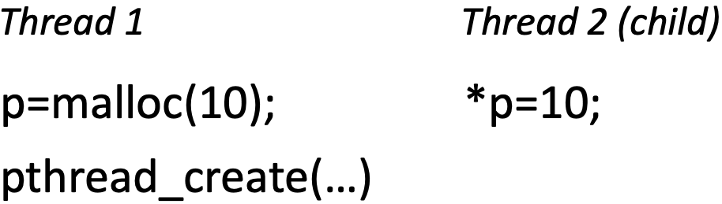

####  How to detect data races? Happen‐before algorithm

20200407-lecture2.zip-Lec2.pdf-P31

Use logic time‐stamps to find concurrent accesses

#### How to detect data races? Lock‐set algorithm
20200407-lecture2.zip-Lec2.pdf-P33

A common lock should protect all conflicting accesses to a shared variable

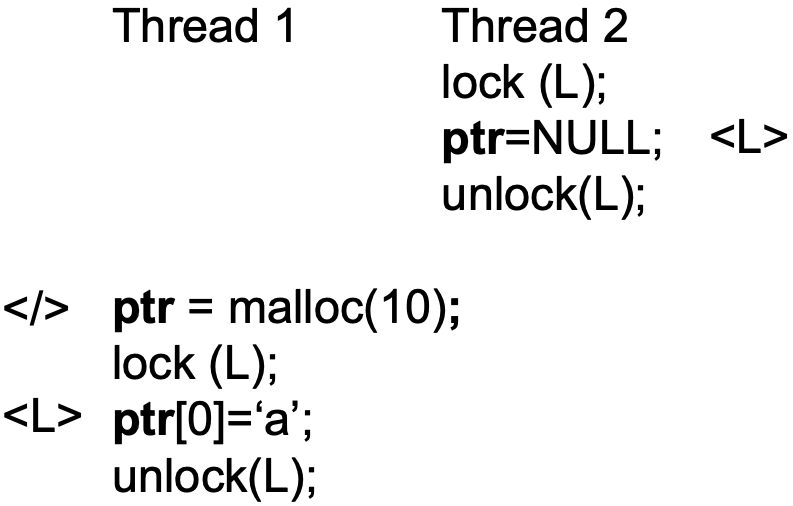

####  How to detect atomicity‐violations?

20200407-lecture2.zip-Lec2.pdf-P43

Know which code region should maintain atomicity

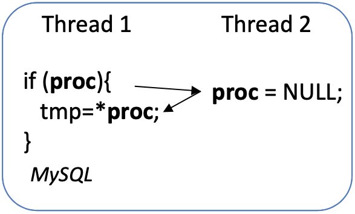

Judge whether a code region’s atomicity is violated

### AVIO: Detecting Atomicity Violations via Access-Interleaving Invariants (ASPLOS’06)

20200407-lecture2.zip-Lec2.pdf-P45-46

#### Atomicity violation

Atomicity violation = unserializable interleaving

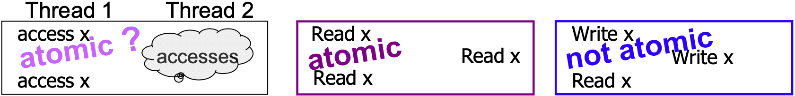

#### Read/Write interleaving

Totally 8 cases of interleaving

#### Interleaving violations

4 out of 8 cases are interleaving violations

Both hardware and software solutions exist

### ConSeq & ConMem

#### University of Chicago Tools: ConSeq & ConMem
20200407-lecture2.zip-Lec2.pdf-P62

20200407-lecture2.zip-Lec2.pdf-P71

#### The lifecycle of concurrency bugs: Fault
20200407-lecture2.zip-Lec2.pdf-P63-66

#### The lifecycle of concurrency bugs: Error
20200407-lecture2.zip-Lec2.pdf-P63-66

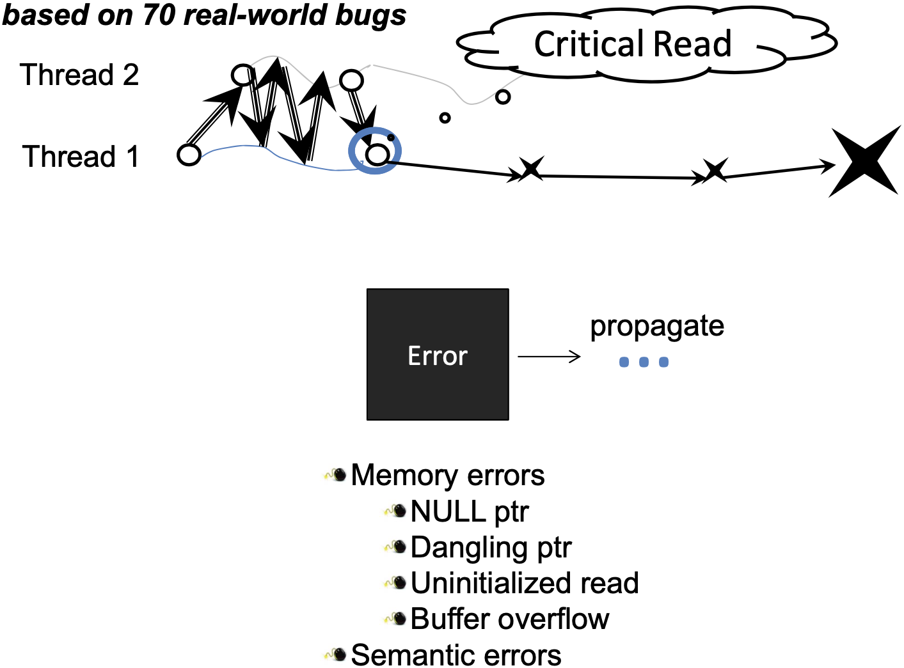

#### The lifecycle of concurrency bugs: Failure
20200407-lecture2.zip-Lec2.pdf-P63-66

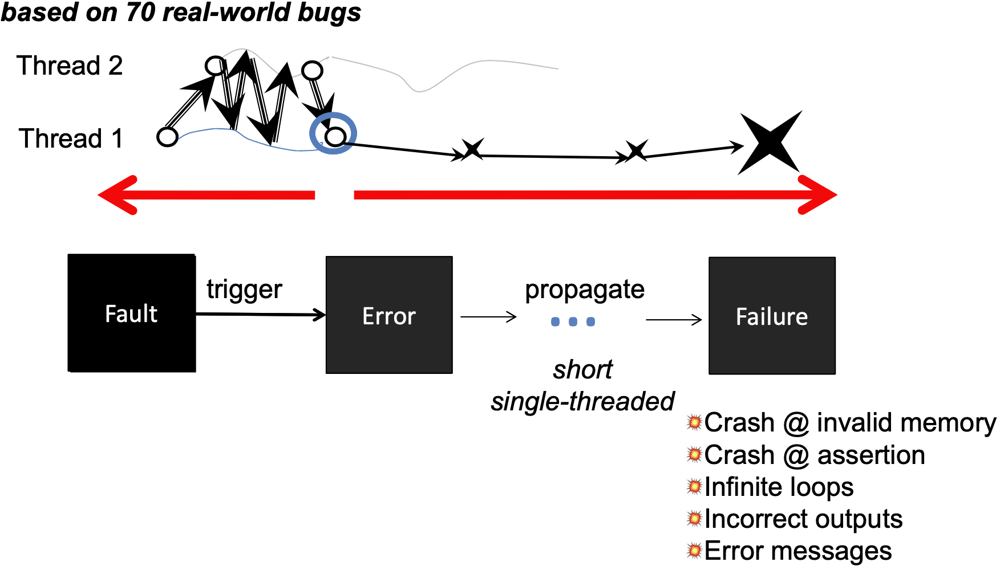

#### Cause‐oriented approach
20200407-lecture2.zip-Lec2.pdf-P69
Limitations
– False positives
– False negatives

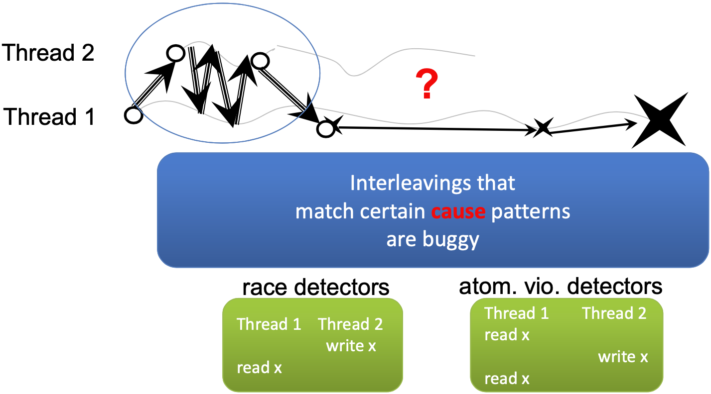

#### Effect‐oriented approach

20200407-lecture2.zip-Lec2.pdf-P70

– Step 1: *Statically* identify potential failure/error site

– Step 2: *Statically* look for critical reads
– Step 3: *Dynamically* identify buggy interleaving

#### ConMem: Detecting Severe Concurrency Bugs through an Effect-Oriented Approach, ASPLOS’10
20200407-lecture2.zip-Lec2.pdf-P72

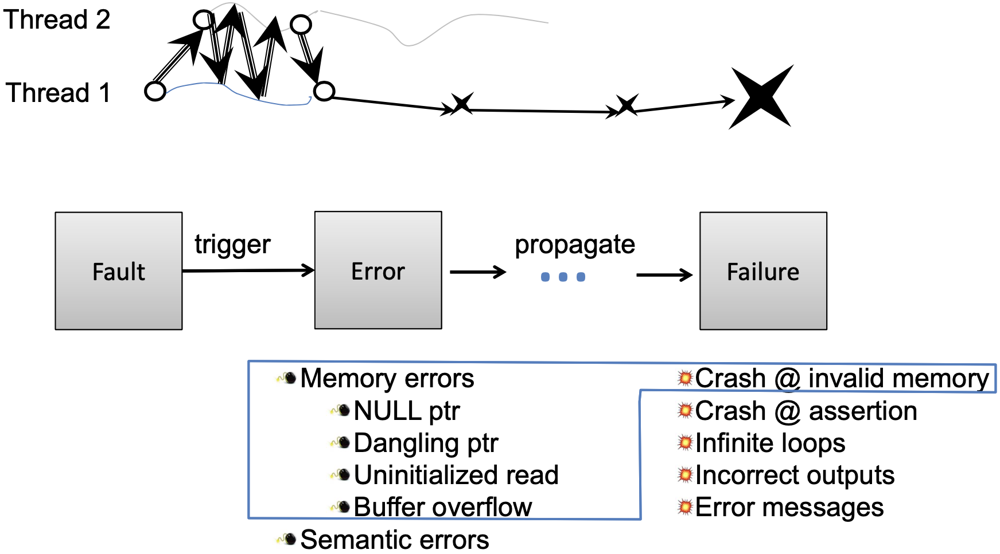

#### ConSeq: Detecting Concurrency Bugs through Sequential Errors, ASPLOS’11
20200407-lecture2.zip-Lec2.pdf-P73

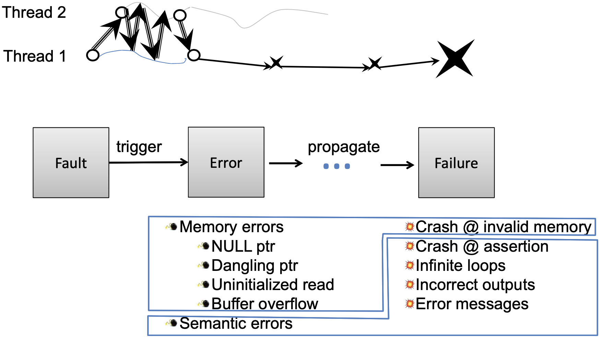

