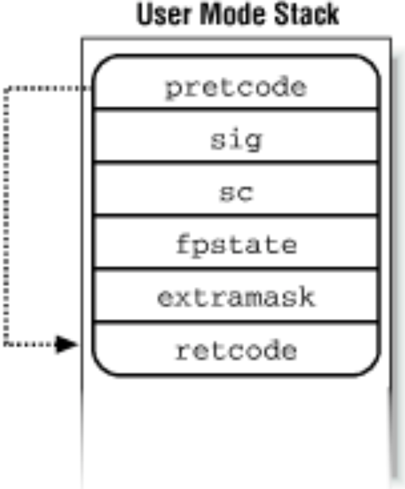

## 20200410-第十六讲 进程通信
[v1](https://github.com/LearningOS/os-lectures/blob/2f1d9c5b9494e0d2c25afa3102884380991840c4/lecture16/ref.md)
[v2](https://github.com/LearningOS/os-lectures/blob/49cfe2da914e337c08b0356ce136dcc4c7b5a6bb/lecture16/ref.md)
[v3]()
### 目录
第十六讲 进程通信
16.1 进程通信概念
16.2 信号和管道
16.3 Linux信号机制
16.4 消息队列和共享内存
16.5 dbus
16.6 binder

### 16.3 Linux信号机制

20200410-09-ipc.pdf
20200410-understanding.linux.kernel.pdf
### Signal Model
#### Signal Model
Ref: 20200410-09-ipc.pdf-Page:6

 * Application registers handlers with signal() or sigaction()
 * Send signals with kill() and friends
     * Or raised by hardware exception handlers in kernel
 * Signal delivery jumps to signal handler
     * Irregular control flow, similar to an interrupt

#### Language Exceptions
Ref: 20200410-09-ipc.pdf-Page:8

 * Signals are the underlying mechanism for Exceptions and catch blocks
 * JVM or other runtime system sets signal handlers
 * Signal handler causes execution to jump to the catch block
### Signal Handler Control Flow
#### Signal Handler Control Flow
Ref: 20200410-09-ipc.pdf-Page:9

#### Alternate Stacks
Ref: 20200410-09-ipc.pdf-Page:10

 * Signal handlers can execute on a different stack than program execution.
   * Set with sigaltstack() system call
 * Like an interrupt handler, kernel pushes register state on interrupt stack
   * Return to kernel with sigreturn() system call
   * App can change its own on-stack register state!

#### Frame on the User Mode stack
Ref: https://www.halolinux.us/kernel-reference/figure-103-frame-on-the-user-mode-stack.html

 * pretcode: Return address of the signal handler function;
 * sig: The signal number; 
 * sc: hardware context of the User Mode process
 * fpstate: floating point registers of the User Mode process
 * extramask: blocked real-time signals
 * retcode: Eight-byte code issuing a sigreturn( ) system call;

#### Signal trampoline & sigreturn() syscall
Ref: https://www.netbsd.org/docs/internals/en/chap-processes.html#signal

a small piece of assembly code to perform cleanup after handling the signal.

The signal trampoline code in turn calls sigreturn().
This sigreturn() call undoes everything that was done in order to invoke the signal handler.
Changing the process's signal mask, switching signal stacks (see sigaltstack(2))
switches stacks, and restores the process's context
sigreturn() never returns
the signal trampoline code lives either in the vDSO or in the C library.
vDSO (virtual dynamic shared object): a small shared library that the kernel automatically maps into the address space of all user-space applications.

#### Dealing With Asynchronous Signals In Multi Threaded Program
https://stackoverflow.com/questions/6949025/how-are-asynchronous-signal-handlers-executed-on-linux

The first available thread gets the signal
Most handlers run on the thread's stack.
A handler can run on an alternate stack
the thread is running in the kernel does not run the handler until it goes to userspace.

### Signal handlers
#### Default handlers

Ref: 20200410-09-ipc.pdf-Page:11

 * Signals have default handlers:
    * Ignore, kill, suspend, continue, dump core
    * These execute inside the kernel
 * Installing a handler with signal()/sigaction() overrides the default
 * A few (SIGKILL, SIGSTOP) cannot be overridden

#### Signal Delivery
Ref: 20200410-09-ipc.pdf-Page:12
 * Kernel is lazy!
    * Send a signal == mark a pending signal in the task
       * And make runnable if blocked with TASK_INTERRUPTIBLE flag
    * Check pending signals on return from interrupt or syscall
       * Deliver if pending

#### Nested Signals
Ref: 20200410-09-ipc.pdf-Page: 17

 * sigaction() API lets you specify this in detail
    * What signals are blocked (and delivered on sigreturn)
    * Similar to disabling hardware interrupts
 * Blocking system calls inside of a signal handler are only safe with careful use of sigaction()
