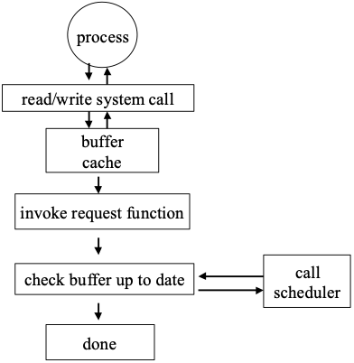
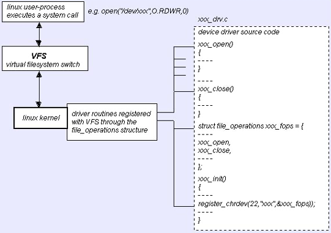

## 19.5 Linux I/O子系统

[v1](https://github.com/LearningOS/os-lectures/blob/c4b987ce66a217941f7427d06985ec0def4c0073/lecture19/ref.md)

### ref

20140504-lecture19-io-instances-usb.pptx

http://osq.cs.berkeley.edu/public/JFoster-Drivers.ppt
JFoster-Drivers.ppt
Linux Device Drivers Overview

### slides

#### Linux I/O Architecture

##### Linux I/O Architecture

##### Block Driver

##### Network Driver

#### Device Driver

##### Device Driver interface

##### Interface between a Device Driver and Linux Kernel

##### Device Driver Implementation

Assuming that your device name is xxxx
 * xxxx_init() initialize the device when OS is booted
 * xxxx_open() open a device 
 * xxxx_read() read from kernel memory 
 * xxxx_write() write 
 * xxxx_release() clean-up (close)
 * init_module()
 * cleanup_module()

##### Kernel Support Functions

 * I/O ports reservations
    * request_region()
 * Memory Allocations	
    * kmalloc(), vmalloc(), get_free_page()
 * Interrupt Handler Registration
    * request_irq()
 * Data Transfer between User/Kernel
    * memcpy_fromfs()

#### Device Driver Programming

##### API requirements

ref: JFoster-Drivers.ppt - Page 4

 * Driver functions return positive ints on success, negative ints on failure
 * Kernel won’t call non-blocking I/O functions if previous request still pending
 * Every kernel function that calls kmalloc (GFP_KERNEL) should be reentrant
 * Common Mistakes
    * Locking, Interrupt time, resource allocation

##### Locking
 * Four kinds of locks in kernel
    * Spin locks and read-write locks
    * Interrupt enable/disable
       * Sometimes combined, e.g., spin_lock_irq
    * Whole kernel lock
 * Locks are used all over the place
    * Are they used correctly?  consistently?

##### Interrupt Time

When in_interrupt is true, code cannot
 * Access current
 * Call the scheduler (may sleep)
 * Call kmalloc(GFP_KERNEL) (may sleep)
 * Copy to/from user-space (may sleep)
 * more?

##### Resource Allocation

 * Drivers get and release system resources
    * Memory
    * IRQs
    * module numbers (maybe)
    * space for their code (mod usage count)
 * Are the resources handled correctly?
    * Leaks lead to instability -- reboot to reclaim