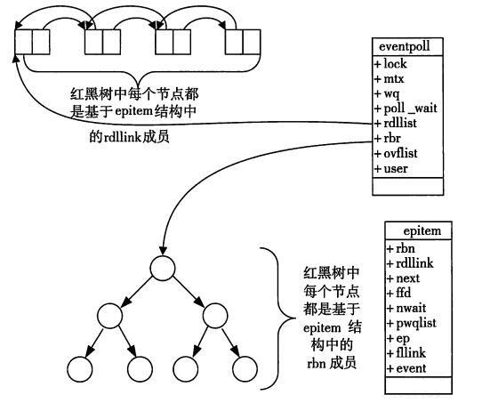
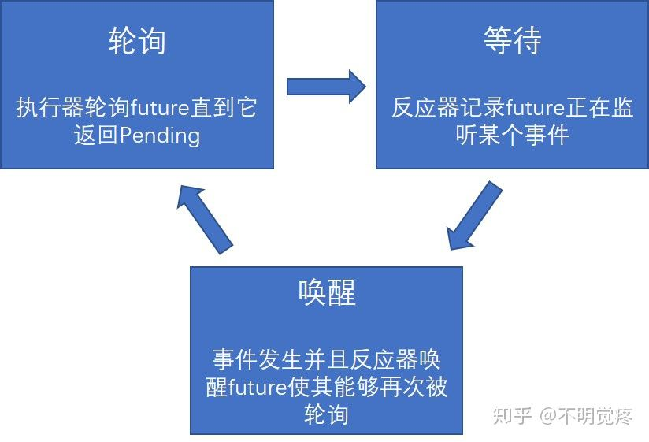

## 第二十一讲 异步编程(Asynchronous Programming)

[v1](https://github.com/LearningOS/os-lectures/blob/13a92296aa1a93c0fc54b244539a4f21791d52ac/lecture21/ref.md)

[v2](https://github.com/LearningOS/os-lectures/blob/13735ecd36723347059e662d986f4642b887252d/lecture21/ref.md)

[v3](https://github.com/LearningOS/os-lectures/blob/485c97b7fb6e45428339d043fe1d4cc58802cd26/lecture21/ref.md)

[v4](https://github.com/LearningOS/os-lectures/blob/ebf4eb827994ef3ebde6d5d87d90c8597279d151/lecture21/ref.md)

### ref

- [Futures Explained in 200 Lines of Rust](https://cfsamson.github.io/books-futures-explained/#futures-explained-in-200-lines-of-rust) [repo at github](https://github.com/cfsamson/books-futures-explained)
- Writing an OS in Rust - [Async/Awai](https://os.phil-opp.com/async-await/)
- [零成本异步I/O](https://zhuanlan.zhihu.com/p/97574385)

### 21.1 Background
ref: https://cfsamson.github.io/books-futures-explained/0_background_information.html#some-background-information


#### Multitasking

参考： https://cfsamson.github.io/book-exploring-async-basics/2_async_history.html#non-preemptive-multitasking

**Non-Preemptive multitasking**
- The programmer `yielded` control to the OS
- Every bug could halt the entire system
- Example: Windows 95

**Preemptive multitasking**
- OS can stop the execution of a process, do something else, and switch back
- OS is responsible for scheduling tasks
- Example: UNIX, Linux

#### User-level Thread

参考： https://stackoverflow.com/questions/15983872/difference-between-user-level-and-kernel-supported-threads

https://cfsamson.github.io/books-futures-explained/0_background_information.html#green-threads

**Advantages**

- Simple to use
- A "context switch" is reasonably fast
- Each stack only gets a little memory
  - You can have hundreds of thousands of user-level threads running
- Easy to incorporate [*preemption*](https://cfsamson.gitbook.io/green-threads-explained-in-200-lines-of-rust/green-threads#preemptive-multitasking)

**Drawbacks**

- The stacks might need to grow
  - Solving this is not easy and will have a cost
- Need to save all the CPU state on every switch
- Complicated to implement correctly if you want to support many different platforms

Example: [Green Threads](https://cfsamson.github.io/books-futures-explained/0_background_information.html#green-threads)

#### Kernel-supported Threads

ref: https://stackoverflow.com/questions/15983872/difference-between-user-level-and-kernel-supported-threads
https://cfsamson.github.io/books-futures-explained/0_background_information.html#threads-provided-by-the-operating-system

**Advantages**

- Easy to use
- Switching between tasks is reasonably fast
- Geting parallelism for free

**Drawbacks**

- OS level threads come with a rather large stack
- There are a lot of syscalls involved
- Might not be an option on some systems, such as http server

Example:

- [Using OS threads in Rust](https://cfsamson.github.io/books-futures-explained/0_background_information.html#threads-provided-by-the-operating-system)

#### Callback based approaches

Ref: https://cfsamson.github.io/books-futures-explained/0_background_information.html#callback-based-approaches

A callback based approach is to save a pointer to a set of instructions we want to run later together with whatever state is needed.

**Advantages**

- Easy to implement in most languages
- No context switching
- Relatively low memory overhead

**Drawbacks**

- Memory usage grows linearly with the number of callbacks
  - Each task must save the state it needs for later
- Callback hell: Hard to debug
- Require a substantial rewrite to go from a "normal" program flow to one that uses a "callback based" flow

Example: [Callback based approaches](https://cfsamson.github.io/books-futures-explained/0_background_information.html#callback-based-approaches)

#### Event queue: Epoll, Kqueue and IOCP

参考： https://cfsamson.github.io/book-exploring-async-basics/6_epoll_kqueue_iocp.html#epoll
https://zhuanlan.zhihu.com/p/39970630 select poll epoll的区别

There are some well-known libraries which implement a cross platform event queue using Epoll, Kqueue and IOCP for Linux, Mac, and Windows, respectively.

- Epoll
  - Epoll is the Linux way of implementing an event queue
  - Epoll was designed to work very efficiently with a large number of events
- Kqueue
  - Kqueue is the MacOS way of implementing an event queue, which originated from BSD
  - In terms of high level functionality, it's similar to Epoll in concept but different in actual use
- IOCP
  - IOCP or Input Output Completion Ports is the way Windows handles this type of event queue

#### Epoll

参考： https://zhuanlan.zhihu.com/p/39970630



#### Read data from a socket using epoll

https://cfsamson.github.io/book-exploring-async-basics/6_epoll_kqueue_iocp.html#readiness-based-event-queues

**Workflow to read data from a socket using epoll/kqueue**

1. Create an event queue by calling the syscall `epoll_create` or `kqueue`
2. Ask the OS for a file descriptor representing a network socket
3. Register an interest in `Read` events on this socket
   - In order to receive a notification when the event is ready in the event queue we created
4. Call `epoll_wait` or `kevent` to wait for an event
   - Block (suspend) the thread it's called on
5. When the event is ready, our thread is resumed, and return from our "wait" call with data about the event
6. Call `read` on the socket we created

**Example**

- [epoll example](http://man7.org/linux/man-pages/man7/epoll.7.html)
- [Complete example](https://www.suchprogramming.com/epoll-in-3-easy-steps/)

#### From callbacks to futures (deferred computation)

ref: https://cfsamson.github.io/books-futures-explained/0_background_information.html#from-callbacks-to-promises

Future is one way to deal with the complexity which comes with a callback based approach.

```rust
async function run() {
    await timer(200);
    await timer(100);
    await timer(50);
    console.log("I'm the last one");
}
```

- The `run` function as a *pausable* task consisting of several sub-tasks
  - On each "await" point it yields control to the scheduler
- When the sub-tasks changes state to either `fulfilled` or `rejected`, the task is scheduled to continue to the next step

### 21.2 Futures in Rust

参考： https://cfsamson.github.io/books-futures-explained/1_futures_in_rust.html#futures-in-rust
参考： https://github.com/cfsamson/books-futures-explained
参考： Evernote： 20200402-异步消息调研

#### 零成本异步I/O

参考：

- video https://www.youtube.com/watch?v=skos4B5x7qE
- 中文 https://zhuanlan.zhihu.com/p/97574385
- async汇总 https://areweasyncyet.rs/

Future的设计目标

- 调用 I/O 时，系统调用会立即返回，然后你可以继续进行其他工作
- I/O完成时，回到调用该异步 I/O 暂停的那个任务线上
- **一种通过对异步 I/O 的良好抽象形成的基于库的解决方案**
  - 它不是语言的一部分，也不是每个程序附带的运行时的一部分，只是可选的并按需使用的库

**零成本抽象**

- 不给不使用该功能的用户增加成本
- 使用该功能时，它的速度不会比不使用它的速度慢

#### Concept of Future

Ref: https://os.phil-opp.com/async-await/#example

A future is a representation of some operation which will complete in the future.


Three phases in asynchronous task:

1. **Executor**: A Future is polled which result in the task progressing
   - Until a point where it can no longer make progress
2. **Reactor**: Register an event source that a Future is waiting for
   - Makes sure that it will wake the Future when that event is ready
3. **Waker**: The event happens and the Future is woken up
   - Wake up to the executor which polled the Future
   - Schedule the future to be polled again and make further progress

#### 基于轮询的 Future的异步执行过程

- 执行器会轮询 `Future`，直到最终 `Future` 需要执行某种 I/O 
- 该 `Future` 将被移交给处理 I/O 的反应器，即 `Future` 会等待该特定 I/O 
- I/O 事件发生时，反应器将使用传递的`Waker` 参数唤醒 `Future` ，传回执行器
- 循环上述三步，直到最终`future`任务完成（resolved）
- 任务完成并得出结果时，执行器释放句柄和整个`Future`，整个调用过程就完成了



#### Leaf futures & Non-leaf-futures

Ref: https://cfsamson.github.io/books-futures-explained/1_futures_in_rust.html#leaf-futures

Ref: https://os.phil-opp.com/async-await/#the-async-await-pattern

 * Leaf future
     * Runtimes create *leaf futures* which represents a resource like a socket
    * Operations on these resources will be non-blocking and return a future which we call a leaf future

```rust
// stream is a **leaf-future**
let mut stream = tokio::net::TcpStream::connect("127.0.0.1:3000");
```

 * Non-leaf-future
    * The bulk of an async program will consist of non-leaf-futures, which are a kind of pause-able computation
    * Non-leaf-futures represents a *set of operations*

```rust
// Non-leaf-future
async fn example(min_len: usize) -> String {
    let content = async_read_file("foo.txt").await;
    if content.len() < min_len {
        content + &async_read_file("bar.txt").await
    } else {
        content
    }
}
```

#### Runtimes
- Languages like C#, JavaScript, Java, GO and many others comes with a runtime for handling concurrency
- Rust uses a library for handling concurrency

- The two most popular runtimes for Futures:
  - [async-std](https://github.com/async-rs/async-std)
  - [Tokio](https://github.com/tokio-rs/tokio)

**What Rust's standard library takes care of**
ref: https://cfsamson.github.io/books-futures-explained/1_futures_in_rust.html#what-rusts-standard-library-takes-care-of

1. A **common interface** representing an operation which will be completed in the future through the `Future` trait.
2. An ergonomic way of **creating tasks** which can be suspended and resumed through the `async` and `await` keywords.
3. A defined interface wake up a suspended task through the `Waker` type.

#### Rust future example

Ref: https://os.phil-opp.com/async-await/#the-async-await-pattern

```rust
use futures::future::{self, Future};

fn main() {
    let _ = example(100);
}

async fn example(min_len: usize) -> String {
    let content = async_read_file("foo.txt").await;
    if content.len() < min_len {
        content + &async_read_file("bar.txt").await
    } else {
        content
    }
}

fn async_read_file(name: &str) -> impl Future<Output = String> {
    future::ready(String::from(name))
}
```

#### async Lifetimes

Ref: https://rust-lang.github.io/async-book/03_async_await/01_chapter.html#async-lifetimes

- `async fn`s which take references or other non-`'static` arguments return a `Future` which is bounded by the lifetime of the arguments.

```rust
// This function:
async fn foo(x: &u8) -> u8 { *x }

// Is equivalent to this function:
fn foo_expanded<'a>(x: &'a u8) -> impl Future<Output = u8> + 'a {
    async move { *x }
}
```

- By moving the argument into the `async` block, we extend its lifetime to match that of the `Future` returned

```rust
fn bad() -> impl Future<Output = u8> {
    let x = 5;
    borrow_x(&x) // ERROR: `x` does not live long enough
}

fn good() -> impl Future<Output = u8> {
    async {
        let x = 5;
        borrow_x(&x).await
    }
}
```

#### Zero-cost futures in Rust

Ref: https://aturon.github.io/blog/2016/08/11/futures/

- Build up a big `enum` that represents the state machine
  - There is one allocation needed per “task”, which usually works out to one per connection
- When an event arrives, only one dynamic dispatch is required
- There are essentially no imposed synchronization costs

Here are the results, in number of “Hello world!"s served per second on an 8 core Linux machine.


### 21.3 Generators and async/await

Ref: https://cfsamson.github.io/books-futures-explained/3_generators_async_await.html#generators-and-asyncawait

#### Concurrency in Rust

Ref: https://cfsamson.github.io/books-futures-explained/3_generators_async_await.html

1. Stackful coroutines, better known as green threads.
2. Using combinators.
3. Stackless coroutines, better known as generators.

#### State Machine Transformation in Future

Ref: https://os.phil-opp.com/async-await/#state-machine-transformation
https://cfsamson.github.io/books-futures-explained/3_generators_async_await.html#stackless-coroutinesgenerators

- Async in Rust is implemented using Generators
- Generators in Rust are implemented as state machines
- Compiler transforms the body of the `async` function into a [*state machine*](https://en.wikipedia.org/wiki/Finite-state_machine), with each `.await` call representing a different state.
- Each state represents a different pause point of the function


- Arrows represent state switches and diamond shapes represent alternative ways


#### State Machine Type

Ref: https://os.phil-opp.com/async-await/#the-full-state-machine-type

- Create a state machine and combine them into an [`enum`](https://doc.rust-lang.org/book/ch06-01-defining-an-enum.html)

```rust
enum ExampleStateMachine {
    Start(StartState),
    WaitingOnFooTxt(WaitingOnFooTxtState),
    WaitingOnBarTxt(WaitingOnBarTxtState),
    End(EndState),
}
```

- Generates an implementation of the state transitions in the `poll` function

```rust
impl Future for ExampleStateMachine {
    type Output = String; // return type of `example`

    fn poll(self: Pin<&mut Self>, cx: &mut Context) -> Poll<Self::Output> {
        loop {
            match self { // TODO: handle pinning
                ExampleStateMachine::Start(state) => {…}
                ExampleStateMachine::WaitingOnFooTxt(state) => {…}
                ExampleStateMachine::WaitingOnBarTxt(state) => {…}
                ExampleStateMachine::End(state) => {…}
            }
        }
    }
}
```

#### Example of Generator

Ref: https://cfsamson.github.io/books-futures-explained/3_generators_async_await.html#how-generators-work

```rust
#![feature(generators, generator_trait)]
use std::ops::{Generator, GeneratorState};

fn main() {
    let a: i32 = 4;
    let mut gen = move || {
        println!("Hello");
        yield a * 2;
        println!("world!");
    };

    if let GeneratorState::Yielded(n) = gen.resume() {
        println!("Got value {}", n);
    }

    if let GeneratorState::Complete(()) = gen.resume() {
        ()
    };
}
```

### 21.4 Self-Referential Structs & Pin

Ref: https://cfsamson.github.io/books-futures-explained/4_pin.html#pin

#### Self-Referential Structs

Ref: https://os.phil-opp.com/async-await/#self-referential-structs

```rust
async fn pin_example() -> i32 {
    let array = [1, 2, 3];
    let element = &array[2];
    async_write_file("foo.txt", element.to_string()).await;
    *element
}
```

The struct for the "waiting on write" state

```rust
struct WaitingOnWriteState {
    array: [1, 2, 3],
    element: 0x1001c, // address of the last array element
}
```

#### The Problem with Self-Referential Structs

Ref: https://os.phil-opp.com/async-await/#the-problem-with-self-referential-structs

**memory layout of self-referential struct**


**After moving this struct to a different memory address**


#### Possible approaches to solve the dangling pointer problem

Ref: https://os.phil-opp.com/async-await/#possible-solutions

- **Update the pointer on move:** Require extensive changes to Rust that would result in potentially huge  performance losses.
- **Store an offset instead of self-references:**: Require the compiler to **detect all self-references** or need a runtime system again to analyze references and correctly create the  state structs.
- **Forbid moving the struct:** This approach can be implemented at the type system level without additional  runtime costs
  - It puts the burden of dealing with  move operations on possibly self-referential structs on the programmer

#### Defination of Pin

Ref: https://cfsamson.github.io/books-futures-explained/4_pin.html#definitions
https://github.com/rust-lang/rfcs/blob/master/text/2349-pin.md
the pinning API was proposed in RFC 2349

- Pin wraps a pointer. A reference to an object is a pointer
  - **Reference type**. In order to break apart a large future into its smaller components, and put  an entire resulting future into some immovable location, we need a reference type for methods like `poll`
- Pin gives some guarantees about the *pointee* (the data it points to)
  - **Never to move before being dropped**. To store references into itself, we decree that by the time you initially `poll`, and promise to never move an immobile future again

```rust
trait Future {
    type Item;
    type Error;

    fn poll(self: Pin<Self>, cx: &mut task::Context) -> Poll<Self::Item, Self::Error>;
}
```

#### Pinning to the heap

Ref: https://cfsamson.github.io/books-futures-explained/4_pin.html#pinning-to-the-heap

Pinning to the heap is safe so the user doesn't need to implement any unsafe code.

- Once the data is allocated on the heap it will have a stable address
- Examp: [Pinning to the heap](https://cfsamson.github.io/books-futures-explained/4_pin.html#pinning-to-the-heap)

### 21.5 Waker and Reactor

Ref: https://cfsamson.github.io/books-futures-explained/2_waker_context.html#waker-and-context

#### Waker

Ref: https://cfsamson.github.io/books-futures-explained/2_waker_context.html#the-waker

- The `Waker` type allows for a loose coupling between the reactor-part and the executor-part of a runtime
- By having a wake up mechanism that is *not* tied to the thing that executes the future, runtime-implementors can come up with interesting new wake-up mechanisms
- Creating a `Waker` involves creating a `vtable` which allows us to use dynamic dispatch to call methods on a *type erased* trait object we construct our selves

#### Fat pointers in Rust

Ref: https://cfsamson.github.io/books-futures-explained/2_waker_context.html#fat-pointers-in-rust

**Example `&[i32]`**

- The first 8 bytes is the actual pointer to the first element in the array (or part of an array the slice refers to)
- The second 8 bytes is the length of the slice.

**Example `&dyn SomeTrait`**

- The first 8 bytes points to the `data` for the trait object
- The second 8 bytes points to the `vtable` for the trait object

**Trait object**

- `&dyn SomeTrait` is a reference to a trait, or what Rust calls a *trait object*.
- Implement `Waker:` we'll actually set up a `vtable`

Example:

- [Fat pointers in Rust](https://cfsamson.github.io/books-futures-explained/2_waker_context.html#fat-pointers-in-rust)

#### Reactor

Ref: https://cfsamson.github.io/books-futures-explained/6_future_example.html#the-reactor
https://docs.rs/tokio/0.1.22/tokio/reactor/index.html

- To actually abstract over this interaction with the outside world in an asynchronous way
  - Receive events from the operating system or peripherals
  - Forward them to waiting tasks

- [Mio](https://github.com/tokio-rs/mio): Library of reactors in Rust
  - Provide non blocking APIs and event notification for several platforms

#### Reactor example

The example task is a timer that only spawns a thread and puts it to sleep for the number of seconds we specify. The reactor we create here will create a **leaf-future** representing each timer. In return the Reactor receives a waker which it will call once the task is finished.

- [Our Reactor](https://cfsamson.github.io/books-futures-explained/6_future_example.html#the-reactor)
  - Be dependent on thread::spawn

#### Async implementation in kernel mode

Ref: https://os.phil-opp.com/async-await/#simple-executor

```rust
// in src/task/simple_executor.rs

use super::Task;
use alloc::collections::VecDeque;

pub struct SimpleExecutor {
    task_queue: VecDeque<Task>,
}

impl SimpleExecutor {
    pub fn new() -> SimpleExecutor {
        SimpleExecutor {
            task_queue: VecDeque::new(),
        }
    }

    pub fn spawn(&mut self, task: Task) {
        self.task_queue.push_back(task)
    }
}
```

- Only dependent on queue, No dependent on thread

#### Asynchronous task based on the keyboard interrupt

Ref: https://os.phil-opp.com/async-await/#async-keyboard-input

- The executor has proper support for `Waker` notifications
  - The simple executor does not utilize the `Waker` notifications
  - Simply loops over all tasks until they are done

- Create an asynchronous task based on the keyboard interrupt


- A simple implementation of that queue could be a mutex-protected [`VecDeque`](https://doc.rust-lang.org/stable/alloc/collections/vec_deque/struct.VecDeque.html)
  - Using mutexes in interrupt handlers is not a good idea since it can easily lead to deadlocks.

- Example: https://github.com/phil-opp/blog_os/blob/post-12/src/task/keyboard.rs

#### Complete Example

Ref: https://cfsamson.github.io/books-futures-explained/8_finished_example.html#our-finished-code

- [Finished Example](https://cfsamson.github.io/books-futures-explained/8_finished_example.html#our-finished-code)

