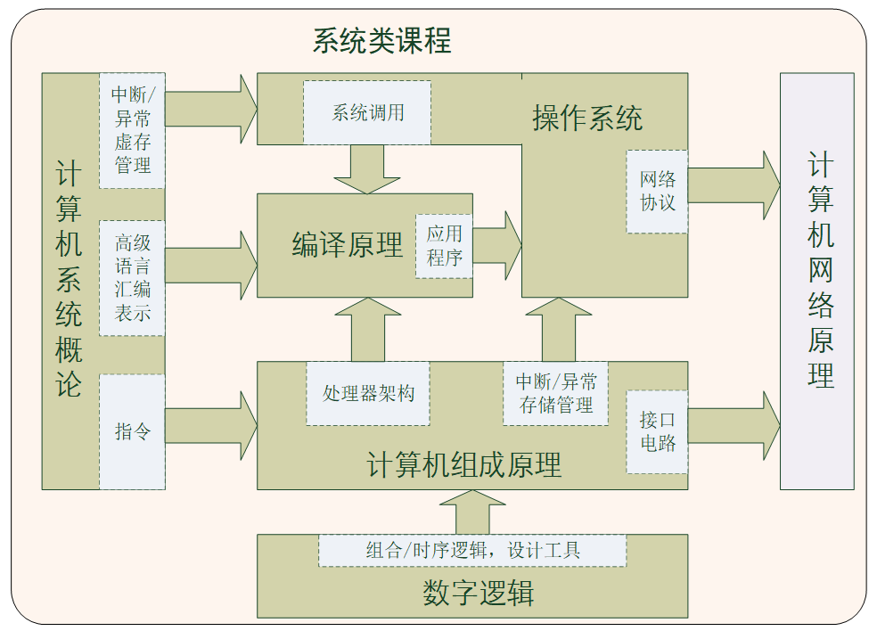
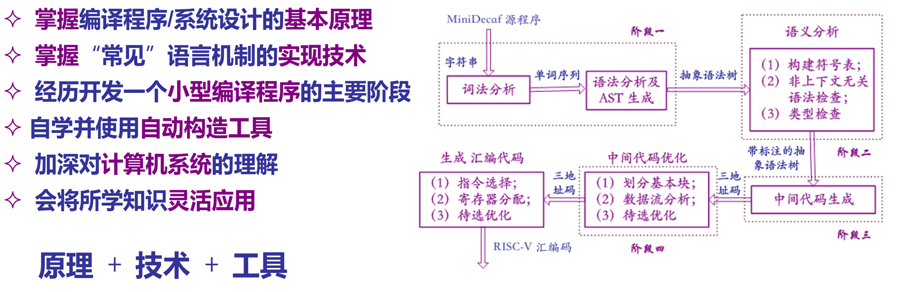
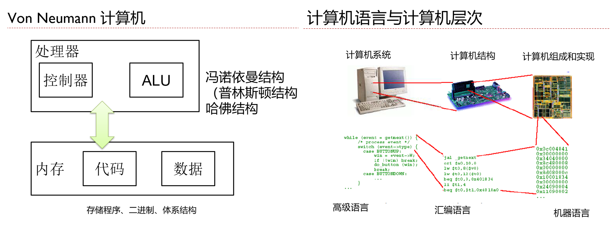
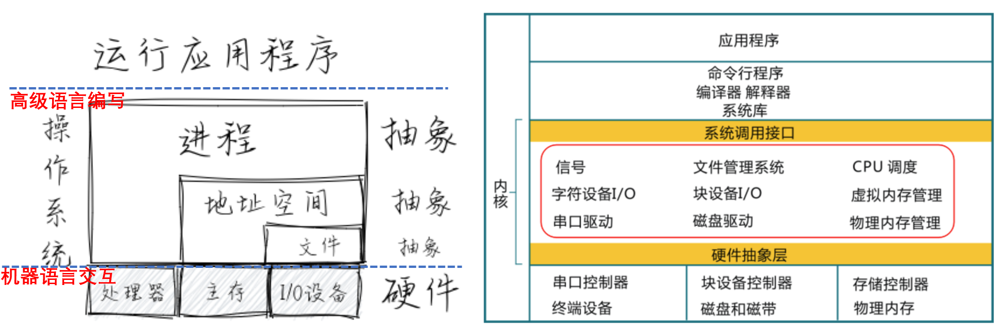
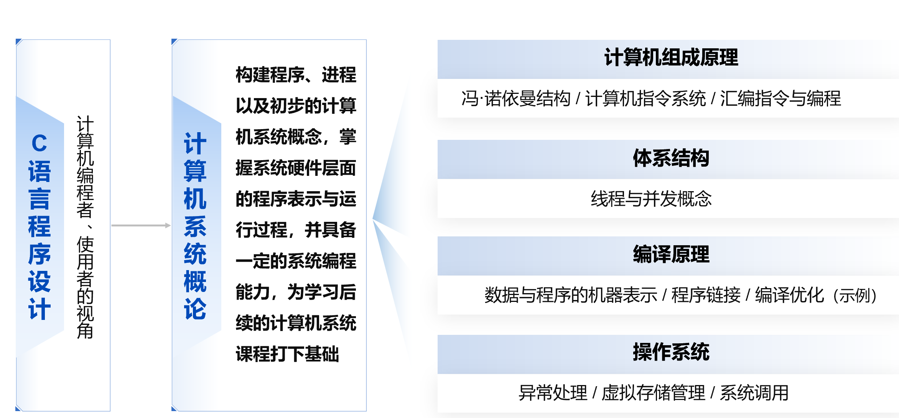
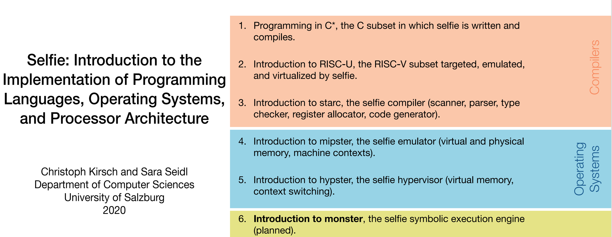
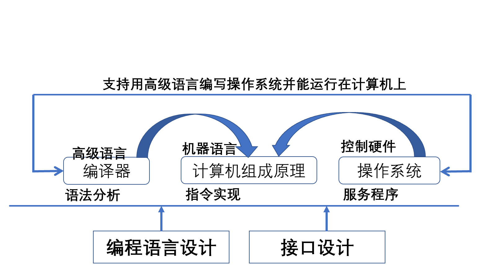

<!-- theme: gaia -->
<!-- _class: lead -->

# 从操作系统的角度看
# 编译原理和计算机组成原理

 

陈渝

清华大学

2023年5月13日

第七届全国高校计算机类专业系统能力培养高峰论坛  

---

# 报告内容
## - 背景和问题
  
## - 编译/操统/计组的特点与联系

## - 关于编译/操统/计组的综合实践

---
# 背景与问题
## 自我介绍
- 清华大学计算机系软件所 陈渝 
  - 研究方向：操作系统
  - 教学内容：
    - “计算机科学基础” 大一第一学期 
    - “编译原理” 大三第一学期
    - “操作系统” 大三第二学期
    - “高级操作系统” 研究生课

---
# 背景与问题
## 清华SYS课程系列
- 计算机系统概论 大二第一学期
- 计算机组成原理 大三第一学期
- “编译原理” 大三第一学期
- “操作系统” 大三第二学期
- “计算机系统结构” 大三第二学期
- “计算机网络原理” 大三第一学期

 

---
# 背景与问题
- **WHY** "从操作系统角度看编译原理/计算机组成原理"
- **SYS** Courses --> **SOS** Courses
  - 学生觉得学习这三门课程很难/量大，缺乏兴趣
  - 老师觉得讲授这三门课程很难/量大，缺乏动力
  - 三门课程的内容相对独立，缺少联系
  - 与实际应用的联系不够紧密，缺少牵引性

---
# 背景与问题
- **WHY**  "从操作系统的角度看编译原理和计算机组成原理"
  - 我们培养学生的目标
    - 系统分析能力：提问题
    - 系统抽象能力：建模型
    - 系统综合能力：系统观
    - 系统设计能力：提思路
    - 系统实现能力：写代码
  - 这些能力更多是通过**学生的自身实践**来获得的，上课是实践的辅助
  - 而老师的主要精力可能花在讲授知识上了，导致**目标与现状不符**  
---
# 背景与问题
## 简洁明了的上古计算机系统
  - Dennis Ritchie开发的CC编译器源码行数：< 1万行
  - Ken Thompson开发的UNIX内核源码行数：< 1万行
  - Intel 4004 晶体管数量：2300个
    - Marcian Hoff提出单芯片设计思路，Federico Faggin完成设计实现 

编译器<-->操作系统<-->计算机组成之间的整体交互简单清晰
学生能够通过**实践**对计算机系统有全面的理解
通过Compiler/OS/CPU的实践让学生足以产生计算机操作的连贯画面

---
# 背景与问题
## 日趋复杂的现代计算机系统
  - GCC-11 编译器源码行数：1667万行
  - Linux-6.0 内核源码行数：3306万行
  - AMD桌面处理器5950X 晶体管数量：395亿 

复杂性的必然结果是专业化，清晰度消失了
计算机系统的本质隐藏在各种晦涩的接口和实现中
学生也陷入了知识的汪洋大海中，难以把握全局

---
# 背景与问题
## 学生学习系统类课程的困难
- 实际实现与抽象概念的巨大差距
  - 学生难以理解老师和课本中的概念
- 代码阅读量不够
  - 学生难以理解程序的实现细节

---
# 背景与问题
## 学生学习系统类课程的困难
- 复杂的实验和编程任务  
  - 课程通常需要与计算机底层打交道
  - 学生可能缺乏与计算机底层相关的实践经验
- 缺乏系统性和整体性
  - 学生难以理解系统类课程的知识体系
  - 学生难以把这些课程综合起来理解和灵活运用 

---
# 背景与问题
## 解决上述问题的已有方法
- 新类型教材与实验
- 《计算机系统基础 第2版》，袁春风、余子濠
- 《计算机系统- 系统架构与操作系统的高度集成》(Computer Systems: An  Integrated Approach to Architecture and Operating System), Umakishore Ramachandran等
- 《计算机系统设计原理》(Principal of Computer System Design), Jerome H. Saltzer等

<!-- "Computer Systems: An Integrated Approach to Architecture and Operating Systems" 这本书是一本广泛使用的计算机系统教科书，已经出版了多个版本。该书由多位作者合作编写，包括 Umakishore Ramachandran 在内的许多专业人士。

该书的主要特点是从系统整体的角度介绍计算机系统，涵盖了计算机硬件、操作系统和编程等方面。其具有以下几个方面的优点：

综合性强：该书内容涵盖了计算机系统的各个方面，包括计算机硬件、操作系统和编程等方面，具有较强的综合性。

深入浅出：书中采用了清晰易懂的语言和实际案例，使得读者更易理解计算机系统的概念和原理。

实践性强：书中包含了大量的实践案例和编程练习，有助于读者更好地理解和应用所学知识。 -->

<!-- 《计算机系统设计原理》（Principles of Computer System Design）是由Jerome H. Saltzer、M. Frans Kaashoek和David P. Reed合作编写的一本计算机系统设计的经典教材。该书系统地介绍了计算机系统设计的基本原理、方法和实践，内容涵盖了计算机系统的各个方面，如处理器、存储器、输入输出、网络通信等。

这本书在计算机系统设计领域有着广泛的影响，被誉为是经典的计算机系统设计教材之一。它不仅涵盖了计算机系统设计的基础知识，还介绍了一些重要的实际应用，如分布式系统、安全和可靠性等。此外，该书的风格简洁明了，结构合理，适合作为高级本科生和研究生的教材，也适合作为工程师和研究人员的参考书。 -->

---
# 背景与问题
## 解决上述问题的已有方法
- 新类型教材与实验
  - 《深入理解计算机系统》（Computer Systems: A Programmer's Perspective，**CSAPP** ）, Randal E. Bryant等, 2003
    - 全面覆盖计算机系统原理
    - 注重底层原理的实践和应用
    - 一些内容过于深入

<!-- 《深入理解计算机系统》（Computer Systems: A Programmer's Perspective，CSAPP）是一本经典的计算机系统原理教材，由Randal E. Bryant和David R. O'Hallaron合著，该书首次出版于2003年，目前已经发行了第三版。以下是对该书的评价：

全面覆盖计算机系统原理：该书从底层计算机组成原理、系统编程、网络编程等多个方面对计算机系统进行了全面深入的介绍，对于想要深入理解计算机系统的读者来说非常有价值。

注重实践和应用：该书强调实践和应用，涵盖了大量的实验和编程任务，这有助于读者通过动手实践来加深对理论知识的理解。

着重讲解底层原理：该书从底层原理出发，深入剖析计算机系统的工作原理，让读者了解计算机系统内部的运行机制，这对于有志于从事系统编程、系统设计等方向的读者非常有帮助。

翔实的例子和练习：该书提供了大量的实例和练习题，这些例子和练习旨在帮助读者深入理解计算机系统原理，加深对概念和原理的理解和记忆。

语言简明易懂：该书的语言简明易懂，作者在讲解概念和原理时尽可能地避免使用过于专业和晦涩的术语，使得读者能够轻松理解书中内容。

综上所述，CSAPP是一本非常优秀的计算机系统原理教材，具有全面深入、着重讲解底层原理、翔实的例子和练习等特点。它适合对计算机系统感兴趣的学生和从事系统编程、系统设计等领域的开发者阅读。 

以下是可能需要一定的预备知识或比较深入的部分：

机器级代码和汇编语言：该书在介绍计算机系统时，包括了机器级代码和汇编语言的部分，这需要读者有一定的汇编语言基础。

内存和存储器层面的讲解：该书在介绍计算机系统时，对于内存和存储器的讲解比较深入，需要读者具备一定的硬件基础知识。

系统I/O层面的讲解：该书在介绍计算机系统时，也包括了系统I/O层面的讲解，需要读者了解操作系统和计算机网络的相关知识。

虽然这些部分对于初学者来说可能会有些困难，但是对于深入理解计算机系统的工作原理非常有帮助。
-->

---
# 背景与问题
## 解决上述问题的已有方法
- 新类型教材与实验
- 《从NAND到Tetris：用硬件和软件构建现代计算机》(The Elements of Computing Systems: Building a Modern Computer from First Principles), Noam Nisan等，2005
  - 从基础的布尔逻辑、组合逻辑和时序逻辑开始，逐步引导读者构建出一个简单的计算机
  - 涵盖了计算机系统的各个层面，包括硬件、指令集架构、汇编语言、编译器、操作系统和应用程序等
<!-- 
https://zhuanlan.zhihu.com/p/119466344
https://www.zhihu.com/question/464124424
"From NAND to Tetris"是一本非常有趣和有启发性的计算机科学教材，它的全名是《从NAND到Tetris：用硬件和软件构建现代计算机》(The Elements of Computing Systems: Building a Modern Computer from First Principles)。这本书的作者是Noam Nisan和Shimon Schocken，他们是以色列的计算机科学家。

这本书的核心思想是从最基本的数字逻辑门(NAND门)开始，一步步地构建现代计算机，包括处理器、内存、存储器、操作系统和编程语言等。这种自下而上的方法，帮助读者逐步理解计算机是如何工作的，同时也可以培养读者的实践能力和创新思维。

这本书的配套课程也非常有趣和实用，包括了一系列项目，让学生通过实践构建一个完整的计算机系统。这些项目包括构建数字逻辑门、CPU、内存和操作系统等，最终实现一个可以运行简单程序的计算机。

总之，"From NAND to Tetris"是一本非常值得推荐的计算机科学教材，它通过实践性的项目和深入浅出的讲解，让读者全面了解现代计算机的工作原理和构成，同时也能够培养读者的实践能力和创新思维。 

-->

---

# 报告内容
## - 背景和问题
  
## - 编译/操统/计组的特点与联系

## - 关于编译/操统/计组的综合实践

---
# 编译/操统/计组的特点与联系
## - 共性在哪里？
## - 关系在哪里?
## - 需要学生掌握的核心点是啥？

---
# 编译/操统/计组的特点与联系

---
# 编译/操统/计组的特点与联系

---
# 编译/操统/计组的特点与联系

---
# 编译/操统/计组的特点与联系

---
# 编译/操统/计组的特点与联系

## 共性的关键点
### 归纳与抽象（做减法）
  - 编译原理：词法与语法（**去除**复杂语法分析/代码优化/中间表示等）
  - 操作系统：进程（**去除**地址空间/文件/同步互斥/性能优化等）
  - 计算机组成原理：机器指令/语言（**去除**流水线等优化实现）
简化已有课程的知识点，只留下基本**综合知识点**
 

---
# 编译/操统/计组的特点与联系

## 共性的关键点（留本质）
### **语言** Language
  - 编译原理：高级语言--中间语言--汇编语言
  - 操作系统：高级语言+汇编语言+系统调用
  - 计算机组成原理：机器语言（汇编语言）及其硬件实现

---
# 编译/操统/计组的特点与联系
## 关系的关键点（留本质）
### **接口** Interface
  - 编译原理--计算机组成原理：数据与程序的机器表示
  - 编译原理--操作系统：机器视角下的程序结构/控制流/变量访问
  - 计算机组成原理--操作系统：汇编语言/特权级/中断/虚拟地址

---
# 编译/操统/计组的特点与联系
需要学生掌握的**核心点**：高级语言编写的程序如何编译&加载&运行
 - 基于**语言**和**接口**，用全局的思路来理解编译/操统/计组
 - 用一个**工程项目**(甚至一个程序)来实践编译/操统/计组
 - 讲课内容：简化的编译/操统/计组的核心关联知识
   - 编译：高级语言 --> 汇编语言  --> 机器语言
   - 计组：机器语言 --> 特权级指令：数据处理/CPU状态 
   - 操统：高级语言 --> 特权级指令：控制CPU/处理中断

---

# 报告内容
## - 背景和问题
  
## - 编译/操统/计组的特点与联系

## - 关于编译/操统/计组的综合实践

---
# 关于编译/操统/计组的综合实践

---
# 关于编译/操统/计组的综合实践
**邢其正** 本科：北京科技大学，研究生：北京大学，将去阿里工作
- 2021年作为出题导师参加全国大学生计算机系统能力大赛
  - https://github.com/maxXSoft
  - [proj5-fuxi-full-system-with-cpu-compiler-os](https://github.com/oscomp/proj5-fuxi-full-system-with-cpu-compiler-os)
  - 处理器: Fuxi (伏羲), 32-bit pipelined RISC-V CPU
  - 编译器: Yu (羽), a simple system programming language
  - 操作系统: GeeOS (寂), a lightweight, UNIX like operating system written in YuLang,running on Fuxi

---
# 关于编译/操统/计组的综合实践
- 初步构想
  - 学生能够得到的收获
    - 三者的抽象能力
    - 三者的综合能力
    - 三者的实践能力
  - 不涉及
    - 性能优化，/操作系统/编译器/计算机组成的非相关复杂细节  

---
# 关于编译/操统/计组的综合实践
- 初步构想

---
# 关于编译/操统/计组的综合实践
- 初步构想
  - 一个简化RISC-V的处理器设计：定义机器语言
    - 初级：纯软件实现的硬件指令功能模拟
    - 高级：课硬件实现的时钟周期级模拟仿真 
    - 基本计算/控制指令
    - 特权级/中断支持
    - (option)虚拟地址支持
---
# 关于编译/操统/计组的综合实践
- 初步构想 
  - 一个简化C语言的编译器设计：定义高级语言
    - 初级：C语言的子集，只有基本整型数的运算和基本控制逻辑，编译为RISC-V汇编语言
    - 高级：C语言的子集，可支持指针和函数，可编译为RISC-V机器语言

---
# 关于编译/操统/计组的综合实践
- 初步构想
  - 一个面向简化RISC-V并基于简化C语言的OS设计：定义上下接口
    -  初级：支持一个计算和"Helloworld"输出功能的应用加载与执行
    -  高级：支持两个应用交替加载与执行

---
# 关于编译/操统/计组的综合实践
- 初步构想
  - 简化已有三门课程
  - 形成教程和实验指导书
  - 能够在线进行实验

---
<!-- theme: gaia -->
<!-- _class: lead -->

# 谢谢！

计算机系统能力大赛操作系统比赛 https://os.educg.net

开源操作系统训练营 https://github.com/LearningOS/rust-based-os-comp2023

