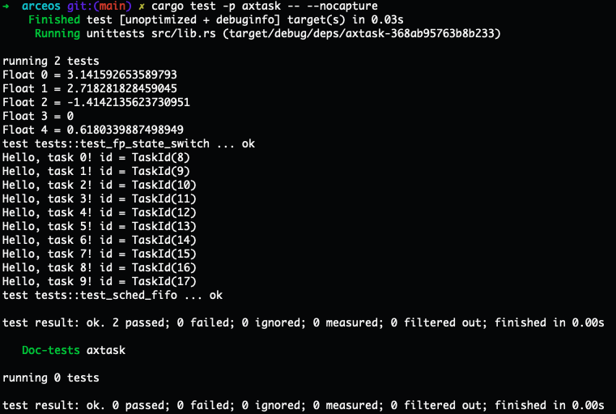

# 大实验可选项目
- [ArceOS: 组件化操作系统](https://github.com/rcore-os/arceos)
- [组件化 rCore Tutorial 教学OS](https://github.com/YdrMaster/rCore-Tutorial-in-single-workspace)

- 基于用户态中断的软硬件协同优化  
- 其它学生自己感兴趣的OS相关题目
   - 请联系老师协商确认  
---
<!-- theme: gaia -->
<!-- _class: lead -->
# **ArceOS: 组件化操作系统的初步探索**

贾越凯 陈渝

清华大学 计算机系

2023/3/15

---

# 背景

* 为什么要做组件化的 OS？
  * 可形成不同特征/形态/架构的操作系统内核
    + 易于定制
        + 性能
        + 安全
    + 易于开发
    + 易于复用


<!--
硬件和应用都在发展，但 OS 发展滞后，用的大多都还是 Linux 等通用 OS

我们希望能够根据应用的需求，对 OS 功能进行定制，不将应用没有用到的功能包含进 OS 中，或引入一些专门设计的模块，从而提升 OS 的性能与安全。

但是，现有的通用操作系统，比如 Linux，有上千万行代码，无论是裁剪，还是增加模块，都非常困难。所以我们就需要一个非常模块化的 OS，方便进行开发。

而且，在 Linux 的上千万行代码中，都是与 Linux 紧耦合的，很难将其中的几部分抠出来，用到其他 OS 上，代码可重用性差。而我们希望，我们的 OS 中的组件，能够被其他 OS 等系统软件复用，便于其他 OS 的开发。

最后一点，Linux 等 OS 都是 C 语言写的，由于其语言非常灵活，使得模块间的调用关系也非常混乱。而我们希望用 Rust 语言进行开发。

所以，我们就希望通过实现一个个组件，来搭建一个 OS，从而降低 OS 的开发难度，提升性能、安全、和可复用性。

-->

---

# ArceOS 简介

* https://github.com/rcore-os/arceos
* Ar-Qs, Ar-key-O-S
  - 提供了一套组件化的操作系统框架
  - 提供各种内核组件的实现
    - 各种内核组件可在没有OS kernel的情况下独立运行
       - 如filesystem, network stack等内核组件可以在裸机或用户态以库的形式运行
       - 各种设备驱动等内核组件可以在裸机上运行
  - 内核组件+组件化的OS框架 = 不同形态的OS kernel
---

# ArceOS 简介

* https://github.com/rcore-os/arceos
* Ar-Qs, Ar-key-O-S
* 支持形成unikernel
    - 只运行一个用户程序
    - 用户程序与内核链接为同一镜像
    - 不区分地址空间与特权级
    - 安全性由底层 hypervisor 保证

---

# ArceOS 简介

* https://github.com/rcore-os/arceos
* Ar-Qs, Ar-key-O-S
* 支持形成normal kernel
    - 在用户态运行多个用户程序
    - 用户程序与内核分开
    - 区分地址空间与特权级
    - 安全性由kernel保证

---

# ArceOS 简介

* https://github.com/rcore-os/arceos
* Ar-Qs, Ar-key-O-S
* 支持形成micro kernel
    - 在用户态运行多个用户程序和OS服务
    - 用户程序和OS服务与内核分开
    - 区分地址空间与特权级
    - 安全性由内核保证

---

# ArceOS 简介

* https://github.com/rcore-os/arceos
* Ar-Qs, Ar-key-O-S
* 支持形成hypervisor
    - 在hyervisor态运行hyerpvisor
    - 用户程序和OS内核运行在VM中，与hyerpvisor分开
    - 安全性由hypervisor保证

---

# ArceOS 整体架构

<style scoped>
section img {
  display: block;
  margin: 0 auto;
  width: 75%;
}
</style>




---

# ArceOS 模块
 
<style scoped>
section li {
  font-size: 30px;
}
</style>

<div class="columns">
<div style="width:100%">

### crates

+ 与 OS 的设计无关的公共模块
    + linked_list
    + page_table
    + allocator
    + scheduler
    + drivers
    + ...
 
</div>
<div style="width:100%">

### modules

+ 与 OS 的设计紧耦合的模块
    + axtask
    + axnet
+ 对 crates 的选取与包装:
    + axalloc：
    + axdriver

</div>
</div>


---

# 应用程序模块依赖

+ 必选模块
    + axruntime：启动、初始化、模块总体管控
    + axhal：硬件抽象层
    + axlog：打印日志
* 可选模块
    + axalloc：动态内存分配
    + axtask：多任务 (线程)
    + axdriver：设备驱动 (如网络、磁盘)
    + axnet：网络

---

# 应用程序配置变更

* 示例：调度算法变更

    ```toml
    # apps/multitask/Cago.toml
    [dependencies]
    libax = {
        path = "../../ulib/libax",
        default-features = false,
        features = ["paging", "multitask", "sched_fifo"]
    }
    ```

* 其他可能的配置变更：
    + 内存分配器
    + 网络协议栈
    + ...

<style scoped>
section li {
    font-size: 31px;
}
</style>

---

# ArceOS 应用程序清单

<style scoped>
section table {
    font-size: 30px;
    width: 100%;
    margin: 0 auto;
    margin-top: 30px;
}
</style>

| 应用 | 启用的功能 | 额外依赖的模块 | 镜像大小 |
|-|-|-|-|
| helloworld | | | 28K |
| memtest | alloc, paging | axalloc | 44K |
| multitask | paging, multitask, sched_fifo | axalloc, axtask | 40K |
| httpclient | paging, net | axalloc, axdriver, axnet | 88K |
| echoserver | paging, net, multitask | axalloc, axdriver, axnet, axtask | 96K |

---

# 单元测试

+ 可以只运行要测试的模块，无需运行完整的 OS
+ 在本机用户态执行，方便调试
+ 示例：axtask 单元测试



<style scoped>
section img {
    display: block;
    margin: 0 auto;
    width: 46%;
    margin-top: -20px;
}
</style>


---

# ArceOS 相关大实验选题

+ crates 层：
    + 算法：调度、内存分配、... <div class="right-label">★★☆☆☆</div>
    + 驱动：物理网卡、SD 卡、virtio GPU, ... <div class="right-label">★★★☆☆</div>
    + 文件系统：FAT、ext4、... <div class="right-label">★★★☆☆</div>
    + 网络：支持 lwip 协议栈 <div class="right-label">★★★★☆</div>
    + virtio：virtio-fs、virtio-console、... <div class="right-label">★★★★☆</div>
+ modules 层：
    + 移植：x86_64、树莓派、... <div class="right-label">★★☆☆☆</div>
    + 异步 I/O：Rust async <div class="right-label">★★★☆☆</div>

---

# ArceOS 相关大实验选题

+ ulib 层：
    + 兼容 Linux 系统调用接口 <div class="right-label">★★★☆☆</div>
    + 支持已有复杂应用：NGINX、Redis、...<div class="right-label">★★★★☆</div>
    + 支持 Rust std <div class="right-label">★★★★☆</div>
+ 框架完善：
    + 增加更多单元测试、文档 <div class="right-label">★★☆☆☆</div>
    + 支持多核、增加同步互斥功能 <div class="right-label">★★★☆☆</div>
    + 支持内核中断、支持内核抢占 <div class="right-label">★★★★☆</div>
    + 支持unikernel/MicroKernel/MonolithicKernel架构的OS <div class="right-label">★★★★☆</div>
+ 其他：
    + 支持游戏应用、webassembly... <div class="right-label">★★★☆☆</div>

<style scoped>
section li {
    font-size: 29px;
}
</style>

---

# 相关参考

- [OSv](http://osv.io/)：OSv is the open-source versatile modular unikernel designed to run unmodified Linux applications.
  - [OSv源码仓库](https://github.com/cloudius-systems/osv) 、[OSv支持的Linux应用](https://github.com/cloudius-systems/osv-apps)、[OSv wiki文档](https://github.com/cloudius-systems/osv/wiki)
- [rCore](https://github.com/rcore-os/rCore) 和 [zCore](https://github.com/rcore-os/zCore)：rcore-os开源社区设计的早期Rust-based OS
- [unikraft](https://unikraft.org/): Unikraft is an automated system for building specialized OSes known as unikernels. 
  - [unikraft内核/应用/工具源码](https://github.com/unikraft)
  - [virtiofs for unikraft源码/本科毕设论文/评测数据](https://github.com/astrynzha/virtiofs_unikraft)

---

<!-- _class: lead -->
<!-- _paginate: false -->
<!-- _backgroundImage: url('https://marp.app/assets/hero-background.svg') -->

# Thanks!
